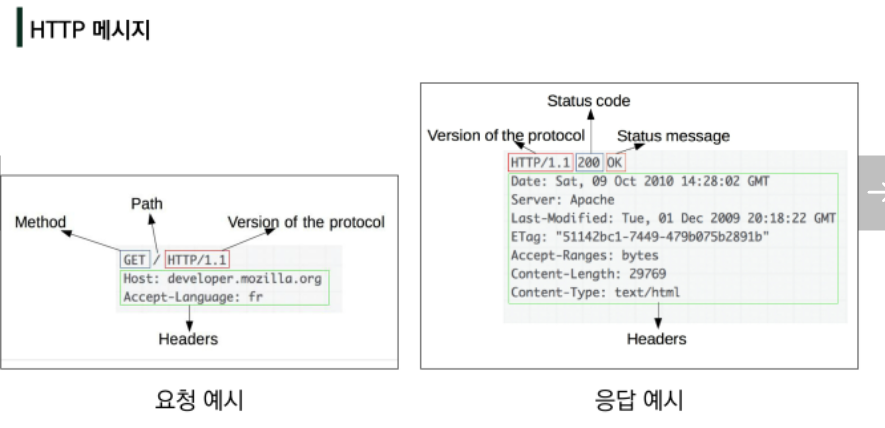
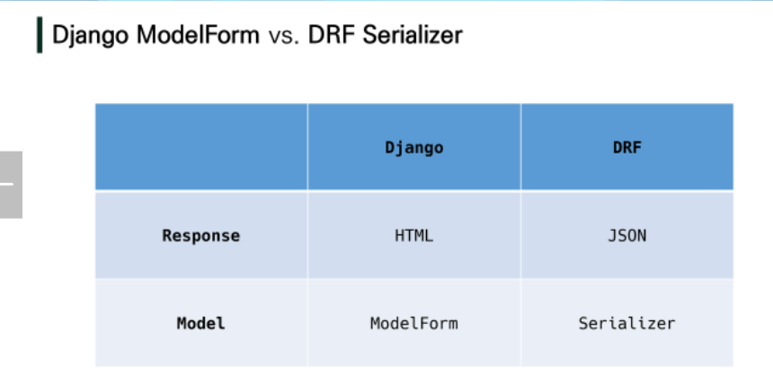
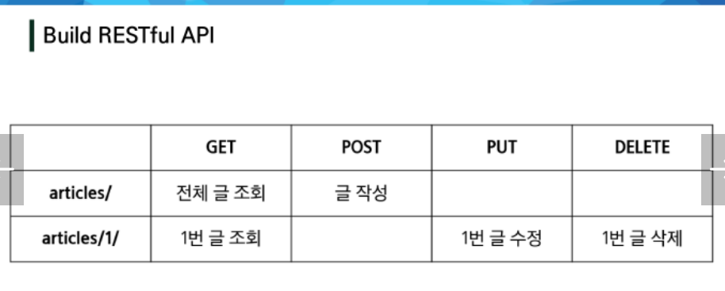

# Django 05
## REST API
### INDEX

[toc]

---

### HTTP
##### HTTP
- HyperText Transfer Protocol
- 요청(request)와 응답(response)로 이루어진 웹에서 구성된 모든 데이터 교환의 기초
- 기본 특성
	- Stateless/ Connectionless
	- 쿠키와 세션을 통해 서버 상태를 요청과 연결



##### HTTP request methods
- 자원에 대한 행위를 정의/ 주어진 자원에 수행하길 원하는 행동
- EX) GET, POST, PUT, DELETE

##### HTTP response status codes

- 특정 HTTP 요청이 성공적으로 완료되었는지 여부를 나타냄.
- 5개의 그룹
	1. informational(1xx)/ 2. successful(2xx)/ 3. redirection(3xx)/ 4.client error(4xx)/ 5.server error(5xx)

##### 웹에서의 리소스 식별
- HTTP 요청의 대상을 자원(리소스, resource)라고 함/ 자원은 문서, 사진 어떤것이든 가능
- 각 리소스는 리소스 식별을 위해 HTTP 전체에 사용되는 URI(Uniform Resource Identifier)로 식별된다.

##### URL, URN
- URL(Uniform Resource Locator)
	- **통합 자원 위치**
	- 네트워크 상에 자원이 어디 있는지 알려주기 위한 약속
	- 현재는 추상화된 의미론적인 구성
	- 웹주소/링크 라고도 불림
- URN(Uniform Resource Name)
	- **통합 자원 이름**
	- URL과 다리 자원의 위치에 영향을 받지않는 유일한 이름 역할
##### URI
- Uniform Resource Identifier
	- **통합 자원 식별자**
	- 인텉넷의 자원을 식별하는 유일한 주소/ 문자열
	- 하위 개념으로 URL, URN
	- 인터넷 상 정보를 표현하는 방식(주소..)

##### URI의 구조
- Schema : 브라우저가 사용해야 하는 프로토콜(https..data..file..)
- Host(Domain name) : 요청을 받는 웹 서버의 이름(142.251.42.142 와 같은 IP)
- Port : 웹 서버 상의 리소스에 접근하는데 사용되는 '문(gate)'
	- HTTP 프로토콜의 표준 포트 : HTTPS 80, HTTPS 443
- Path : 웹 서버 상의 리소스 경로/ 실제 물리적 위치가 아닌 추상화 형태의 구조로 표현
- Query(Identifier) : Query String Parameters/ 웹 서버에 제공되는 추가적인 매개 변수/ &로 구분 되는 key-value 목록
- Fragment : Anchor/ 자원 안에서의 북마크의 한 종류/ 브라우저에서 해당 문서(HTML)의 특정 부분을 보여주기 위한 방법/ 브라우저에서 알려주는 요소 이기 때문 fragment identifier(부분 식별자)라고 한다.

- 실제 url주소에서의 구조확인.
###### https://www.example.com:80/path/to/myfile.html/?key=value#quick-start
	   schema//Host :Port/Path-,-,/?Query#Fragment

### RESTful API
#### API
- Application Programming Interface
- 프로그래밍 언어가 제공하는 기능을 수행할 수 있게 만든 인터페이스
	- 애플리케이션과 프로그래밍으로 소통하는 방법(CLI:명령줄, GUI:그래픽, API:특정 기능 수행)
- Web API
	- 웹 애플리케이션 개발에서 다른 서비스에 요청을 보내고 응답을 받기 위해 정의된 명세
	- Open API를 사용하는 추세
- 서비스 API EX) Youtube API ...

#### REST
- REpresentational State Transfer
- API Server를 개발하기 위한 일종의 소프트웨어 **설계 방법론**
- 네트워크 구조의 원리 모음 : 자원을 정의, 자원에 대한 주소를 지정하는 전반적인 방법
- REST 원리를 따르는 시스템을 **RESTful**이라고 한다.

- 자원을 정의하는 방법에 대한 고민 : ex) 정의된 자원을 어디에 위치 시킬 것인가.

- REST의 자원과 주소의 지정 방법
	1. 자원 : URI(URL,URN 포함)
	2. 행위 : HTTP Method
	3. 표현 : 자원과 행위를 통해 궁극적으료 표현되는 결과/ JSON으로 표현된 데이터를 제공

- REST의 핵심 규칙
	1. **정보**는 URI로 표현
	2. 자원에 대한 **행위** 는 HTTP Method로 표현(GET, POST, PUT, DELETE)
- **설계 방법론을 지키지 않았을 때 잃는 것보다 지켰을 때 얻는 것이 훨씬 많다.**
	- 뭐가 되든 모르겠으면 지키는게 더 났다 라는 말씀.

#### JSON
- JSON(JavaScript Object Notation)
	- JavaScript 표기법을 따른 단순 문자열
- 특징 
	- **사람이 읽거나 쓰기 쉽고, 기계가 파싱하고 만들어내기 쉽다.**
	- 어떠한 프로그래밍언어에서든 쉽게 변환 가능한 key-value 형태 구조를 갖는다.
- TMI : java 와 연관없고, javascript와도 연관없음. 이 세개들은 서로 연관이 거의 없다.

#### RESTful API
- REST 원리를 따라 설계한 API/ RESTful services,  simply REST services 라고 부름
- 프로그래밍을 통해 클라이언트의 요청에 JSON을 응답

### Response
##### Response - JsonResponse
```python
from django.http.response import JsonResponse
```
- 빈 리스트에 Json 형식의 딕셔너리를 만들어 JsonResponese(list, safe=False)로 반환
- Content-Type entity header : 데이터의 media type을 나타내기 위해 사용됨/ 응답 내에 있는 컨텐츠의 유형이 실제로 무엇인지 클라이언트에게 알려줌.

- JsonResponse objects
	- JSON-encoded response를 만드는 HttpResponse의 서브 클래스
	- "safe" parameter : True가 기본값/ dict 이외의 객체를 직렬화(Serialization)하러면 False로 설정해야 함..

##### Serialization
- 직렬화 : 데이터 구조나 객체 상태를 동일하거나 다른 컴퓨터 환경에 저장하고, 나중에 재구성할 수 있는 포맷으로 변환하는 과정.
- Django에서는 Queryset, Model instance와 같은 복잡한 데이터를 JSON, XML 등의 유형으로 쉽게 변환할 수 있는 Python 데이터 타입으로 만들어준다.

##### Response - Django Serializer
- Django의 내장 HttpResponse를 활용한 JSON 응답 객체
```python
from django.http.response import JsonResponse, HttpResponse
from django.core import serializers
```
- 주어진 모델 정보를 활용하기 때문에 이전과 달리 필드를 개별적으로 직접 만들어 줄 필요 없다.

##### Response - Django REST Framework
- Django REST framework(DRF) 라이브러리 를 사용한 JSON 응답
- pip로 djangorestframework 설치하여 앱등록 후 사용.
```python
## articles/serializers.py
from rest_framework import serializers
from .models import Article

class ArticleSerializer(serializers.ModelSerializer):
	class Meta:
		model = Article
		fields = '__all__'
```
- Article 모델에 맞춰 자동으로 필드를 생성해 serialize 해주는 ModelSerializer 확인
- ModelForm 과 형태가 비슷하다.

```python
from rest_framework.decorators import api_view
from rest_framework.response import Response
from .serializers import ArticleSerializer

@api_view()
def 함수작성():
```
- DRF 의 Response()를 활용해 Serialize 된 JSON 객체 응답.

##### Django REST Framework (DRF)
- Web API 구축을 위한 강력한 Toolkit을 제공하는 라이브러리
- DRF의 Serializer는 Django의 Form 및 ModelForm 클래스와 매우 유사하게 구성되고 작동함.
- Web API : 웹 애플리케이션 개발에서 다른 서비스에 요청을 보내고 응답을 받기 위해 정의된 명세.




### Single Model
#### DRF with Single Model
- 단일 모델의 data를 직렬화(serialization) 하여 Json 으로 변환하는 방법.

#### ModelSerializer
- 모델 필드에 해당하는 필드가 있는 Serializer 클래스를 자동으로 만들 수 있는 shortcut
- 기능 : 모델 정보에 맞춰 자동으로 필드 생성/ serializer에 대한 유효성 검사기를 자동으로 생성/ .create(), .update()의 간단한 기본 구현이 포함됨.

- ModelSerializer 생성
	- Model의 필드를 어떻게 **"직렬화"** 할 지 설정하는 것이 핵심/ Django에서 Model의 필드를 설정하는 것과 동일함.
```python
# articles/serializers.py
from rest.framework import serializers
from .models import Article

class ARticleListSerializer(serializers.ModelSerializer):

	class Meta:
		model = Article
		fields = ('id', 'title',)
```
##### 'many' argument
- many = True
	- "Serializing multiple objects"/ 단일 인스턴스 대신 QuerySet 등을 직렬화하기 위해서는 serializer를 인스턴스화 할 때 many=True를 키워드 인자로 전달.



##### 1. GET - Article List
- api_view decorator
	- 기본적으로 GET 메서드만 허용되며 다른 메서드 요청에 대해서는 405 Method Not Allowed 로 응답
	- View 함수가 응답해야 하는 HTTP 메서드의 목록을 리스트의 인자로 받음
	- DRF 에서는 선택이 아닌 **필수적으로 작성**해야 해당 view 함수가 정상적으로 동작.

###### 2. GET - Article Detail
- ModelForm에서 다른 기능에 대해 form을 선언한 것과 같이 1개의 Article에 대한 조회를 위해 필요에 맞는 field를 선언하여 새로운 serializer를 생성한다.

###### 3. POST - Create Article 
- 201 Created 상태 코드 및 메세지 응답
- RESTful 구조에 맞게 작성
	1. URI 는 자원을 표현 2. 자원을 조작하는 행위는 HTTP Method
- article_list 함수 1개로 Article 조회/ 생성 하는 행위를 어떤 Method인가를 구분하여 처리 가능하다.

###### Status Codes in DRF
- DRF에는 status code를 보다 명확하고 읽기 쉽게 만드는 데 사용할 수 있는 정의된 상수 집합을 제공
- status 모듈에 HTTP status code 집합이 모두 포함되어 있다.
```python
# status 모듈 예시
from rest_framework import status

def example_list(request):
	return Response(serializer.data, status = status.HTTP_201_CREATED)
```

###### 'raise_exception' argument
- "Raising an exception on invalid data"
- is_valid() 는 유효성 검사 오류가 있는 경우 serializers.ValidationError 예외를 발생시키는 선택적 raise_exception 인자를 사용할 수 있다.
- DRF에서 제공하는 기본 예외 처리기에 의해 자동 처리되면 기본적으로 400 를 응답으로 반환.
- **유효하지 않다면 HTTP 400 code 반환**

###### 4. DELETE - Delete Article
- 204 No Content 상태 코드 및 메시지 응답.
- 1개의 view 함수로 조회/ 삭제/ 생성 처리를 모두 가능하게 된다.

###### 5. PUT - Update Article
- 1개의 view함수로 조회/삭제/생성/수정 을 모두 가능하게 된다.
```python
@api_view(['GET','POST'])
class view--(request):
	if request.method == "GET":
		조회 기능 처리
		serializer = ArticleListSerializer(articles, many = True)
		return Response(serializer.data)
	elif request.method == "POST":
		게시글 생성 기능 처리
		serializer = ArticleSerializer(data = request.data)
		if serializer.is_valid():
			serializer.save()
			return Response(serializer.data, status = status.HTTP_201_CREATED)
		return Response(serializer.errors, status = status.HTTP_400_BAD_REQUEST)
	elif request.method == "DELETE":
		article.delete()
		data = {
			'delete' : f{메시지 전달}
		}
		return Response(data, status = status.HTTP_204_NO_CONTENT)
```

### 1:N Relation
##### DRF with 1:N Relation
- 1:N 관계에서의 모델 data를 직렬화하여 JSON 으로 변환하는 방법
- 2개의 상의 1:N 관계의 모델을 CRUD 로직을 수행 가능하도록 설계
```python
# /models.py
class Comment(models.Model):
	article = ForeignKey(Article, on_delete = models.CASCADE)
	...
```
- 마이그레이션
```python
#/serializers.py
class CommentSerializer(serializers.ModelSerializer):
	class Meta:
		model = Comment
		fields = '__all__'
```
- Comment List
```python 
#/views/py
@api_view(['GET'])
def comment_list(request):
	comments = get_list_or_404(Comment) # get_list_or_404 로 Comment의 전체 데이터 가져오기
	serializer = CommentSerializer(Comment, many=True)
	return Response(serializer.data)
```

- Create Comment
```pyhton
@api_view(["GET"])
def comment_create(request, article_pk):
	article = get_objects_or_404(Comment, pk = article_pk) # comment_pk에 해당하는 데이터 가져오기
	serializer = CommentSerializer(request.data)
	if serializer.is_valid(raise_exception = True)
		serializer.save(article=article) # Article 생성과 다르게 ForeignKey 때문에 참조하는 모델의 객체 정보가 필요하다. save에 인자를 추가한다.
		return Response(serializer.data, status = status.HTTP_201_CREATED)
```
###### Read Only Field (읽기 전용 필드)
- 어떤 게시글에 작성하는 댓글인지에 대한 정보를 form-data로 넘겨주지 않았기 때문에 직렬화 과정에서 article 필드가 유효성 검사를 통과하지 못한다.
- 이때는 읽기 전용 필드(read_only_fields) 설정을 통해 직렬화하지 않고 반환 값에만 해당 필드가 포함되도록 설정 가능하다.
```python
#/serializers.py
class CommentSerializer(serializers.ModelSerializer):
	class Meta:
	...
	read_only_fields = ('aritlcle',) ## 읽기 전용 필드 추가. 
```
###### GET&DELETE&PUT - detail, delete, update Comment
- Comment Detail
```python
@api_view(["GET"])
def comment_detail(request, comment_pk):
	comment = get_objects_or_404(Comment, pk = comment_pk) # comment_pk에 해당하는 데이터 가져오기
	if request.method = "GET":
        serializer = CommentSerializer(comment)
        return Response(serializer.data)
	elif request.method = "DELETE":
		comment.delete()
		data ={
			'delete': f대충삭제되었다는 메세지
		}
		return Response(data, status=status.HTTP_204_NO_CONTENT)
	elif request.method = "PUT":
		serializer = CommentSerializer(comment, data=request.data)
		serializer.save()
		return Response(serializer.data)
```

##### 1:N Serializer
###### 1. 특정 게시글에 작성된 댓글 목록 출력하기 → 기존 필드 override
- 2가지 형태로 구성 : PrimaryKeyRelatedField / Nested relationships
1. PrimaryKeyRelatedField
	- pk를 사용하여 관계된 다상을 나타내는데 사용
	- to many relationship(N)를 나타내는 경우 many=True 설정
	- comment_set 필드 값을 form-data로 받지 않으므로 read_only=True 설정
```python
#serializer.py
class ArticleSerializer(serializers.ModelSerializer):
	comment_set = serializer.PrimaryKeyRelatedField(many=True, read_only=True)
	class Meta:
		...
# /models.py
class Comment(...):
	article = ... (,related_name='comments'추가)
```
2. Nested relationships
	- 모델 관계상으로 참조된 대상은 참조하는 대상의 표현에 포함되거나 중첩(nested) 될수 있다.
	- 이러한 중접된 관계는 serializers 를 필드로 사용하여 표현 가능
```python
#/serializers.py
class ArticleSerializer(...):
	comment_set = CommentSerializer(many=True, read_only=True) ## 필드 추가.
	...
```
###### 2. 특정 게시글에 작성된 댓글의 개수 구하기 → 새로운 필드 추가
- comment_set 매니저는 모델 관계로 인해 자동으로 구성되어 커스텀 필드를 구성하지 않아도 comment_set이라는 field 옵션에 작성만 해도 사용가능 했다.
- 하지만 nested인 경우 별도의 값을 위한 필드는 자동으로 구성되는 매니저가 아니기 때문에 직접 필드를 작성해야 한다.
```python
#/serializers.py
class ArticleSerializers(...):
	comment_set = ...
	comment_count = serializers.IntergerField(source='count_set.count', read_only=True)
	class Meta:
		...
```
- source arguments : 필드를 채우는 데 사용할 속성의 이름. 위 에서는 comment_set 이라는 필드에 .(dot)을 통해 전체 댓글의 개수 확인 가능.

- 특정 필드를 overried 혹은 추가한 경우 serializer 정의에서 read_only_fields shortcut으로 사용할 수 없다.

- PrimaryKeyRelatedField의 경우 각 article에 comment의 pk가 추가되고, Nested relationships의 경우 각 article에 comment들의 전체 정보가 추가 된다. 입맛에 맞게 사용하면 된다.
