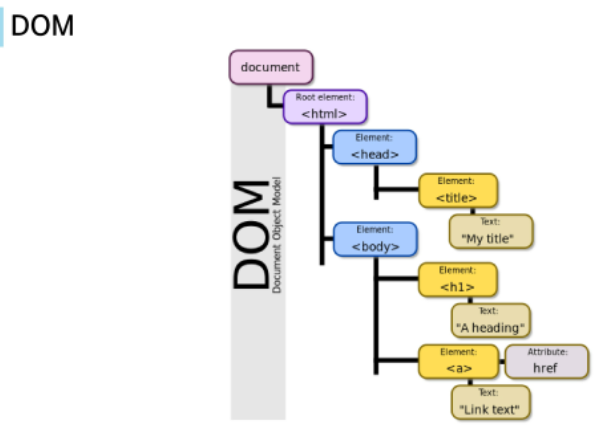
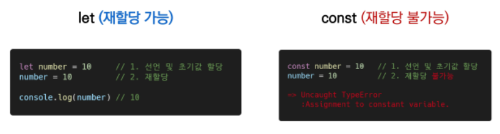
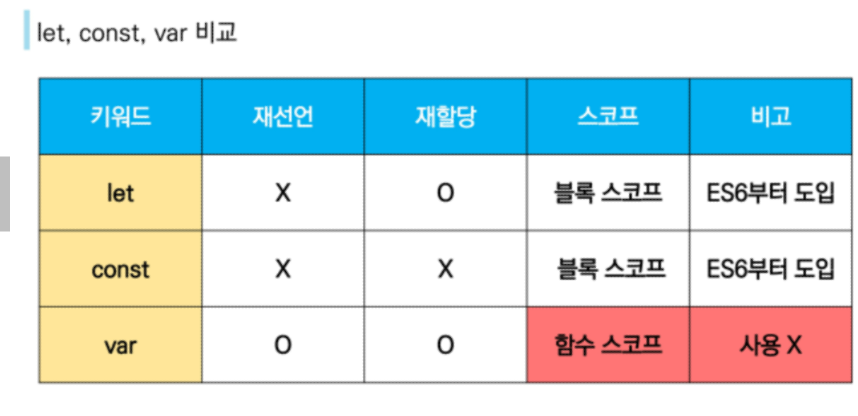
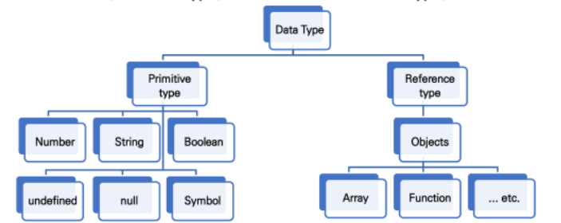
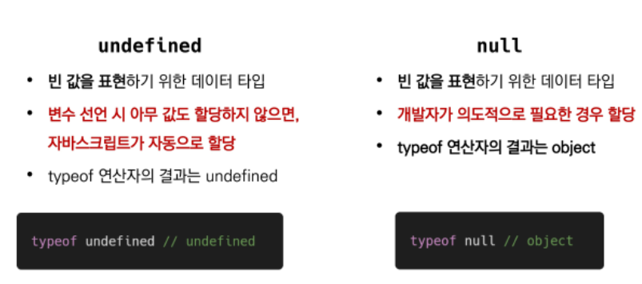
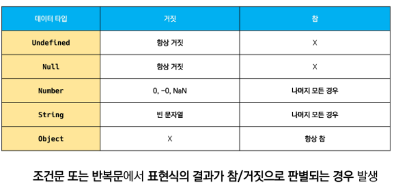
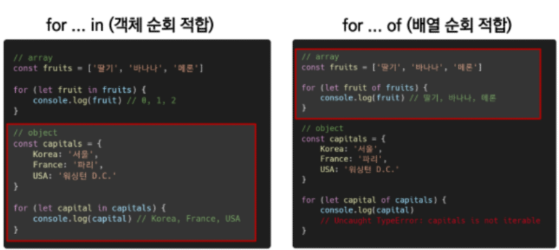
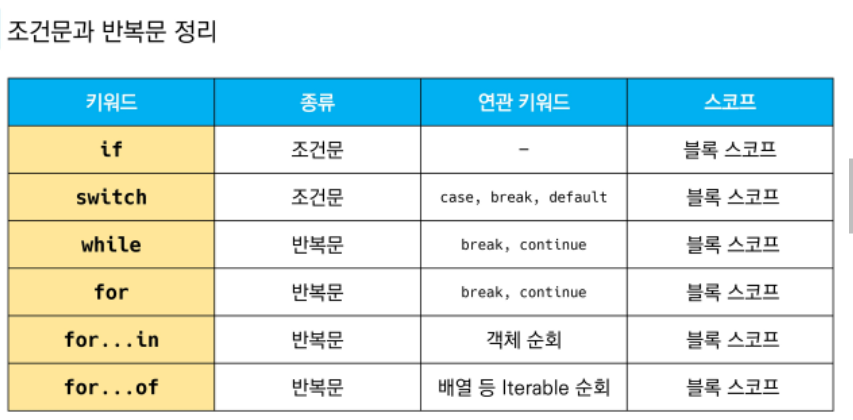

# JavaScript 01
## JavaScript 기초
### JavaScript Intro
- 브라우저 : URL로 웹을 탐색하고 서버와 통신, HTML 문서, 파일을 출력하는 GUI 기반의 소프트웨어
- JavaScript의 필요성 : 브라우저 화면을 '동적'으로 만들기 위함/ 브라우저를 조작할 수 있는 유일한 언어

### Browser
- DOM(Document Object Model) 조작(문서 조작)/ BOM(Browser Object Model) 조작(navigator, screen, location..)/ JavaScript Core(ECMAScript)(Data Structure, Conditional Expression,iteration)

#### DOM
- HTML을 프로그래밍으로 조작 가능한 인터페이스/ 문서를 구조화하고 하나의 객체로 취급하여 다루는 논리적 트리 모델
  - 파싱(Parsing)
  	- 구문 분석, 해석/ 브라우저가 문자열을 해석하여 DOM Tree로 만드는 과정


	
#### BOM
- Browser Object Model
- 자바스크립트가 브라우저와 소통하기 위한 모델/ 브라우저의 창이나 프레임을 추상화하여 프래그래밍적으로 제어할 수 있도록 제공하는 수단

#### JavaScript Core
- 브라우저(BOM & DOM)을 조작하기 위한 명령어 약속

### ECMAScript
#### ECMA
- ECMA(ECMA International) : 정보 통신에 대한 표준을 제정하는 비영리 표준화 기구
- ECMAScript는 ECMA에서 ECma-262 규격에 따라 정의한 언어
- ECMAScript6는 ECMA에서 제안하는 6번째 표준 명세를 말함.

### 세미콜론
- 세미코론 : 자바스크립트는 세미콜론을 선택적으로 사용가능

### 코딩 스타일 가이드
- 코딩 스타일의 핵심은 합의된 원칙과 일관성
	- 절대적인 하나의 정답은 없다, 상황에 맞게 원칙을 정하고 일관성있게 사용
	- 코딩 스타일은 코드의 품질에 직결되는 중요한 요소
	- Airbnb 와 Google의 JavaScript Style Guide를 따른다.

### 변수와 식별자
#### 식별자 정의와 특징
- 식별자(identifier) = 변수명
- 식별자는 문자, $, _ 로 시작
#### 식별자 작성 스타일
- 카멜 케이스(변수, 객체, 함수)/ 파스칼 케이스(클래스, 생성자)/ 대문자 스네이크케이스(상수에 사용)

#### 변수 선언 키워드

- let : 재할당 예정인 변수 선언시 사용/ 변수 재선언 불가능
- const : 재할당 예정이 없는 변수 선언시 사용/ 변수 재선언 불가능
- 위 두개 모두 블록 스코프



- 블록 스코프(block scope)
	- if, for, 함수 등의 **중괄호 내부**를 가리킴
	- 블록 스코프를 가지는 변수는 블록 바깥에서 접근 불가능

```js
let x = 1
if (x==1) {
    let x = 2
    console.log(x)
}
consoloe.log(x)
```

​		- 위 중괄호 안의 x와 밖의 x는 다른 변수주소를 갖는다.

- var 
  - var로 선언한 변수는 재선언 및 재할당 모두 가능하다.
  - 호이스팅되는 특성으로 예기치 못한 문제 발생 가능(let 과 const사용을 권장함)
  - **함수 스코프** : 함수의 중괄호 내부/ 함수 스코프를 갖는 변수는 함수 바깥에서 접근 불가능 하다.
  - **호이스팅** : 변수를 선언 이전에 참조할 수 있는 현상/ 변수 선언 이전의 위치에서 접근시 undefined를 반환



### 데이터 타입


- 자바스크립트의 모든 값은 특정한 데이터 타입을 가짐/ 원시 타입(Primitive type)과 참조 타입(Reference type)

#### 원시 타입(Primitive type): 객체가 아닌 기본 타입/ 변수에 해당 타입의 값이 담김/ 다른 변수에 복사할 때 실제 값이 복사됨
  - 숫자 타입 : 정수 실수 구분이 없는 하나의 숫자타입/ 부동소수점 형식/ NaN : 숫자가 아니라는 의미를 갖는 숫자 타입

  - 문자열 타입 : 텍스트 데이터/ 템플릿 리터럴 - 따옴표 대신 backtick(`)으로 표현

```js
    const firstName = 'b'
    const lastName = 'last'
    const fullName = `${firstName} ${lastName}`
    
    console.log(fullName) // b last 출력됨.
```

  - undefined : 변수의 값이 없음을 나타내는 데이터 타입/ 변수 선언 이후 직접 값을 할당하지 않으면, 자동으로 undefined가 할당됨./ 개발자의 의도가 없음
  - null : 변수의 값이 없음을 의도적으로 표현할때 사용되는 데이터 타입/ 개발자의 의도가 있음
    
  - Boolean : true/ false
    
    - Js에서는 빈 배열이라도 참값이 나옴.

#### 참조 타입(Reference type) 
- 객체 타입의 자료형/ 변수에 해당 객체의 참조 값(주소)가 담김/ 다른 변수에 복사할때 참조 값이 복사됨.

#### 연산자
- 할당 연산자 : +=, -=, *=, /=, ++, --
- 비교 연산자 : > <
  동등 비교 연산자(==) : 특별한 경우 제외하고 **사용하지 않음**( 파이썬의 그것과 다름)
  일치 비교 연산자(===) : 엄격한 비교가 이뤄짐(파이썬의 ==와 같음)
- 논리 연산자 :&&, ||, ! 의 and, or, not 사용
- 삼항 연산자(Ternary Operator) : 조건식 ? a : b의 식으로 표현됨. 조건식이 참이면 a를, 조건식이 거짓이면 b를 반환한다.

### 조건문
####  if
- if, else if, else : 조건은 소괄호 안에 작성/ 실행할 코드는 중괄호 안에 작성/ 블록 스코프 생성
```js
if (조건문) {
	실행
} else if (조건문) {
	실행
} else {
	실행
}
```
#### swtich
- switch : 많은 분기에 따라 어느 값에 해당하는지 판별/ 표현식(expression)의 결과값을 이용한 조건문/ 표현식의 결과값과 case문의 오른쪽 값을 비교/ break 및 default문은 선택적으로 사용 가능/ break문이 없는 경우 break문을 만나거나 default 문을 실행할때까지 다음 조건문 실행
- 블록 스코프 생성
```js
switch(excpression) {
  case 'first value': {
    실행
    [break]
  }
  case 'second value': {
  	실행
  	[break]
  }
  [default: {
  	실행
  }]
}
```

### 반복문
#### 반복문의 종류와 특징
- while/ for/ for ... int : 객체의 속성들을 순회할 때 사용/ for ... of : 반복 가능한 객체를 순회하며 값을 꺼낼 때 사용(iterable : Array, Map, Set, String)
#### while 
```js
while (condition) {
 실행
}
```
- 조건문이 참인동안 반복 시행/ 블록 스코프

#### for
- 세미 콜론 ; 으로 구분되는 세 부분으로 구성
- initialization : 최초 반복문 진입 시 1회만 실행/ condition : 매 반복 시행 전 평가되는 부분/ expression : 매 반복 시행 이후 평가되는 부분
- 블록 스코프 생성
```js
for (initialzation; condition; expression){
	실행
}
for (let i = 0 ; i < 6; i ++){
	consolo.log(i) // 0,1,2,3,4,5 출력
}
```

#### for ... in 
- **객체의 속성들을 순회**할 때 사용/ 배열도 순회 가능하지만 **권장하지 않음**/ 블록 스코프
- (+) Js에서는 객체는 dict형식의 데이터이다.
```js
for (variable in object) {
	실행
}

const capitals = {
	korea : 'seoul',
	france: 'paris',
	USA: 'washington D.C.'
}
for (let capital in capitals){
	console.log(capital) ## korea, france, USA → capitals의 key값이 출력됨.
}
```
#### for ... of
- **반복 가능한 객체를 순회**하며 값을 꺼낼 때 사용/ 블록 스코프
```js
for (variable of iterables) {
	실행
}

const fruits = ['딸기','바나나','메론']

for (let fruit of fruits){
	fruit = fruit + "!"
	console.log(fruit)
}

for (const fruit of fruits){
	//fruit 재할당 불가, const로 선언했기 때문에
	console.log(fruit)
}
```

- - for ... in 은 객체 순회 적합/ for ... of 는 배열 순회 적합



- for ... in 은 객체의 key를 순회하고/ for ... of는 배열의 인자를 순회한다. 객체(dict형식)은 순회하지 못한다.



### 함수
