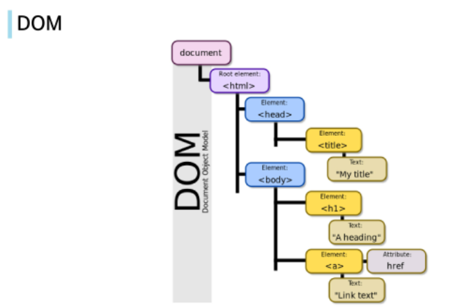
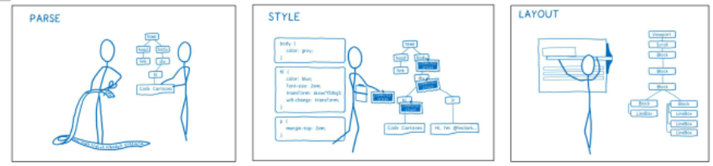
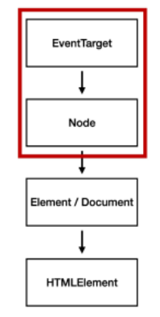
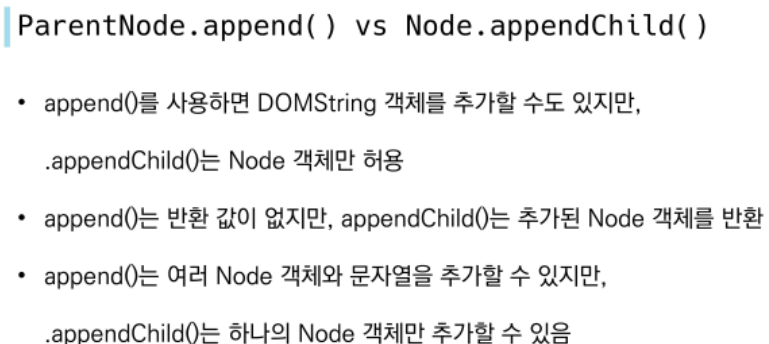
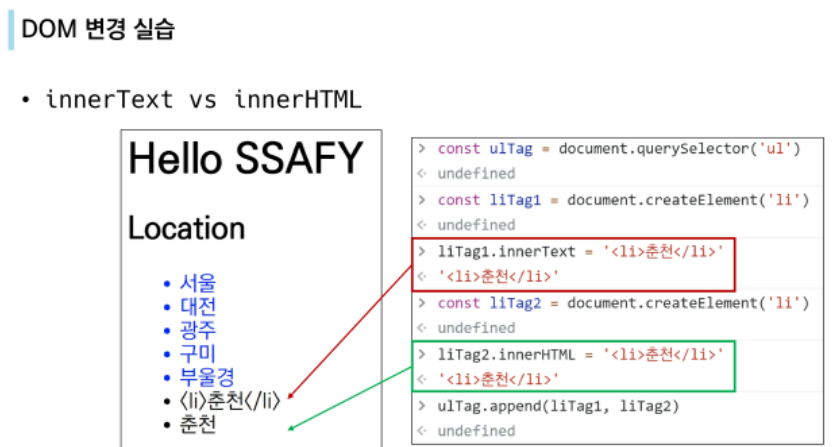
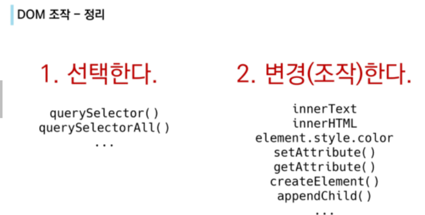

# JavaScript 03
## DOM 조작과 EVENT
[toc]

### DOM(Document Object Model)
#### 브라우저에서 할 수 있는 일
- DOM 조작/ BOM 조작/ JavaScript Core/
#### DOM?
- HTML, XML과 같은 문서를 다루기 위한 문서 프로그래밍 인터페이스
- 문서를 구조화하고 구조화된 구성 요소를 하나의 객체로 취급하여 다루는 논리적 **트리 모델**
- window/ document/ navigator...

##### DOM -해석
- 파싱(Parsing) : 구문 분석, 해석/ 브라우저가 문자열을 해석하여 DOM Tree로 만드는 과정

#### BOM?
- Browser Object Model
- JS가 브라우저와 소통하기 위한 모델/ 브라우저의 창이나 프레임을 추상화하여 프로그래밍적으로 제어하는 수단/ 버튼, URL 입력창 등 브라우저 윈도우 및 웹페이지 일부분을 제어가능

### DOM 조작
- Document는 문서 한장(HTML)에 해당하고 이를 조작/ 선택(Select) - 변경(Manupulation)
#### DOM 관련 객체의 상속 구조
- Event Target : Event Listener를 가질 수 있는 객체가 구현하는 DOM인터페이스
- Node : 여러 가지 DOM 타입들이 상속하는 인터페이스
- Element : Document 안의 모든 객체가 상속하는 가장 범용적인 인터페이스/ 부모인 Node와 그 부모인 EventTarget의 속성을 상속
- Document : 브라우저가 불러온 웹 페이지/ DOM트리의 진입점(enry point)역할
- HTMLElement : 모든 종류의 HTML 요소

#### DOM 선택 - 선택 관련 메서드
- document.querySelector(selector) : 제공한 선택자와 일치하는 element 하나 선택/CSS selector를 만족하는 첫 번째 element 객체를 반환
- document.querySelectorAll(selector) : 제공한 선택자와 일치하는 여러 element를 선택/ 일치하는 NodeList를 반환
	- 위 두개 메서드는 id, class, tag 등을 선택자로 사용가능하여, 구체적이고 유연하게 사용 가능하다.
#### DOM 선택 - HTMLCollectior & NodeList
- 배열과 같이 각 항목에 접근하기 위한 index 제공(유사 배열)
- HTMLCollection : name, id, index 속성으로 각 항목에 접근 가능
- NodeList : index로만 각 항목에 접근 가능/ HTMLCollection 과 달리 forEach와 같은 배열에서 사용하는 메서드 사용가능
- 위 두개는 Live Collection으로 변경사항이 실시간으로 반영하지만, querySelectorAll()에 의해 반환되는 NodeList는 Static Collection으로 실시간 반영 X

#### DOM 선택 - Collection
- Live Collection : 문서(HTML)의 변경에 실시간 반영
- Static Collection : 문서의 변경이 실시간 반영 X
- 
#### DOM 변경 - 변경 관련 메서드
- document.createElement() : 작성한 태그 명의 HTML element 생성 반환
- Element.append() : 특정 부모 Node의 자식 NodeList 중 마지막 자식 다음에 추가/ 여러개이 Node객체, DOMString 추가가능/반환값 X
- Node.appendChild() : 한 Node를 특정 부모 Node의 자식 NodeList 중 마지막 자식으로 삽입/ 오직 하나의 Node만 추가 가능/ 만약 주어진 Node가 이미 문서에 존재하는 다른 Node를 참조한다면 새로운 위치로 이동
  - append는 삽입이 잘못되도 오류발생 X/ appendChild는 잘못되면 오류발생함.

#### DOM 변경 - 변경 관련 속성(property)
- Node.innerText : 해당 Node 객체와 그 자손의 텍스트 컨텐츠(DOMString)을 표현
- Element.innerHTML : element 내에 포함된 HTML 마크업을 반환/ XSS 공격에 취약하므로 사용 주의.

#### DOM 삭제 - 삭제 관련 메서드
- ChildNode.remove() : Node가 속한 트리에서 해당 Node를 제거
- Node.removeChild() : DOM에서 자식 Node를 제거하고 제거된 Node를 반환

#### DOM 속성 - 속성 관련 메서드
- Element.setAttribute(name, value) : 지정된 element의 name의 value를 설정/ name이 이미 있다면 갱신, 없다면 추가의 기능을 한다.
- Element.getAttribute(attributeName) : 해당 요소의 지정된 값(문자열)을 반환/ 인자(attributeName)는 값을 얻고자 하는 속성의 이름.

#### DOM 조작 - 정리

### Event
####  Event(이벤트) 개념
- 네트워크 활동이나 사용자와의 상호작용 같은 사건의 발생을 알리기 위한 객체
- 이벤트는 마우스 클릭, 키보드 사용 드으이 사용자 행동으로 발생한다.

#### Event 기반 인터페이스
- AnimationEvent, ClipboardEvent, DragEvent 등
- UIEvent : 간단한 사용자 인터페이스 이벤트
- ~ 하면 ~ 한다.

#### Event handler - addEventListener()
- EventTarget.addEventListener() : 지정한 이벤트가 대상에 전달될 때마다 호출할 함수를 설정/ 이벤트에 지원하는 모든 객체(Element, Document, Window) 를 대상으로 지정 가능
- target.addEventListener(type, listener[, optins])
	- type : 반응 할 이벤트 유형('input','scroll','click' 등등)/ listener : 지정된 타입의 이벤트가 발생했을 때 알림을 받는 객체(EventListener인터페이스 or JS function 객체여야 함/ 이벤트 발생시 수행되는 객체(ex: 함수))
	- listener에 function() 이 아닌 function을 넣는다.(결과를 넣는냐, 하는 방법을 넣느냐의 차이)
- **"대상(EventTarget)에 특정 이벤트(type)가 발생하면, 할 일(listener)을 등록하자." : EventTarget.addEventListener(type, listener)**
- JS의 여러가지 함수 선언을 사용하여 listener 구현이 가능하다!

#### Event 취소
- event.preventDefault() : 현재 이벤트의 기본 동작을 중단.
- HTML 요소의 기본 동작을 작동하지 않게 막음( a 태그의 기본동작 = 클릭시 링크로 이동, form 태그 = form 데이터 전송) → 각 요소의 기본동작이 존재한다.
- 이벤트를 취소할 수 있는 경우. 이벤트의 전파를 막지 않고 그 이벤트를 취소.
- 응용예시) 게시글을 지우기전 "정말 지우시겠습니까?"의 확인작업 올리기 위해 일단 event의 동작을 일시 정지할때.

