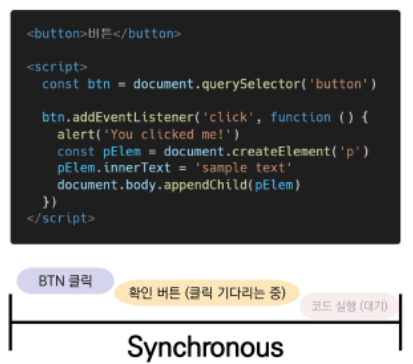
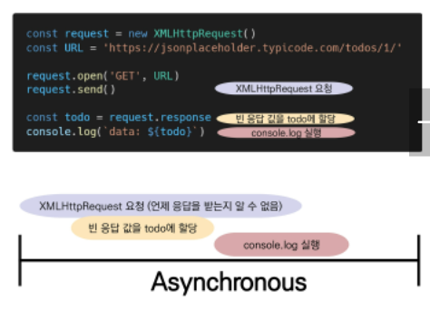
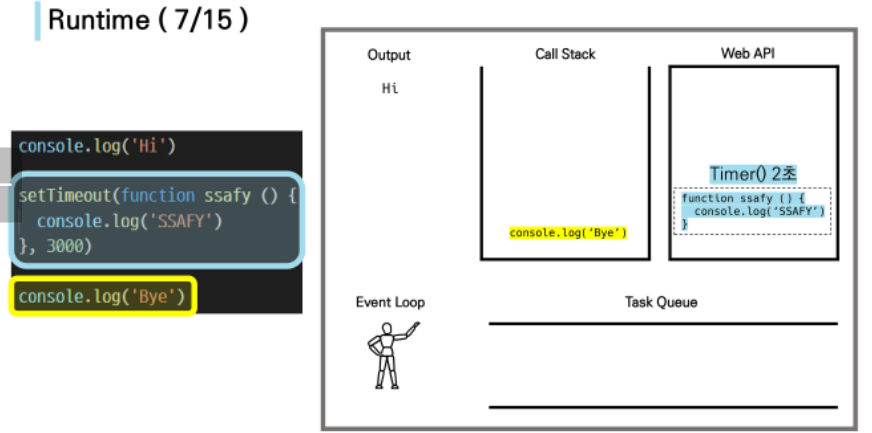
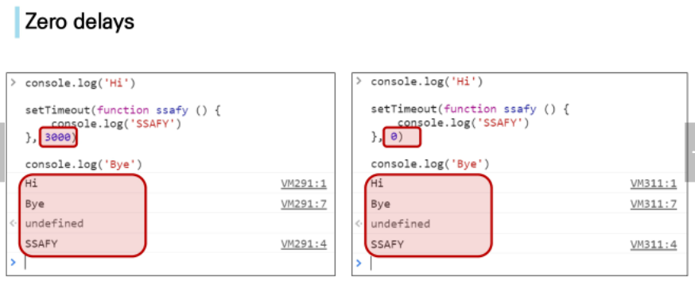
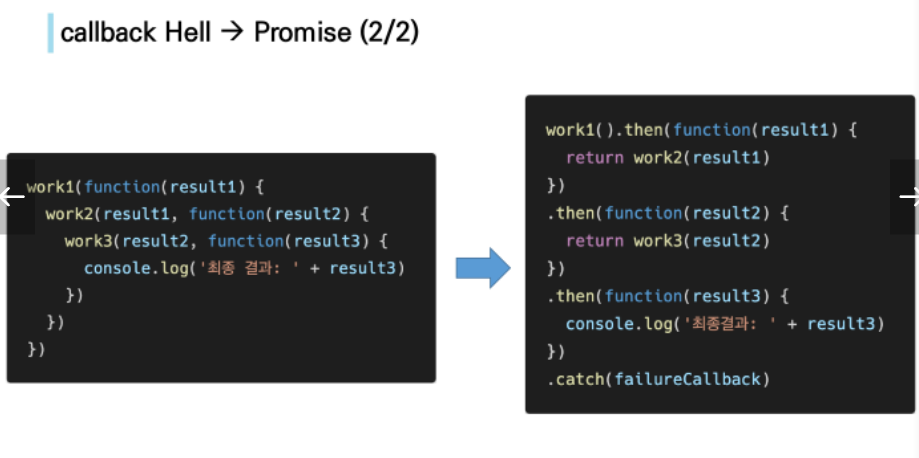
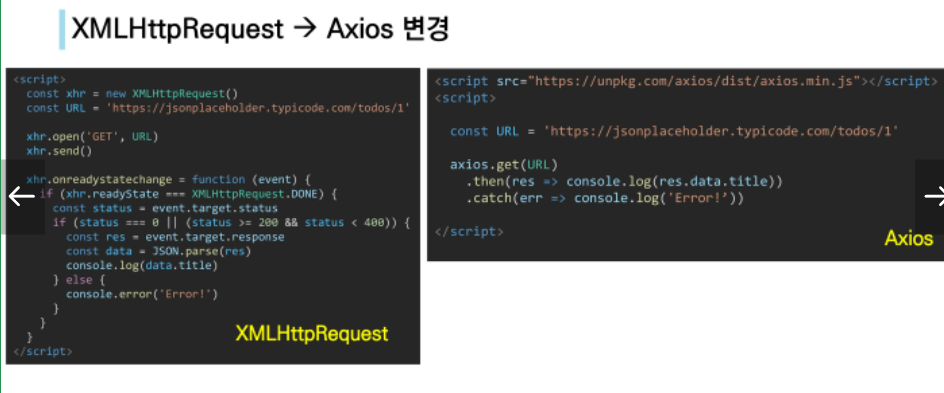
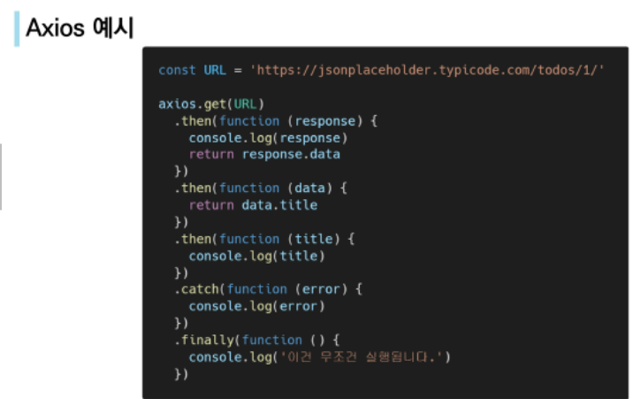
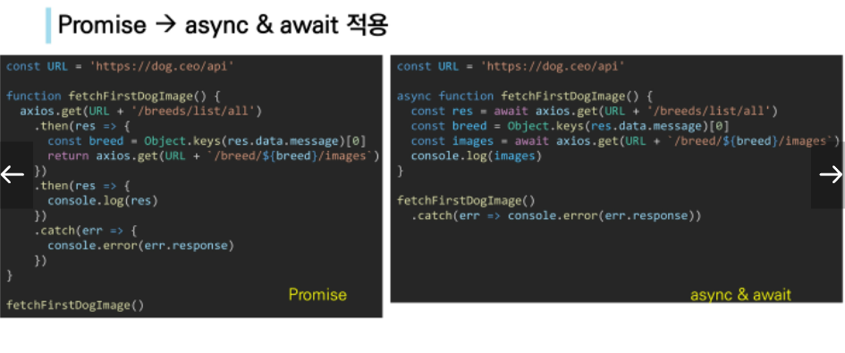

# JavaScript 03
## axios를 이용한 비동기 통신 개념
[toc]

### AJAX
#### AJAX 란
- **Asynchronous JavaScript And XML**(비동기식 JavaScript와 XML)
- 서버와 통신하기위해 XMLHttpRequest 객체 활용
- 다양한 데이터 포맷을 주고 받을 수 있다.
#### AJAX 특징
- 페이지 전체를 reload(새고 고침)를 하지 않고서도 수행되는 **비동기성**
- 페이지 새로 고침없이 서버에 요청/ 서버로부터 데이터를 받고 작업을 수행과 같은 정적인 작업이 아닌 동적인 작업이 가능하다.

#### XMLHttpsReqest 객체
- 서버와 상호작용하기 위해 사용되며 전체 페이지의 새로 고침 없이 데이터를 받아올 수 있다.
- 사용자의 작업을 방해하지 않으면서 페이지 일부를 업데이트 가능.
- XML뿐만 아니라 모든 종류의 데이터를 받아올 수 있다.

### Asychronous JavaScript

#### 동기성
- **순차적, 직렬적** Task 수행/ 요청을 보낸 후 응답을 받아야만 다음 동작이 이루어짐(Blocking)



- 버튼 클릭후 alert 메세지의 확인 버튼을 누를때까지 문장이 만들어지지 않는다./ alert 이후의 코드는 alert의 처리가 끝날 때까지 실행되지 않는다.
- ##### "JavaScript는 single threaded"이기 때문에.

#### 비동기식
- **병렬식** Task 수행/ 요청을 보낸 후 응답을 기다리지 않고 다음 동작이 이루어짐.(Non-blocking)



- **요청을 보내고 응답을 기다리지 않고 다음 코드 실행**/ 
- 결과적으로 변수 todo에는 응답데이터가 할당되지 않고 빈 문자열이 할당된다.
- 왜 JS는 기다려주지 않는가?
- ##### "JavaScript는 single threaded"이기 때문에.

#### 왜 비동기(Asychronous)를 사용하는가?
- '사용자 경험'
	- 매우 큰 데이터를 동반하는 앱에서 **동기식 코드**라면 데이터를 모두 불러온 뒤 앱이 실행된다.
	- 데이터를 불러오기 전까지 앱이 멈춘것 처럼 보인다.

	- **비동기식 코드** 에서는 데이터를 요청하고 응답 받는 동안, 앱 실행을 함께 진행한다.
	- 데이터를 불러오는 동안 지속적으로 응답하는 화면을 보여줌으로 더욱 쾌적한 사용자 경험을 제공한다
- blocking : 1개의 작업을 마치면 다음 작업으로 실행/ Non-Blocking : 1개의 작업 요청(응답이 이 오든 안오든) 다음작업 진행. 

#### "JavaScript는 single threaded이다"
- 컴퓨터가 여러 개의 CPU를 가지고 있어도 main thread라 불리는 단일 스레드에서만 작업 수행.
- 이벤트를 처리하는 **Call Stack** 이 하나인 언어
- 위를 개선하기 위해 JavaScript는
	1. 즉시 처리 못하는 이벤트들을 **다른 곳(WEB API)**으로 보내서 처리
	2. 보내진 이벤트들을 처리된 순서대로 **대기실(Task queue)**에 줄을 세워놓고
	3. Call Stack이 비면 **담당자(Event Loop)**가 대기 줄에서 가장 오래된 이벤트를 Call Stack으로 보냄.

#### Concurrency model
- Event Loop를 기반으로 하는 **동시성 모델(Concurrency model)**
1. Call Stack : 요청이 들어올 때마다 해당 요청을 순차적으로 처리하는 Stack(LIFO)형태 구조
2. Web API(Browser API) : JavaScript 엔진이 아닌 브라우저 영역에서 제공하는 API - DOM events, AJAX로 데이터를 **가져오는 시간이 소요되는 일들을 처리.**
3. Task Queue (Event Queue, Message Queue) : 비동기 처리된 callback 함수가 대기하는 Queue(FIFO)형태 구조/ main thread가 끝난 후 실행되어 후속 JavaScript 코드가 차단되는 것을 방지
4. Event Loop : Call Stack이 비어있는지 확인/ 비어있다면 Task Queue에서 실행 대기중인 callback 함수 있는지 확인/ 대기중인 함수가 있다면 가장 앞의 callback함수를 Call Stack으로 push ( Queue의 자료구조에 따라.)



- 동시성 모델 동작 예시.

  순서에 따라 실행되지만, 실행순서와 다르게 Hi와 Bye는 출력이 되고, 동작 시간이 설정된 setTimeout의 SSAFY는 마지막에 출력된다. setTimeout과 같은 함수에 의해 **시간이 걸리므로** Web API로 넘어가서 조건이 만족되면(시간이 지나면) Task Queue로 이동하고 해당 함수가 실행된다.

#### Zero delays



- setTimeout에 시간을 3000ms로 하든 0ms로 하든 대기하고 실행되는건 같음.
- delay(지연)는 JavaScript가 요청을 처리하는 데 필요한 최소 시간이기 때문이다.
- 기본적으로 setTimeout 함수에 특정 시간제한을 설정했더라도 대기 중인 메시지의 모든 코드가 완료될 때까지 대기해야 한다.

#### 순차적인 비동기 처리하기.
- Web API로 들어오는 순서는 중요하지 않고, 어떤 이벤트가 먼저 처리되느냐가 중요하다( === 실행 순서 불명확)

- 이를 해결하기 위한 순차적인 비동기 처리를 위한 2가지 작성 방식
	1. Async callbacks : 백그라운드에서 실행을 시작할 함수를 호출 할 대 인자로 지정된 함수. ex) addEventListner()의 두번째 인자
	2. promise-style : Modern Web APIs에서의 새로운 코드 스타일/ XMLHttpRequest 객체를 사용하는 구조보다 조금 더 현대적인 버전.
	

### Callback Function 

- 다른 함수에 인자로 전달된 함/ 외부 함수 내에서 호출되어 일종의 루틴 또는 작업을 완료
- 동기, 비동기식 모두 사용된다./ 비동기 작업이 완료된 후 코드 실행을 계속하는 데 사용되느 경우를 비동기 콜백(asynchronous callback)이라고 한다.

### JavaScript의 함수는 "일급 객체(Fist Class Object)다"
- 일급 객체(일급 함수) : 다른 객체들에 적용할 수 있는 연산을 모두 지원하는 객체
- 일급 객체의 조건 : 인자로 넘길 수 있어야 하고, 함수의 반환 값으로 사용 가능, 변수에 할당 할 수 있어야 한다.

#### Async callbacks
- 백그라운드에서 코드 실행을 시작할 함수를 호출할 때 인자로 지정된 함수/ 백그라운드 코드 실행이 끝나면 callback 함수를 호출하여 작업이 완료되었음을 알리거나, 다음 작업을 실행하게 할 수 있음.
- callback 함수를 다른 함수의 인수로 전달할 때, 함수의 참조를 인수로 전달할 뿐이지 즉시 실행되지 않고, 함수의 body에서 "called back"된다. 정의된 함수는 때가 되면 callback 함수를 실행하는 역할을 한다.

#### Why use callback?
- **callback 함수는 명시적인 호출이 아닌 특정 루틴 혹인 action**에 의해 호출되는 함수
- Django의 "요청이 들어오면", event의 "특정 이벤트가 발생하면" 과 같은 조건으로 함수를 호출할  수 있었던건 "Callback function" 개념때문에 가능하다.
- 비동기 로직을 수행할 때 callback 함수는 필수.

#### callback Hell 
- 순차적인 연쇄 비동기 작업을 처리하기 위해 "callback 함수 호출, 그다음 callback 함수 호출, .... 반복"의 패턴이 반복된다. 이때 발생하는 상황(callback hell(콜백 지옥), pyramid of doom(파멸의 피라미드))
- 위와 같은 상황이 벌어지면, 디버깅, 코드 가독성에 문제가 생긴다.

#### callback Hell 해결하기
1. Keep your code shallow (코드의 깊이를 얕게 유지)
2. Modularize (모듈화)
3. Handle every single error (모든 단일 오류 처리)
4. Promise callbacks (Promise 콜백 방식 사용)

### Promise
#### Promise object
- **비동기 작업의 최종완료 또는 실패를 나타내는 객체** : 미래의 완료, 실패, 그 결과 값을 나타낸다./ 미래의 어떤 상황에 대한 약속
- 성공이 대한 약속 : .then() 
	- **.then(callback)** : 이전 작업(promise)이 성공했을때, 수행할 작업을 나타내는 callback 함수/ then의 callback은 이전 작업의 성공 결과를 인자로 전달 받는다. / 성공했을때 의 코드를 callback 함수 안에 작성한다.
- 실패에 대한 약속 : .catch()
	- **.catch(callback)** : .then이 하나라도 실패하면 동작한다. 이전 작업의 실패로 인해 생성된 error 객체는 catch의 블록 안에서 사용 가능하다. 
- 각각의 .then() 블록은 서로 다른 promise를 반환한다. → .then()을 여러개 사용(chaining)하면 연쇄적인 작업을 수행 할 수 있다. → 여러 비동기 작업을 차례대로 수행 가능하게 된다!
- .then() 과 .catch() 메서드는 모두 promise를 반환하기 때문에 chaining 가능하다.
- 주의 사항 : **반환 값이 반드시 있어야한다.**, 없다면 callback 함수가 이전의 promise 결과를 받을 수 없다.
- **.finally(callback)** : Promise 객체 반환/ 이전의 then, catch의 결과와 상관없이 무조건 지정된 callback 함수가 실행된다./ 어떠한 인자도 전달되지 않는다./ 성공, 실패 여부와 상관없이 무조건 실행되어야 하는 절에서 활용된다. → .then()과 .catch() 블록에서의 코드 중복을 방지한다.



- 위와 같이 계단식으로 깊게 형성된 함수를 Promise 객체를 통해 해결할 수 있다.

#### Promise가 보장하는 것
- Async callback 작성 스타일과 달리 Promise가 보장하는 특징
1. callback 함수는 JavaScript의 Event Loop가 현재 실행 중인 Call Stack을 완료하기 이전에는 절대 호출되지 않음.
2. 비동기 작업이 성공하거나 실패한 뒤에 .then() 메서드를 이용하여 추가한 경우에도 1번과 똑같이 동작
3. .then()을 여러번 사용하여 여러 개의 callback 함수를 추가할 수 있다(Chaining) → Promise의 가장 뛰어난 장점.

### Axios
#### Axios
- "XHR"이라는 브라우저 내장 객체를 활용해 AJAX 요청을 처리하는데, 이보다 편리한 AJAX 요청이 가능하도록 도움을 줌./ 확장 가능한 인터페이스와 함께 패키지로 사용이 간편한 라이브러리를 제공.



- 위 비교를 보면 알 수 있듯이, 적은 코드로 같은 일이 가능하다. URl 요청, 파싱, 함수 실행 등의 과정을 보다 편리하게 수행가능하다.



```js
axios.get(URL)
	.then(function (a) {
    ///
    return a.b
})
	.then(function (b) {
    return b.c
})
```

- 위와 같이 a의 b의 값을 리턴하여 다음 b로 넘어가고, b의 c값을 리턴하여 다음 값으로 넘어간다.
#### [부록] async & await
- 비동기 코드를 작성하는 새로운 방법
- 기존 Promise 시스템 위에 구축된 syntactic sugar(문법적 설탕)
	- Promise 구조의 then chaining을 제거
	- 비동기 코드를 조금 더 동기 코드처럼 표현
	- 
#### Promise → async & await 적용
0. aysnc & await를 사용하기 위해 함수를 묶어야 한다.
1. 해당 함수 맨 앞에 async 라는 키워드로 표시를 남긴다
2. 함수 블록 내부에, 비동기로 동작하는 함수들을 찾아서 앞에 await 키워드를 남긴다.



