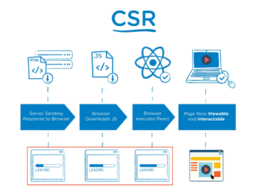
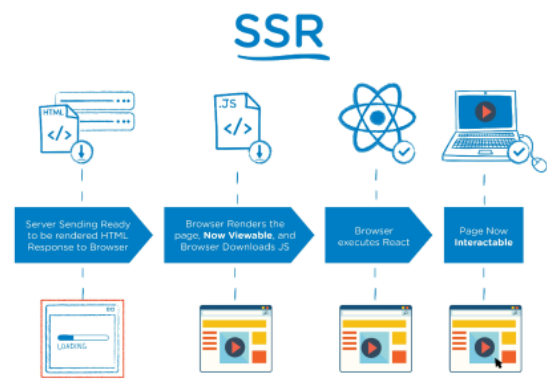
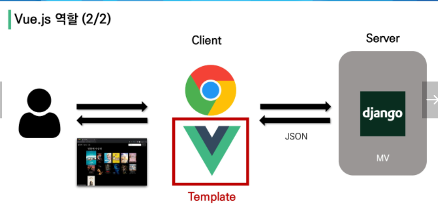
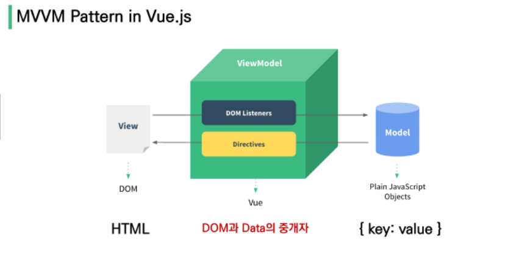
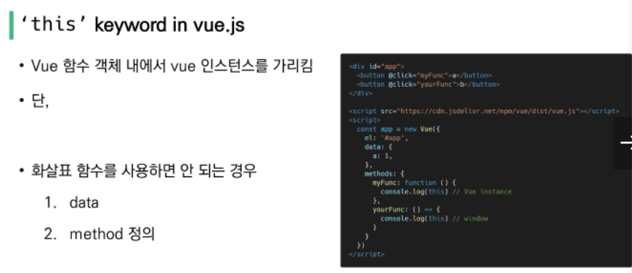
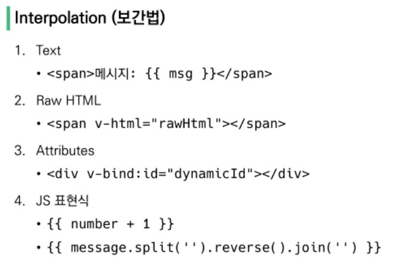
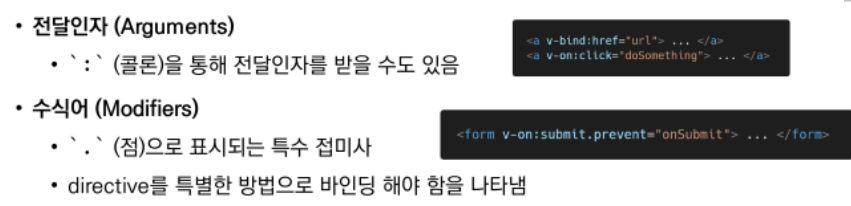
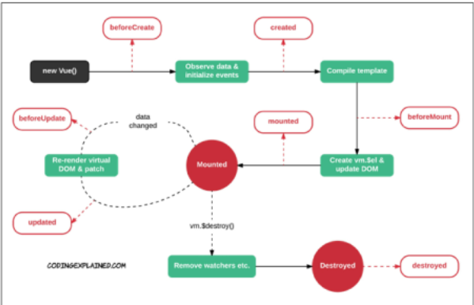

# Vue_01
## Vue 01 
[toc]

## Vue.js
### Intro
#### Front-End Development
- HTML, CSS 그리고 JS를 활용하여 데이터를 볼 수 있게 만들어줌 
	- 위 작업을 통해 사용자(User)는 데이터와 상호작용 할 수 있음.
- 대표적 프론트엔드 프레임워크 : Vue.js, React, Angular

#### Vue.js
- 사용자 인터페이스를 만들기 위한 진보적인 자바스크립트 프레임워크
- 현대적인 tool과 다양한 라이브러를 통해 SPA(Single Page Application)를 완벽 지원

#### SPA
- Single Page Application(단일 페이지 애플리케이션)
- 현재 페이지를 동적으로 렌더링함으로써 사용자와 소통하는 웹 애플리케이션
- **단일 페이지**로 구성되며 서버로부터 최초에만 페이지를 다운로드하고, 이후는 동적으로 DOM을 구성
	- 새로고침을 통해 새로운 페이지를 받는게 아니라, 처음 페이지에서 필요한 부분을 동적으로 다시 작성
- 연속되는 페이지 간의 사용자 경험(UX, User Expierience)을 향상
	- 모바일 사용량이 증가하고 있는 현재, 트래픽의 감소와 속도, 사용성, 반응성의 향상이 매우 중요.
- 동작 원리의 일부가 CSR(Client Side Redering)의 구조를 따름

#### SPA 등장 배경
- 과거는 요청에 따라 매번 새로운 페이지를 응답하는 웹사이트 (MPA, Multi Page Application)
- 스마트폰의 등장으로 모바일 최적화의 필요성 대두.
- 위와 같은 문제 해결을 위해 Vue.js와 같은 프론트엔드 프레임워크 등장(CSR, SPA)
- 1개의 웹 페이지에서 여러 동작이 이뤄지며, 모바일 앱과 비슷한 형태의 사용자 경험 제공.

#### CSR
- **Client Side Rendering**
- 서버에서 화면을 구성하는 SSR방식과 달리 **클라이언트**에서 화면을 구성.
- 최초 요청시 HTML, CSS, js 등 데이터를 제외한 각종 리소스 응답 받고, 필요한 데이터만 요청해 jS로 DOM을 렌더링
- 즉, 뼈대만 처음에 받고, 브라우저에서 동적으로 DOM을 그림.
- SPA가 사용하는 렌더링 방식.

- 장점
  1. 서버와 클라이언트 간 트래픽 감소
  2. 사용자 경험 향상
- 단점
  1. SSR에 비해 전체 페이지 최종 렌더링 시점이 느림
  2. SEO(검색 엔진 최적화)에 어려움이 있다.

#### SSR
- **Server Side Rendering**
- 서버에서 클라이언트에게 보여줄 페이지를 모두 구성하여 전달하는 방식
- JS 웹 프레임워크 이전에 사용되던 전통적 렌더링 방식.

- 장점 
	1. 초기 구동 속도가 빠르다.
	2. SEO(검색 엔진 최적화)에 적합
- 단점 
	1. 모든 요청마다 새로운 페이지를 구성하여 전달. → 변화가 생길때마다 새로고침이 발생.(트래픽이 증가.)

#### SSR & CSR
- 두 방식의 차이는 **렌더링의 주최가 누구**인가에 따라 결정.
- 실제 브라우저에 그려질 HTML을 서버가 만들면 SSR, 클라이언트가 만들면 CSR
- SSR : Django에서 Axios를 활용한 좋아요/ 팔로우 로직 → Server에서 완성된 HTML을 제공하는 구조 ( SSR )
- CSR : AJAX를 활용해 비동기 요청으로 필요한 데이터를 클라이언트가 서버로 직업요청 → JS를 활용해 DOM을 조작.

### Why Vue.js?
- 왜 사용하지? : 현대 복잡한 웹구조는 Vanilla JS 만으로는 관리가 어렵다.
	- Vue는 간편하고, 동시다발적 관리가 가능하다(**Data 에 대한 관리를 통해**)

### Concepts of Vue.js
#### MVVM Pattern
- 애플리케이션 로직을 UI로부터 분리하기 위해 설계된 **디자인 패턴**

#### MV
- Model
	- Vue에서 JS object를 지칭한다.  View Instance(View Model) 내부에 data로 존재.
	- data가 변경되면 View(DOM,HTML)이 반응한다.
- View
	- Vue에서 DOM(HTML)지칭
- ViewModel
	- Vue에서 Vue Instance를 지칭한다.
	- View와 Model 사이의 Data, DOM에 관련된 모든 일을 처리.

### Quick Start of Vue.js
- Django에서는 url → views → template 순서로 작성/ Vue에서는 Data 로직 → DOM 작성
1. HTML상에 Vue CDN 추가.
2. HTML상의 node에 유일한 id를 주고, script상에서 vue instance에 해당 id를 할당하고 처리작업 진행.

### Basic syntax of Vue.js
#### Vue instance
- 새로운 Vue instance를 생성/ 해당 instance의 option을 설정하여 원하는 동작 구현
- Vue Instance === Vue Component

#### Options/DOM
1. 'el' : instance 에 mount(연결)할 DOM(HTML)의 요소 id(id, class, 등등 다 가능) 할당.
2. 'data' : instance의 데이터 객체/ 상태 데이터 정의/ v-bind, v-on 과 같은 directive로 사용가능./ Vue 객체 내에서는 this를 통해 접근한다.
3. 'methods' : Vue 인스턴스에 추가할 메서드/ Vue 객체 내 다른 함수에서 this 키워드를 통해 접근 가능/ **화살표 함수로 메서드 정의하면 안됨!!** : 화살표 함수가 부모 컨텍스트를 바인딩하기 때문에, 'this'는 Vue 인스턴스가 아니다.

- 일반 함수 선언에서는 'this'가 Vue instance를 반환/ 화살표 함수에서는 'this'가 window를 반환한다.

### Template Syntax
#### Template Syntax
- 렌더링 된 DOM에 Vue 인스턴스의 데이터를 바인딩하는 문법.

#### Interpolation(보간법)

#### Directive(디렉티브)
- v-접두사 형태의 특수 속성/ 표현식의 값이 변경될때 반응적으로 DOM에 적용함

- v-text : 엘리먼트의 textContent를 업데이트.
- v-html : 엘리먼트의 innerHtml 업데이트/ 사용하지 말것(XSS공격에 취약)
- v-show/ v-if, v-else-if, v-else

    - v-show 와 v-if
    - v-show(Expensive initial load, cheap toggle) : false인 경우 CSS display 속성을 hidden으로 만들어 토글한다.(DOM상에 존재는 하지만 보이지 않음.)
    - v-if ( Cheap initial load, expensive toggle) : false인 경우 렌더링을 하지 않는다.(DOM상에 존재 자체를 안함)
- v-for : 원본 데이터를 기반으로 엘리먼트 or 템플릿 블록 여러번 렌더링.
    - 사용시 key 속성 각요소에 작성할것
    - 되도록 v-if와 같이 사용하지 말것(v-if 가 우선순위 높음)

- v-on : 엘리먼트에 **이벤트 리스너** 를 연결
    - @이벤트타입 or v-on:이벤트타입 으로 사용.

- v-bind : HTML 요소의 속성에 Vue의 상태 데이터를 값으로 할당.
    - attribute = "{ attribute option : Instance data}" 형태로 사용. or v-bind:attribute

- v-model : HTML, form 요소의 값과 data를 양방향 바인딩
    - .lazy/ .number/ .trim 등의 수식어

#### Options/Data - 'computed'
- 데이터를 기반으로 하는 계산된 속성.
- computed 내의 함수가 할당되지만, 반환값이 저장됨. → 함수모양이지만 사용할때는 변수처럼 사용가능하다.
- **종속된 데이터가 변경될 때만 함수를 실행** → 종속된 데이터가 없을시 업데이트되지 않음.
- **computed & method** : computed는 호출시, 종속데이터가 변경시 계산을 다시해서 반환. 변경없으면 원래값 반환함/ method는 종속데이터의 변경여부에 상관없이 호출때 마다 새로 계산하여 반환한다.

#### Option/Data - 'watch'
- 데이터를 감시/ 데이터 변경 발생시 실행됨.
- **computed & watch** : computed는 "선언형 프로그래밍"으로 호출되서 데이터변경감지시 다시 계산후 반환/ watch는 특정 데이터 변화에 따라 할당된 특정 함수를 실행, "명령형 플그래밍"
- 선언형 & 명령형
    - 선언형 프로그래밍 : 데이터를 변경됐을때 무엇이 만들어져야 할까?
    - 명령형 프로그래밍 : 특정 데이터가 변경되면 무슨 일을 해야하지?

#### Option/Data - 'filter'
- 텍스트 형식화 가능
- imterpolation 혹은 v-bind를 이용시 사용가능. 
- html상의 js 표현식에서 |(파이프)뒤에 추가하여 사용 ,ex) {{ abs|filter1|filter2}}

### Lifecycle Hooks
#### Lifecycle Hooks
- 각 Vue 인스턴스는 생성될때 일련의 초기화 단계를 거친다.
- 위 과정에서 각 세부단계에 접근하여 실행 동작을 설정 가능함. ex) created 단계에서 특정 동작 실행.

- 공식문서의 도식를 보고 참고하도록 한다.
