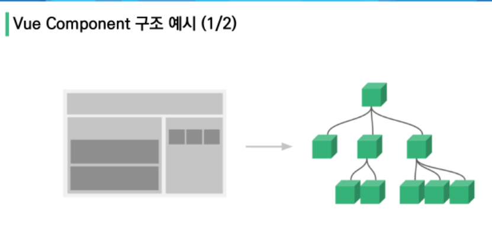
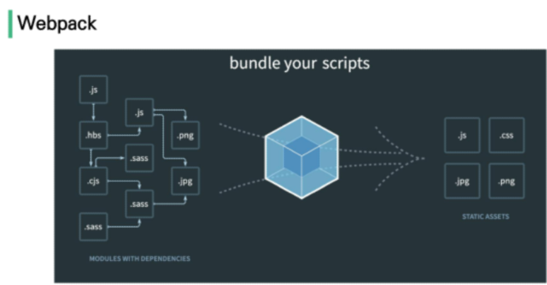
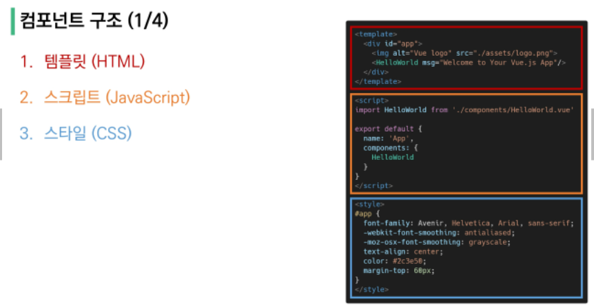
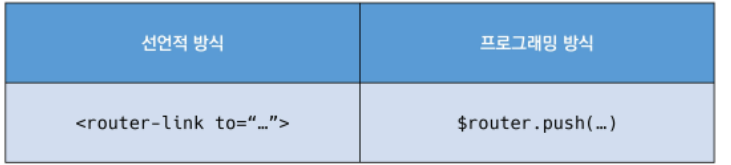
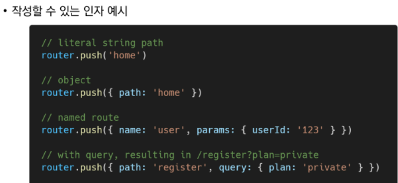
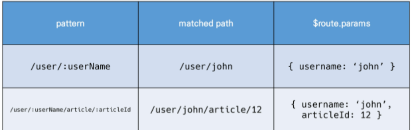

# Vue_02
## Vue
[toc]

## Vue CLI
### SFC
#### Component
- 기존 HTML 엘리먼트를 확장하여 재사용 가능한 코드를 캡슐화
- 유지보수와 재사용성의 측면에서 강력한 기능 제공
- **Vue 컴포넌트 === Vue 인스턴스**


#### SFC(Single File Component)
- Vue의 컴포넌트 기반 개발의 핵심 특징.
- 한 화면의 여러 영역을 각각의 컴포넌트로 관리한다./ .vue 확장자를 가진 싱글 파일 컴포넌트를 통해 개발하는 방식
- **Vue 컴포넌트 === Vue 인스턴스 === .vue파일**

- 기존의 한 화면을 1개의 파일로 관리하던 것을, 한 화면의 각 부분(Component)으로 나누어,
여러개의 파일로 관리한다.



- **단일 파일에서의 개발**의 발생하는 코드 량의 증가에 따른 관리 및 유지보수 비용 증가에 따라. **각 기능 별로 파일을 나눠 개발**하는 방향으로 변화하였다.
- 한 화면 안에서 기능 별로 각기 다른 컴포턴트가 존재한다. 기능 별 컴포넌트는 또 여러 개의 하위 컴포넌트를 가질 수 있다.
- **Vue 컴포넌트**는 const app = new Vue({...})의 app을 의미하며 이는 Vue 인스턴스이다.
- **Vue 컴포넌트는 Vue 인스턴스 이기도하며, Vue 인스턴스는 .vue파일 안에 작성된 코드의 집합이다. .vue 라는 확장자 파일에서는 HTML, CSS, JS들을 통해 관리, 개발한다.**

- 다른 vue파일에서 모듈 import, component에 모듈 등록, 

#### Vue CLI
- Vue.js 개발을 위한 표준 도구.

#### Node.js
- JS를 브라우저가 아닌 환경에서도 구동할 수 있도록 하는 자바스크립트 런타임 환경.

#### NPM(Node Package Manage)
- 자바스크립트 언어를 위한 패키지 관리자. 
	- 파이썬의 pip와 같다.
- Node.js의 기본 패키지 관리자.

#### Vue CLI Quick Start
- 프로젝트 생성 : $vue create appname
- 서버 실행 : $ npm run serve

### Babel & Webpack
#### Babel
- 자바스크립트의 파편화, 표준화의 영향으로 코드의 스펙트럼이 매우 다양하다, 이 에 따라 브라우저 혹은 환경에 따라 동작하지 않을 수 있으므로, 동일한 자바스크립트 버전으로 번역/변환해주는 도구이다.

#### Webpack
- "static module bundler"
- 모듈 간의 의존성 문제 해결을 위한 도구.
	- Module : 1개의 ,js파일을 의미. 각기 다른 역할과 기능이 포함되어 있음.
	- Module 의존성 문제 :모듈의 수가 많아짐에 따라 라이브러리 혹은 모듈 간의 의존성(연결성)이 깊어짐에 따라 어떤 모듈의 문제인지 파익하기 어려워짐.
	- Bundler : 모듈 의존성 문제를 해결해주는 도구./ 여러 모듈을 하나로 묶어주고 묶인 파일은 하나로 합쳐진다.



#### Vue 프로젝트 구조
- public/index.html : Vue 앱의 뻐대
	- src/ components: 하위 컴포넌트들, App.vue :  최상위 컴포넌트
	- package.json : 프로젝트의 종속성 목록과 지원되는 브라우저의 구성 옵션

### Pass Props & Emit Events
#### 컴포넌트 작성
- Vue app 는 자연스럽게 중첩된 컴포넌트 트리로 구성된다./ 컴포넌트간 부모-자식 관계 형성.
- 부모 → 자식 : 데이터 전달 (Pass props), 자식 → 부모 : 동작 알림(Emit event)

#### 컴포넌트 구조

- 템플릿(HTML) : 각 컴포넌트를 작성하는 body
- 스크립트(JavaScript) : JS가 작성되는곳, vue인스턴스의 컴포넌트 정보, 데이터, 메서드 등이 작성됨.
  - 컴포넌트를 스크립트에서 불러오고(import), 등록하고(register) 템플릿에서 보여준다(print)
- 스타일(CSS)

#### Pass Props & Emit Events
##### Props
- 부모 컴포넌트의 정보를 전달하기 위한 사용자 지정 특성.
- 자식 컴포넌트는 props 옵션을 사용하여 데이터를 받는다.
- 모든 props는 상위 → 하위 의 단방향 바인딩이 형성된다.
###### Static Props 작성
- 부모 컴포넌트에서 자식 컴포넌트에 보낼 prop 데이터 선언 : \<parentTag\> prop-data-name = 'value'<.../>

- 자식 컴포넌트에서는 수신할 prop 데이터를 명시적으로 선언하고 사용한다. : export default {}에 props : {} 옵션에 prop 데이터 이름 : 데이터 타입 형식으로 선언 
###### Dynamic Props 작성
- v-bind directive 를 통해 부모의 데이터의 props를 동적으로 바인딩한다. 
- 부모 컴포넌트에서 데이터에 prop 데이터를 명시하고 v-bind(:, 콜론)을 통해 바인딩 한다.
- 자식 컴포넌트에서 수신한 prop 데이터를 명시적으로 선언 후 사용한다. : default에 선언, 템플릿에서 선언한 변수 명에 따라 사용.
###### Props 이름 컨벤션
- 선언시에는 camelCase, 템플릿 상에서는 kebab-case로 사용한다.

###### **컴포넌트의 'data'는 반드시 함수여야 한다**

##### Emit event
- 자식 컴포넌트에서 부모 컴포넌트로 메시지 전송. = 템플릿상에서 v-on을 통해 자식 컴포넌트가 보낸 이벤트를 부모 컴포넌트에서 수신한다.

###### Emit event 작성
- 자식 컴포넌트에서 $emit 인스턴스 메서드를 사용해 특정 이벤트를 트리거 한다.
- 부모 컴포넌트에서는 v-on directive(@, 골뱅이)를 통해 특정 이벤트를 수신한다.
####### event 이름 컨벤션
- props와 달리 항상 소문자로 변환되기 때문에 **kebab-case**를 사용하도록 한다.

### Vue Router
#### Vue Router
- "Vue.js 공식 라우터" : 변수 라우터와 같은 기능.
- $vue add router 로 설치하여 사용.
	- App.vue 코드 변경 발생/ router,index.js 생성/ views 디렉토리 생성

- index.js : 라우트에 관련된 정보 및 설정이 작성됨
- router-link : 사용자 네비게이션을 가능하게 하는 컴포넌트, 목표 경로 "to" prop으로 지정 ex) \<router-link to="/somewhere"\>TEXT\</router-link\>
	- router-link는 클릭 이벤트를 차단하여 새로고침을 방지한다.
- router-view : 주어진 라우터에 대해 일치하는 컴포넌트를 렌더링하는 컴포넌트.

##### History mode 
- 브라우저의 히스토리는 남지만, 실제 페이지로 이동(새로고침)하지 않는 기능 지원.

##### 1.Named Routes
- 이름을 가지는 라우트 : 

```vue
<router-link :to="{name : 'home' }">Text</router-link>
```

##### 2. 프로그래밍 방식 네비게이션
- router-link외의 방법.





##### 3. Dynamic Route Matching
- 동적 인자 전달, :(콜론)으로 시작한다./ 컴포넌트에서 this.$route.params로 사용가능
- 특정 패턴을 가진 라우트를 동일한 컴포넌트에 매핑해야하는 경우.(유저id에 따른 다른 프로필 페이지 이동.)



#### componetns와 views
- App.vue : 최상위 컴포넌트
- views/ : router에 매핑되는 컴포넌트를 모아두는 폴더
- components/ : router에 매핑된 컴포넌트 내부에 작성된 컴포넌트를 모아두는 폴더

#### Why Vue Router?
- SSR에서 CSR로 넘어온 이상. 서버에 대한 요청-응답이 생략되므로, balh..blah..