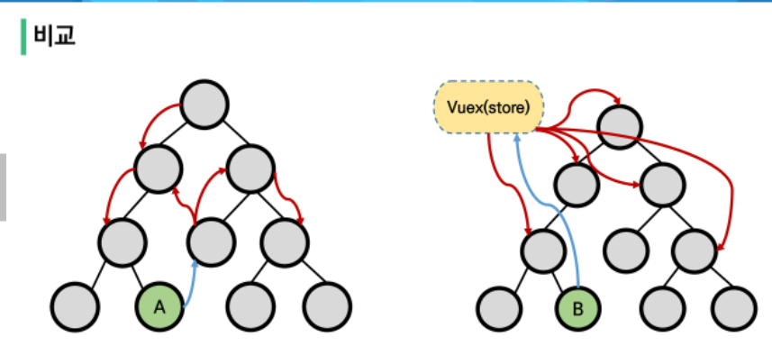
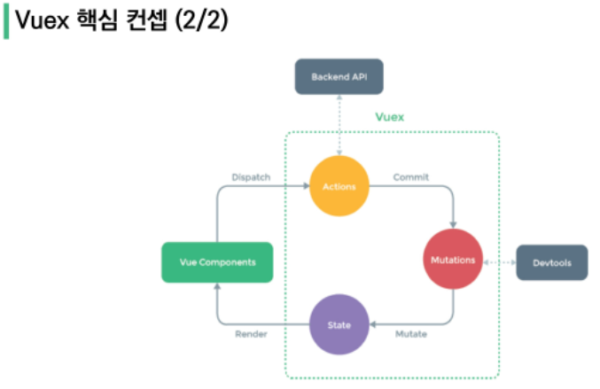
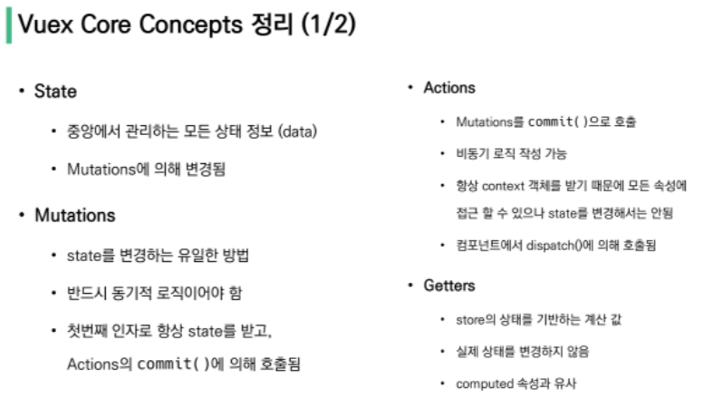
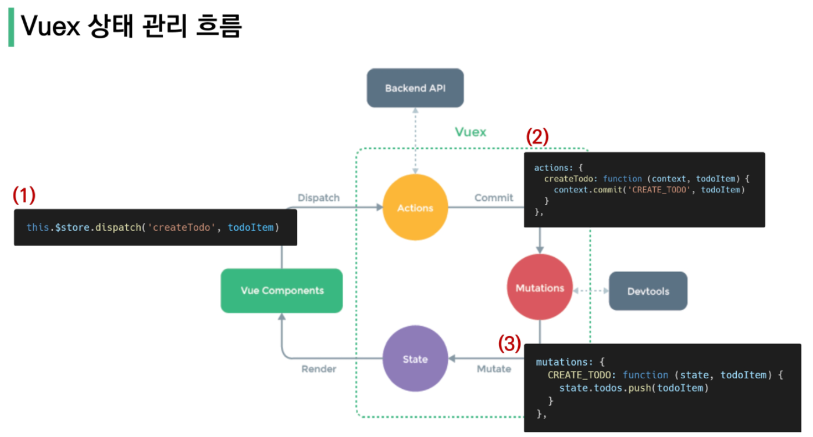

# Vue_03
## Vuex
[toc]

### Vuex Intro
#### Vuex
- "Statement management pattern + Library" for vue.js : 상태 관리 패턴과 라이브러리.
- 컴포넌트 들에 대한 **중앙 집중식 저장소**
##### State
- state는 곧 data, 해당 애플리케이션의 핵심이 되는 요소/ Vuex에서는 중아에서 관리되는 모든 상태 정보.
##### 상태 관리 패턴
- 컴포넌트의 공유된 상태를 추출하고, 이를 전역에서 관리하도록 한다.
- 기존의 부모-자식 관계의 props, emit의 단방향 데이터 흐름에 상관없이 중앙통제를 통해 컴포넌트 간 접근 가능.

#### Vuex management pattern
- 기존의 단방향 데이터 흐름의 props&emit이 아닌, 중앙 저장소(store)에 데이터(state)를 모아놓고 관리한다.
- 규모가 큰(컴포넌트의 중첩, 깊이가 깊은) 프로젝트에서 매우 효율적이다.
- 중앙 저장소의 state만 관리하면 된다. **중앙 저장소의 state가 동일 state를 공유하는 다른 컴포넌트에서도 동기화된다.**



- 좌) 단방향 데이터 흐름/ 우) Vuex를 통한 중앙 집중식 데이터 흐름.
- 단방향 흐름에 의존한 state(상태) 관리에서 Vuex를 활용한 state(상태)관리. 부모-자식(상-하)관계에서 가능한 데이터 전송, 메시지 수신등을 통한 state 관리가 여러개의 component가 아니라, 동기화된 데이터가 저장된 Vuex에서만 관리를 한다.

### Vuex Core Concepts



#### 1. State(=data)
- "중앙에서 관리하는 모든 상태 정보(data)"
	- Vuex는 single state tree를 사용.
- 여러 컴포넌트 내부의 특정 state를 중앙에서 관리한다.
	- 이전에 state를 찾기위해 각 컴포넌트를 확인하는 방식에서, 중앙에서 state 탐색을 진행하면 된다.
- 동기화되어 중앙의 state가 변경시, 관련된 여러 컴포넌트의 DOM(HTML)에서 자동으로 렌더링된다. 

#### 2. Mutations
- "실제로 state를 변경하는 유일한 방법"
- 동기적인 handler 함수 사용 - 변경 시점이 의도한 것과 달라질 수 있으므로,
- 첫번째 인자는 항상 state로 받는다.
- Actions에서 commit()으로 호출된다.

#### 3. Actions
- state를 변경하는 대신 mutations를 commit() 메서드로 호출하여 실행한다.
- mutations와 다르게 비동기 작업이 포함 가능
- context 객체 인자를 받는다.
- 컴포넌트에서 dispatch()에 의해 호출된다.
- "Actions 를 통해 state를 조작 할 수 있지만, state는 오로지 Mutations를 통해서만 조작해야한다."

- **컴포넌트의 dispatch() → Actions수신, commit() → Mutations 수신, state 조작.** 

#### 4. Getters(=computed)
- state를 변경하지 않고 활용하여 계산을 수행(computed와 유사)
- getters 자체가 state를 변경하지 않는다.
	- state를 특정 조건에 따라 구분(계산)하고 구분된 값을 반환한다.

#### Vuex Core Concepts 정리



### Vuex Todo App
#### Set project & components
```bash
1. create proj
$vue create todo-vuex-app
$cd todo-vuex-app

2. Add Vuex plugin in Vue CLI
$vue add vuex
```

- veux plugin 을 추가하여 중앙 저장소 기능을 하는 index.js 추가됨.

#### Create Todo
- store에 state 작성하기.
	- 작성된 state는 컴포넌트에서 $store.state.변수이름 으로 접근한다.
	
- store/index.js에 Action 작성하기.
	- 컴포넌트에서 this.$store.dispatch('함수이름', ...필요인자) 로 호출한다.
	
```js
// store/index.js
actions : {
	actionFunc1 : function( context, ...필요인자){
		context.commit("ACTION-FUNC1", ...필요인자)
	}
},
mutations: {
	ACTION-FUNC1: function(stat, ...필요인자){
		state.데이터.명령(push, splice, 등등)
	}
}
```

- Action 함수는 호출되어, mutations 함수를 호출하고, mutations는 동작하여 state에 대해 처리한다.



#### JavaScript Destructuring assignment(분해 할당)
- 배열의 값이나, 객체의 속성을 고유한 변수로 압축해체(unpack)하는 JS의 표현식.
```js
const commit = context.commit
const state = context.state

const { state, commit } = context

const { commit } = context
```
- 위 할당 식들은 모두 같은 값을 갖는다.

```js
actions: {
	createTodo: function ( context, todoItem) {
		context.commit('CREATE_TODO', todoItem)
	}
},

actions: {
	createTodo: function( {commit}, todoItem){
		commit('CREATE_TODO', todoItem)
	}
}
```
- 위 변수 할당은 모두 같은 값을 갖는다.

### Delete Todo/ Update Todo
- 기능이 포함된 컴포넌트에서 action 함수 호출
- store에서 actions, mutations 선언

- 기본적인 내용에서는 위 과정으로 진행된다 ^^

#### JavaScript Spread Syntax
- "전개 구문"
- 배열이나 문자열과 같은 반복가능한(iterable) 문자를 요소로 확장, 0개 이상의 key-value의 쌍으로 된 객체로 확장 시킬 수 있다.

#### Getters
- store에서 getters에 종속데이터의 변경에 따라 계산한 값을 반환한다.
- 컴포넌트의 computed에서 위에서 계산한 결과를 this.$store.getters.함수이름를 통해 가져온다.
- 컴포넌트의 template에서 사용한다.

#### Component Binding Helper
- JS Array Helper Method 를 통해 배열 조작을 편하게 하는 것과 유사
- 종류 : mapState, mapGetters, mapActions, mapMutations
##### mapState
- **computred와 Store의 state를 매핑**
- Vuex Store의 하위 구조를 반환하여 component 옵션을 생성함.
- 매핑된 computed이름이 state이름과 같을때 문자열 배열을 전달 가능.
```js
this.$store.state.todos 를

import { mapState } from 'vuex'

computed: {
	...mapState([
	'todos',
	])
}, 
```
- 위와 같이 매핑하여 사용가능하다. mapState에 ...의 spread syntax 사용.

##### mapGetters
- **Computed와 Getters를 매핑**
- 해당 컴포넌트 내에서 매핑하고자 하는 이름이 index.js에 정의해 놓은 getters의 이름과 동일하면 배열의 형태로 해당 이름만 문자열로 추가
```js
import { mapGetters } from 'vuex'

...
computed: {
	...mapGetters([
		'gettersName1',
		등등
	])
}
```

##### mapActions
- **action을 전달하는 컴포넌틑 metod 옵션을 만듦**
```js
import { mapActions } from 'vuex'

{
methods: {
	...mapActions([
		'actionsFunc1',
		'actionsFunc2',
	])
  }
}
```
- method처럼 사용하고 필요 인자를 괄호 안에 넣는다.

### LocalStorage
- vuex-persistedstate
- Vuex state를 자동으로 브라우저의 LocalStorage에 저장해주는 라이브러리.
- 페이지가 새로고침 되어도 Vuex state 를 유지시킴.
```bash
$ npm i vuex-persistedstate
```

```js
import createPersistedState from 'vuex-persistedstate'

Vuex.Store({
	plugins: [
		createPersistedState(),
	],
	...
})
```