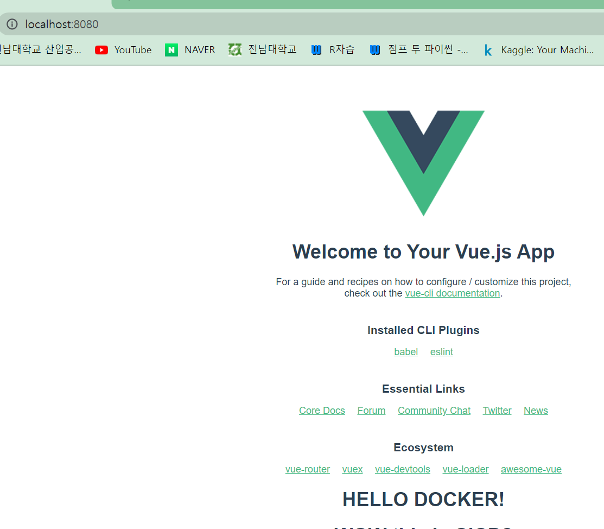

# PJT08
[toc]

## CI/CD
- Continuous Intergration(지속적 통합), Continuous Delivery(지속적인 서비스제공), 또는 Continuous Deployment(지속적인 배포)의 약자로, 애플리케이션 개발 단계를 자동화하여, 애플리케이션 개발 주기를 축햑하는 방법.
- CI/CD 는 애플리케이션 통합, 테스트, 제공, 배포에 이르는 라이프사이클 전체에 걸쳐서 지속적인 자동화와 모니터링을 제공한다. 이러한 구축 사례를**CI/CD 파이프라인**이라고 한다.

## Docker and Jenkins

### Docker
- 애플리케이션 개발, 배송, 실행을 위한 개방형 플랫폼
- 빠르고 일관된 애플리케이션 제공으로 개발 수명 주기를 간소화
	- 컨테이너를 통한 **지속적 통합 및 지속적 전달(CI/CD) 워크플로**에 적합하다.
### Docker Architecture

- 도커 데몬(deamon) : API 요청 수신, 이미지, 컨테이너 와 같은 Docker 객체 관리/ 서로 다른 데몬과 통신 가능
- 도커 클라이언트(client) : Docker 사용자가 Docker와 상호작용하는 기본 방법. 
- 도커 레지스트리 : Docker 이미지 저장. 
- 도커 객체 : 이미지, 컨테이너, 네트워크, 볼륨, 플러그인 및 기타 객체

### 기본 과제

- vue 에서는 

  - IDE내에서 docker 를 통해 dockerizing 하는 방법

  - Dockerfile을 생성하여 dockerizing 하는 방법

 	이 있다. jenkins를 통해 배포하므로, Dockerfile을 생성하여 jenkins 내에서 dockering하는 방법을 실행해보겠다.

1. vue 프로젝트 생성
2. docker 설치후, jenkins 설치
3. localhost:9090에서 jenkins 로그인
4. jenkins에서 필요 플러그인 설치
5. docker에 설치된 jenkins container 내에서 다시 docker 설치
6. 1.에서 생성한 프로젝트의 root directory에 Dockerfile 생성(관련 소스코드는 공식문서의 dockeriziing 참고)
7. 1.의 프로젝트를 gitlab의 repo에 업로드하고, 해당 repo를 jenkins에 연결해준다.
8. Build Trigger와 Build에서 Execute shell에서 build 코드를 기입하고 저장한다.
9. 빌딩 및 배포 시작.

