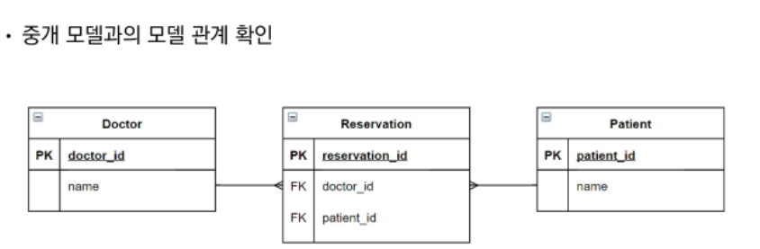
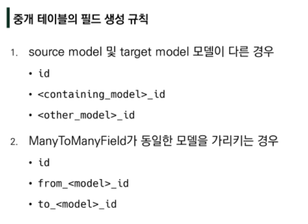
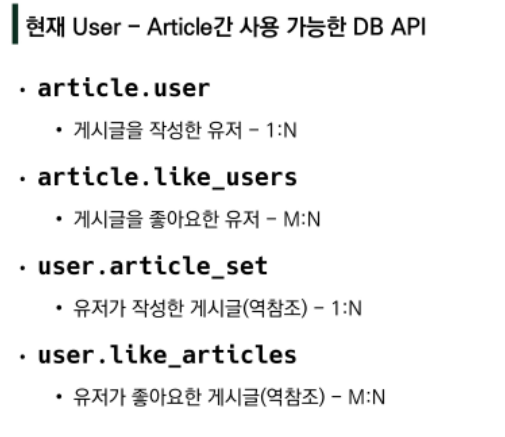

- [Django DB 03](#django-db-03)
	- [Model Relationship II](#model-relationship-ii)
		- [Intro 병원 진료 기록 시스템](#intro-병원-진료-기록-시스템)
			- [병원 진료 기록 시스템을 통한 M:N 관계 학습](#병원-진료-기록-시스템을-통한-mn-관계-학습)
					- [1:M의 한계](#1m의-한계)
					- [중개 모델](#중개-모델)
					- [ManyToManyField](#manytomanyfield)
					- [related\_name](#related_name)
					- [중개 모델(테이블) in Django](#중개-모델테이블-in-django)
		- [ManyToManyField](#manytomanyfield-1)
			- [ManyToManyField 개념 및 특징](#manytomanyfield-개념-및-특징)
			- [ManyToManyField Argument](#manytomanyfield-argument)
		- [Like](#like)
			- [Like 구현하기.](#like-구현하기)
		- [Profile Page](#profile-page)
		- [Follow](#follow)

# Django DB 03
## Model Relationship II
### Intro 병원 진료 기록 시스템
#### 병원 진료 기록 시스템을 통한 M:N 관계 학습
- 환자와 의자, 2개의 객체로 이루어진 진료 기록 시스템.
- 일상의 예시 속 데이터의 흐름을 어떻게 제어할 수 있을까?

###### 1:M의 한계 
```python
class Doctor(model):
	name = TEXT
	
class Patient(model):
	doctor = model.ForeignKey(Doctor)
	name = TEXT
```
- doctor:patient = 1:M 의 관계 형성
- patient는 pk에 따라 1명의 환자로 표현된다. pk=1의 환자가 진료를 마치고 다른 의사에게 진료를 또 받는다고 하면, 새로운 pk를 할당해야하는 비효율적 구현 발생
- 1명의 환자가 2명의 의사에게 진료 예약을 하는것도 비효율적으 구현이 발생한다.

###### 중개 모델
```python
class doctor(model):
	name = TEXT

class patient(model):
	name = TEXT
	
class reservation(model):
	doctor = ForeignKey(doctor)
	patient = ForeignKey(patient)
	## 중개모델 형성.
```



- doctor.reservation_set 과 patient.reservation_set 으로 reservation에 대한 역참조로 1명의 의사에게 할당된 환자, 1명의 환자가 예약한 의사 로 M:N의 관계가 형성 가능하다.

###### ManyToManyField
- 다대다(M:N, many-to-many) 관계 설정 시 사용하는 모델 필드
- 하나의 필수 위치인자가 필요로 하다.
- 위와 같은 중개 모델 구현이 생략가능하다.

```python 
class Doctor(model):
	name = TEXT
	
class Patient(model):
	doctors = ManyToManyField(Doctor)
	name = TEXT
```
-  환자 → 의사 의 관계 형성
-  환자에서 의사 참조/ 의사에서 환자 역참조.

- ManyToManyField 에서 추가 삭제는 add, remove를 사용한다.

###### related_name
- target model(참조 되는 모델)이 source model(참조하는 모델)을 참조할때(역참조), 사용할 manager의 이름을 설정./ ForeignKey의 related_name과 같은 역할을 한다.
```python
class Patient(model):
	doctors = ManyToManyField(Doctor, related_name="patients")
	name = TEXT
```
- 역참조 manager, patient\_set 과 같은 구문을 더 이상 사용 할 수 없다./ patients로 대체됨.

###### 중개 모델(테이블) in Django
- django는 ManyToManyField를 통해 중개 테이블을 자동으로 생성.
- 직접 중개 테이블을 작성하기도 한다.

### ManyToManyField
#### ManyToManyField 개념 및 특징
- 다대다(M:N) 관계 설정 시 사용하는 모델 필드
- 하나의 필수 위치인자가 필요하다.(M:N관계로 설정할 모델 클래스)
- add(), remove()의 RelatedManager을 통해 추가 삭제 가능

#### ManyToManyField Argument
1. related_name
2. through : 중개 테이블을 직접 작성시, through 옵션으로 중개 테이블을 나타내는 Django 모델을 지정 할 수 있다.
3. symmetrical : ManyToManyField 가 동일한 모델(자기자신)에 대해 관계를 형성할때, 대칭적으로 구현된다(A가 B에 대한 방향을 갖는다면, B는 무조건 A에 대한 방향을 갖음). symmetrical=False로 둘 경우, A가 B에 대한 방향을 갖는다고 해서, B가 A에 대한 방향을 가질수도 있고 안 가질수도 있는 비대칭적 관계를 갖게 된다.



### Like
#### Like 구현하기.
- ManyToManyField 작성 후 마이그레이션
```python
class Article(models.Model):
	user = models.ForeignKey(...)
	like_users = models.ManyToManyField(setting.AUTH_USER_MODEL)
```
- 에러 발생
  - like_users 필드 생성 시 자동으로 역참조는 .article_set 매니저를 생성한다. 
  - 이전에 User:Article 관계에서 이미 .article_set 매니저를 사용중이기 때문에 **related_name** 으로 다른 이름을 통한 경로를 선언해주어야 한다.



- QuerySet API - 'exists()'
  - QuerySet 에 결과가 포함되어 있으면 True 반환 그렇지 않으면 False
  - ex) article.like_users.filter(pk=request.user.pk).exists():

### Profile Page
- get_user_model()  로 사용자 이름에 대한 데이터를 받고 profile.html에 표현

### Follow
```python
# accounts/models.py
class User(AbstractUser):
	followings = models.ManyToManyField('self', symmetrical=False, related_name='followers')
```
- migrate.

```python
# accounts/urls.py
urlpatterns = [
...,
	path('<int:user_pk>/follow/', views.follow, name='follow'),
]
# accounts/views.py
@require_POST
def follow(request, user_pk):
	if request.user.is_authenticated:
		## 현재 요청한 사용자의 정보 가져오기.
		person = get_objects_or_404(get_user_model(), pk = user_pk) 
		## url을 통한 사용자 정보와 현재 요청중인 사용자의 정보가 다르다면,
		if person != request.user:
			## 현재 사용자가 탐색중인 사용자를 팔로우 중이라면 언팔
			## 반대라면 팔로우
			if person.followers.filter(pk=request.user.pk).exists():
				person.followers.remove(request.user)
			else:
				person.followers.add(request.user)
		return redirect('accounts:profile', person.username)
	return redirect('accounts:login')
```