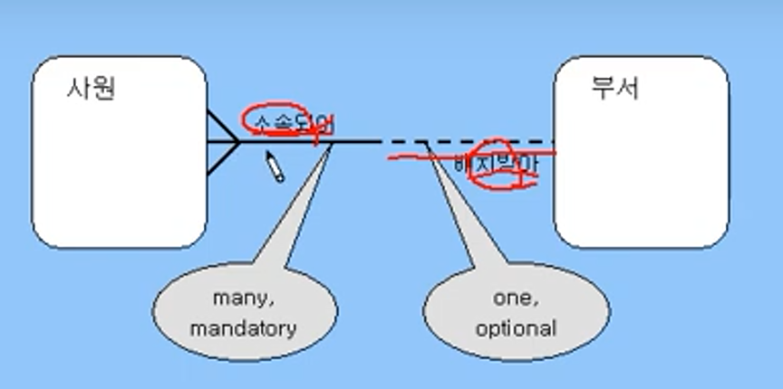
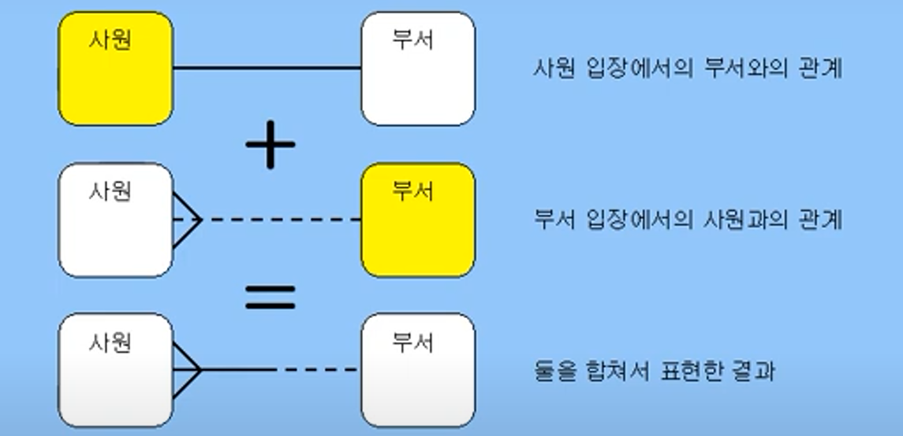
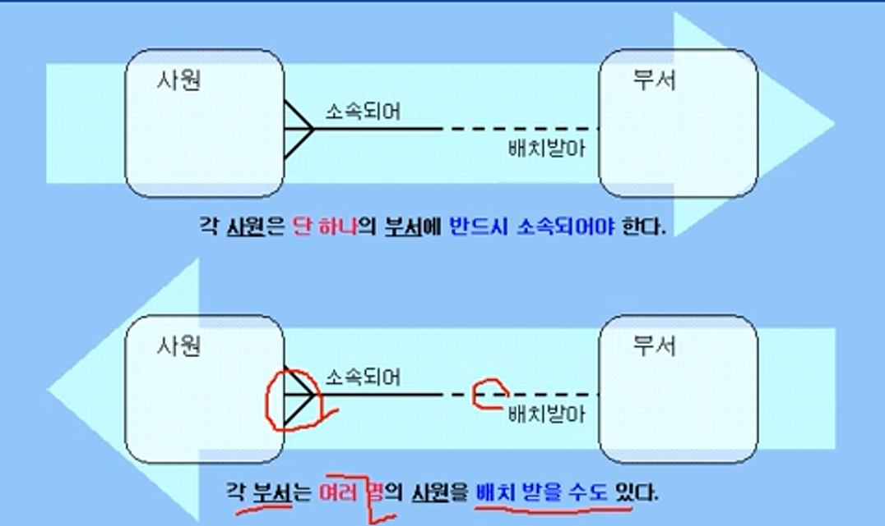
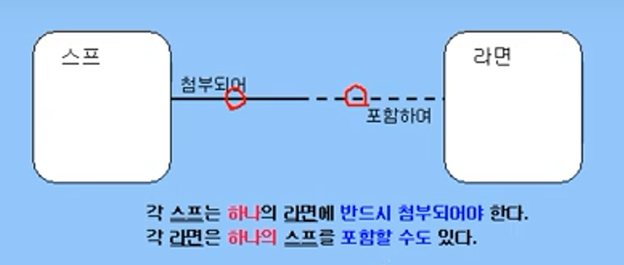
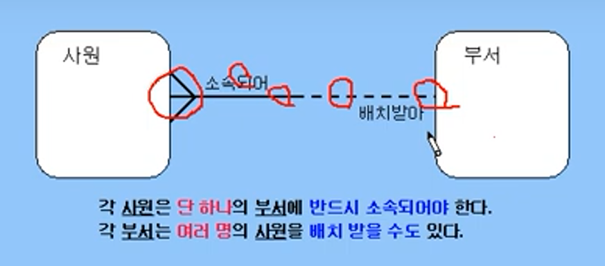
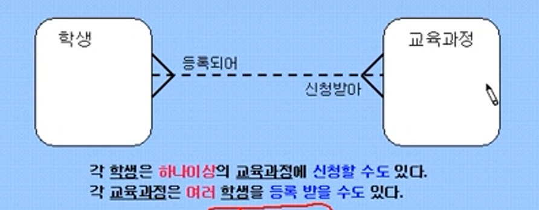
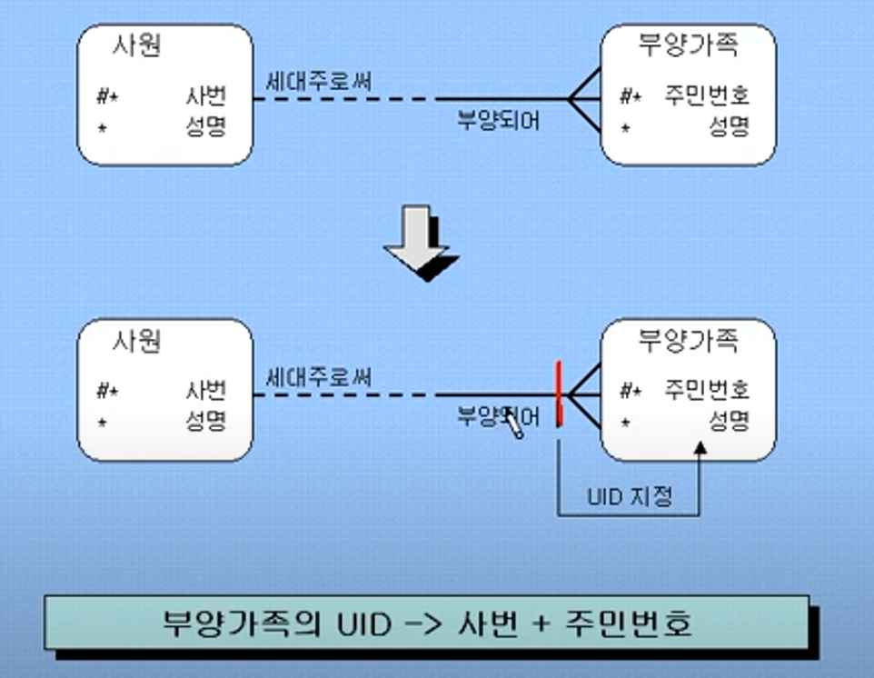
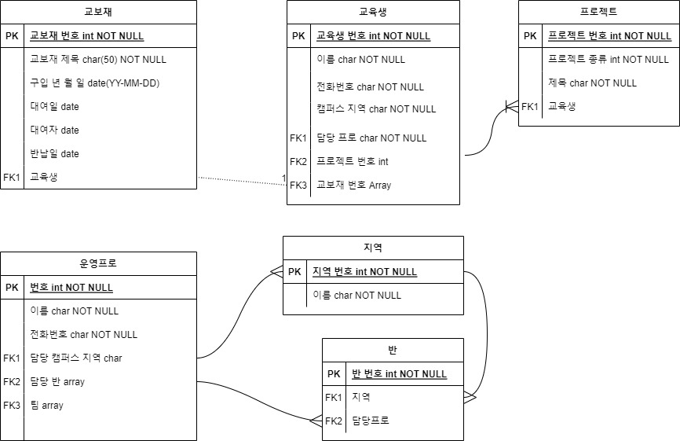

- [계절학기\_2일차](#계절학기_2일차)
	- [PJT 2. Datebase 설계 및 SQL 작성](#pjt-2-datebase-설계-및-sql-작성)
		- [관계형 데이터 모델](#관계형-데이터-모델)
			- [Entity 표현](#entity-표현)
			- [Attribute 표현](#attribute-표현)
			- [Relationship 표현](#relationship-표현)
			- [Relationship 읽기](#relationship-읽기)
			- [관계 형태 - 1:1관계](#관계-형태---11관계)
			- [관계 형태 - M:1 관계](#관계-형태---m1-관계)
			- [관계 형태 - M:M 관계](#관계-형태---mm-관계)
			- [관계형 데이터 모델 - UID Bar](#관계형-데이터-모델---uid-bar)
		- [데이터베이스 설계](#데이터베이스-설계)
			- [Index](#index)
				- [B\*Tree 인덱스](#btree-인덱스)
	- [과제](#과제)

# 계절학기_2일차
## PJT 2. Datebase 설계 및 SQL 작성

### 관계형 데이터 모델
- 데이터 모델은 데이터베이스에 독립적
- 시스템 개발전 보다 많은 아이디어 도출, DB설계 이해를 높이기 위해 데이터 모델링을 한다
- 관계형 데이터 모델은 실체(Entity), 속성(Attruibute), 관계(Relationship)로 구성된 ERD로 표현

#### Entity 표현
- 관리하고자 하는 실체

  

  - 둥근 사각형
  - 이름 = 단수형, 대문자
  - 모든 Entity는 하나 이상의 식별자(UID: Unique Identifier)를 가져야 한다.
  - UID가 없다면 Entity가 아니다.

#### Attribute 표현
- Entity의 속성
- 이름 = 소문자, Entity 이름과 같은면 안됨
- \# = UID, \* = 필수(Mandatory), o = 선택 Attribute 의미

#### Relationship 표현

- 두 Entity 사이에 선을 긋고 관계 명칭 기록
- 선택사항 표시
	- 점선은 선택/ 실선은 필수
- 관계 형태 표시
	- 새 발 모양은 하나 이상(one or more)/ 단 선은 단 하나(one and only one)

- 관계를 표현할때는 어떤 Entity가 주를 이루는가를 따져서 표현한다.

#### Relationship 읽기

- 먼저 한 방향(좌 -> 우)을 읽고, 역방향으로 읽는다.

#### 관계 형태 - 1:1관계

- 양쪽 방향 모두 단 하나씩(one and only one)
- 양방향 모두 반드시(must be)가 되는 경우는 아주 드물다.
- 실제로 동일 Entity일 경우가 많다.

#### 관계 형태 - M:1 관계

- 한 쪽은 하나 이상/ 다른 한쪽은 단 하나씩

- 가장 일반적 관계 형태

- 보통 must be - may be로 지정되나, 양방향 모두 must be가 될 수 도 있다.

  
#### 관계 형태 - M:M 관계

- 양쪽 방향 모두 하나이상(one or more)
- 자주 발생되는 형태이지만, 최종 결과에서는 M:M관계는 나타나지 않는다.
- 상세개념모델링(Advanced Conceptual Data Modeling) 단계에서 M:1관계로 분할된다.

#### 관계형 데이터 모델 - UID Bar

- 새발 표시 뒤에 있는 UID bar에 UID Artrribute를 지정한다.

### 데이터베이스 설계
- Entity를 Table로 Mapping
- Attribute를 Column으로 Mapping
- UID를 Primary Key로 Mapping
- Relationship을 Foreign Key로 Mapping

#### Index
- 인덱스는 데이터베이스 테이블에 대한 검색 성능의 속도를 높여주는 **자료 구조**
- 인덱스를 사용하는 이유
	1. 조건 검색 Where 절의 효율성
	2. 정렬 Orber by 절의 효율성 : Order by는 부하가 많이 걸리므로, index로 그 기능 대체 가능

 	3. MIN, MAX의 효율적인 처리가 가능하다.
- 인덱스의 단점
	1. 정렬 상태를 계속 유지 시켜줘야 함.
	2. 테이블의 전체 데이터 중에서 10 ~ 15% 이하 데이터 처리에만 효율적이고, 그 이상은 아니다. 또한 인덱스 관리를 위해 데이터베이스의 약 10%에 해당하는 저장공간이 추가로 필요하다.
- 인덱스의 관리 : CUD에 따른 인덱스 재정렬을 피하도록 한다.
	- INSERT : 새로운 데이터에 대한 인덱스 추가/ DELETE : 삭제하는 데이터의 인덱스를 사용하지 않는 작업 진행(재사용하지 않아, 삭제시 재정렬할 필요가 없어짐)/ UPDATE: 기존의 인덱스를 사용하지 않음 처리, 갱신 데이터에 대한 인덱스 추가

##### B\*Tree 인덱스
- 가장 많이 사용하는 구조. 밸런스드 트리 인덱스(Balanced Tree Index)
- B Tree 인덱스 중 B\*TREE 와 B+TREE 구조를 가장 많이 사용한다.

- B\*TREE 인덱스는 위와 같이 Root/ Branch/ Leaf Node로 구성된다. 
- 특정 컬럼에 인덱스를 생성하는 순간, 컬럼의 값들은 정렬. 

  - 정렬 순서의 중간 데이터를 Root 블록 지정.
  - Root 블록 기준으로 가지가 되는 Branch 블록을 정의
  - 마지막으로 잎에 해당하는 Leaf 블록에 인덱스의 키가 되는 데이터, RowId를 저장한다.

- 출처
- https://coding-factory.tistory.com/category/DB/Database%20Knowledge
- https://3rdscholar.tistory.com/category/%EB%8D%B0%EC%9D%B4%ED%84%B0%20%EC%82%AC%EC%9D%B4%EC%96%B8%EC%8A%A4/SQL

## 과제
- Entity
	1. 운영프로
		- pk(int , not Null)
		- 이름(char, not Null)
		- 전화번호(char, not Null)
		- fk1. 담당 캠퍼스 지역
		- fk2. 반
		- fk3. 팀
	2. 교보재
		- pk
		- 제목
		- 구입년월일
		- 대여일
		- 대여자
		- 반납일
		- fj1. 교육생
	3. 교육생
		- pk
		- 이름
		- 전화번호
		- 캠퍼스 지역
		- fk1. 운영 프로
		- fk2. 프로젝트
		- fk3. 교보재
	4. 프로젝트
		- pk
		- 프로젝트 순번(1,2,3)
		- 제목
		- fk1 교육생
	5. 지역
		- pk
		- 이름
		- fk1. 담당 프로
		- fk2. 교육생
		- 반
	6. 반
		- pk
		- fk1. 지역
		- fk2. 담당프로
		- fk3. 교육생
	
	
	
	

- SQL
  1. A 프로의 담당 지역과 해당 지역 반
  2. A 프로 담당 반과 해당 반 교육생 이름
  3. 프로젝트 B에 참여하는 교육생 이름
  4. 교육생 C가 참가한 프로젝트에서 가장 많이 만난 교육생의 이름
  5. 현재 연체중인 교보재
  6. 현재 대여중이자 않는 교보재
  7. 교육생 수가 가장 많은 지역 
  8. 이름이 김싸피이고 지역이 D이며 1반인 교육생의 전화번호
  9. 교육생 E의 담당 프로
  10. D 프로가 담당하는 교육생 수
