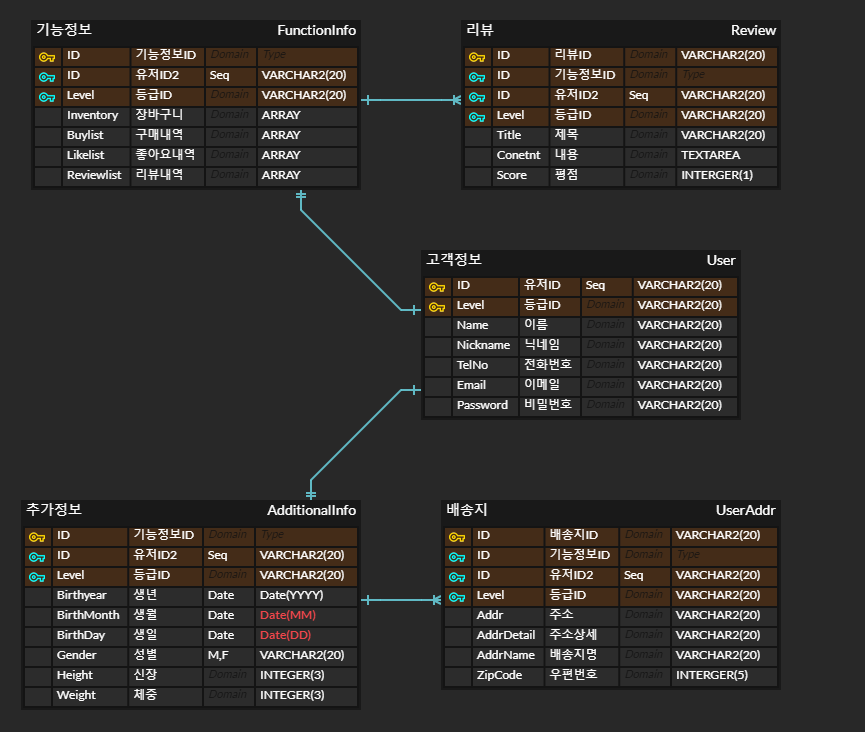

- [관계형 데이터베이스 이해](#관계형-데이터베이스-이해)
  - [과제](#과제)
    - [쇼핑몰의 Database 설계](#쇼핑몰의-database-설계)
      - [개요](#개요)
      - [아이디어 도출 및 기획](#아이디어-도출-및-기획)

# 관계형 데이터베이스 이해

## 과제

### 쇼핑몰의 Database 설계

#### 개요

- 가상의 쇼핑몰 사이트에 대한 DB 설계 및 ERD 작성하기.
- 과정
  1. 아이디어 도출 및 기획
     - DB 설계 대상의 기능 파악
     - 기능에 대한 필요사항 파악
  2. 요구사항 분석
  3. ERD 작성

#### 아이디어 도출 및 기획

- 무신사 고객정보(mypage)를 예로 ERD 작성

- 고객정보
  
  1. 이름
  
  2. 전화번호
  
  3. 닉네임
  
  4. 이메일
  
  5. 아이디
  
  6. 비밀번호
     
     - 추가정보
       1. 생년월일
       2. 성별
       3. 키
       4. 몸무게
       5. 배송지 - Subtable
       6. 회원등급 - Subtable
          
     - 기능정보
       1. 장바구니
       2. 구매내역 
       3. 좋아요 내역
       4. 찜 내역
       5. 후기내역 - Subtable

