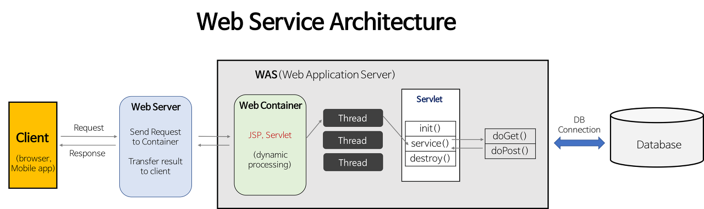

[TOC]

# Web Server and WAS

## Web?? Web Server?? WAS?? Web Application??

- 보통 개발을 한다고 하면 "웹 개발"을 한다고 하며 뭉뚱그려 이야기했는데, 세부적으로 살펴보면 통상의 Web, 서버를 구성하게 되는 Web Server와 WAS의 차이가 분명하다.

- 이러한 이유로 서비스의 요청 흐름을 구성하는 Web Server와 WAS의 정의, 그리고 둘 사이의 차이와 그 용도를 알아보자.

### Web Server

> [웹](https://ko.wikipedia.org/wiki/%EC%9B%94%EB%93%9C_%EC%99%80%EC%9D%B4%EB%93%9C_%EC%9B%B9 "월드 와이드 웹") [서버](https://ko.wikipedia.org/wiki/%EC%84%9C%EB%B2%84) (Web server)는 다음의 두 가지 뜻 가운데 하나이다.
> 
> 1. 웹 서버: [웹 브라우저](https://ko.wikipedia.org/wiki/%EC%9B%B9_%EB%B8%8C%EB%9D%BC%EC%9A%B0%EC%A0%80 "웹 브라우저")와 같은 클라이언트로부터 [HTTP](https://ko.wikipedia.org/wiki/HTTP "HTTP") 요청을 받아들이고, [HTML](https://ko.wikipedia.org/wiki/HTML "HTML") 문서와 같은 웹 페이지를 반환하는 [컴퓨터 프로그램](https://ko.wikipedia.org/wiki/%EC%BB%B4%ED%93%A8%ED%84%B0_%ED%94%84%EB%A1%9C%EA%B7%B8%EB%9E%A8 "컴퓨터 프로그램")
> 2. 웹 서버 (하드웨어): 위에 언급한 기능을 제공하는 컴퓨터 프로그램을 실행하는 [컴퓨터](https://ko.wikipedia.org/wiki/%EC%BB%B4%ED%93%A8%ED%84%B0 "컴퓨터")
> 
> **웹 서버**(web server)는 [HTTP](https://ko.wikipedia.org/wiki/HTTP "HTTP") 또는 [HTTPS](https://ko.wikipedia.org/wiki/HTTPS "HTTPS")를 통해 [웹 브라우저](https://ko.wikipedia.org/wiki/%EC%9B%B9_%EB%B8%8C%EB%9D%BC%EC%9A%B0%EC%A0%80 "웹 브라우저")에서 요청하는 HTML 문서나 [오브젝트](https://ko.wikipedia.org/wiki/%EC%98%A4%EB%B8%8C%EC%A0%9D%ED%8A%B8 "오브젝트")([이미지 파일](https://ko.wikipedia.org/wiki/%EC%9D%B4%EB%AF%B8%EC%A7%80_%ED%8C%8C%EC%9D%BC "이미지 파일") 등)을 [전송](https://ko.wikipedia.org/wiki/%EC%A0%84%EC%86%A1_(%EC%BB%B4%ED%93%A8%ED%8C%85) "전송 (컴퓨팅)")해주는 [서비스 프로그램](https://ko.wikipedia.org/wiki/%EC%84%9C%EB%B9%84%EC%8A%A4%ED%98%95_%EC%86%8C%ED%94%84%ED%8A%B8%EC%9B%A8%EC%96%B4 "서비스형 소프트웨어")을 말한다. 웹 서버 소프트웨어를 구동하는 [하드웨어](https://ko.wikipedia.org/wiki/%ED%95%98%EB%93%9C%EC%9B%A8%EC%96%B4 "하드웨어")도 웹 서버라고 해서 혼동하는 경우가 간혹 있다 - 위키 백과

- 위키 백과에 기술된 내용 중 1번째인 "웹 서버"가 웹 개발에서 주로 사용되는 개념이고 오늘 알아볼 내용

- 쉽게 말해서 Web Server는 HTTP 요청을 받아들이고, **정적 컨텐츠**(HTML 문서, CSS, JavaScript 등)을 제공한다.

- 또한 동적 컨텐츠에 대한 요청을 **WAS**에 전달, 응답받아 사용자에게 제공하는 역할도 한다.
  
  - 동적 컨텐츠는 DB와 연동되는 변경 가능한 구성물(실시간 순위, 사용자 게시판 등)이다. 

- 기술 예시로는 Apache, Nginx 등이 있다.
  
  - Nginx에서 **리버스 프록시(reverse proxy)** 로 어플리케이션에 대한 직접 접근을 방지하여 보안을 강화할 수 도있다.

### WAS

> **웹 애플리케이션 서버**(Web Application Server, 약자 **WAS**)는 [웹 애플리케이션](https://ko.wikipedia.org/wiki/%EC%9B%B9_%EC%95%A0%ED%94%8C%EB%A6%AC%EC%BC%80%EC%9D%B4%EC%85%98 "웹 애플리케이션")과 [서버](https://ko.wikipedia.org/wiki/%EC%84%9C%EB%B2%84 "서버") 환경을 만들어 동작시키는 기능을 제공하는 [소프트웨어 프레임워크](https://ko.wikipedia.org/wiki/%EC%86%8C%ED%94%84%ED%8A%B8%EC%9B%A8%EC%96%B4_%ED%94%84%EB%A0%88%EC%9E%84%EC%9B%8C%ED%81%AC "소프트웨어 프레임워크")이다.[[1]](https://ko.wikipedia.org/wiki/%EC%9B%B9_%EC%95%A0%ED%94%8C%EB%A6%AC%EC%BC%80%EC%9D%B4%EC%85%98_%EC%84%9C%EB%B2%84#cite_note-1) 인터넷 상에서 [HTTP](https://ko.wikipedia.org/wiki/HTTP "HTTP")를 통해 사용자 컴퓨터나 장치에 애플리케이션을 수행해 주는 [미들웨어](https://ko.wikipedia.org/wiki/%EB%AF%B8%EB%93%A4%EC%9B%A8%EC%96%B4 "미들웨어")(소프트웨어 엔진)로 볼 수 있다. 웹 애플리케이션 서버는 동적 서버 콘텐츠를 수행하는 것으로 일반적인 웹 서버와 구별이 되며, 주로 데이터베이스 서버와 같이 수행이 된다. - 위키 백과

- 웹 서버와 웹 컨테이너(Web Container)가 합쳐진 형태로, 웹 서버 단독으로 제공이 불가한 동적 컨텐츠를 DB와 연동으로 사용자에게 제공한다.
  
  - App Server와 동의어이며 Web Server와 Web Application 사이에 위치하여 동적 컨텐츠를 생성하는 미들웨어로 볼 수 있다.

- 또한 JSP, Servlet과 같은 구동 환경을 제공하여 웹 컨테이너라고도 불린다.
  
  - 웹 컨테이너는 웹 서버가 보낸 JSP, PHP와 같은 파일 수행 결과를 웹 서버로 응답하는 역할을 한다.

- 동적 컨텐츠에 대한 트랙잭션 관리 기능도 제공한다.

- 여러개의 WAS를 배치하여 Load Balancing을 통해 효율적인 요청 처리가 가능하다.

- 기술 예시로는 Tomcat, Jeus 등이 있다.
  
  - `Spring`에서는 Tomcat이 기본으로 내장되어 있으나, 이는 프레임워크마다 다르고 환경과 요구사항에 따라 선택하여 조합이 가능하다.

#### Web Application

- Springboot, django, express 와 같은 프레임워크로 구성된 하나의 어플리케이션으로 WAS(Web Application Server)가 포함하는 하나의 구성 요소이다.

- 비즈니스 로직을 수행한다.

### Web Service Architecture

- 웹 서비스 어플리케이션을 Web Server, WAS, DB로 아래와 같은 구조를 갖는다.
  
  `사용자 => Web Server => WAS(Web Container + Servlet) => DB`

- 사용자 요청에 따른 작동 흐름
  
  
  1. 사용자(Client, 브라우저) 가 Web Server로 HTTP 요청
  
  2. Web Server는 요청을 알맞은 WAS로 보낸다.(여러개의 WAS가 있을 수 있거나 Load Balancing 될 수 있다.)
  
  3. WAS는 관련 Servlet을 메모리에 할당
  
  4. WAS는 `web.xml`을 참고하여 해당 Servlet에 대한 Thread를 생성(Thread Pool)
  
  5. `HttpServletRequest`, `HttpServletResponse` 객체를 생성, Servlet에 전달
     
     1. Thread은 할당 요청에 맞는 메서드 A를 호출
     
     2. 메서드 A는 요청에 맞는 동작한다.
  
  6. (동적 컨텐츠와 관련됐다면) DB와 통신하여 요청의 인자에 따른 값을 생성하여 `Response`객체에 담아 WAS에 반환
  
  7. WAS는 `Response`객체를 `HttpServletResponse` 객체로 변환하여 Web Server에 반환한다.
  
  8. 요청에 할당된 Thread를 종료하고, 요청으로 생성된 `HttpServletRequest`, `HttpServletResponse`를 제거한다.

#### 도대체 왜 이렇게 된걸까?

- 단순히 "서버", "백엔드" 라고 퉁치고 말하던 개념이 자세히 보면 여러개로 쪼개져 다시 조립되어 구성된다. 왜 이렇게 된걸까.

- 효율성을 위한 책임(역할)의 분리 아닐까 한다. 
  
  - WAS를 통해 정적 컨텐츠와 동적 컨텐츠를 사용자에게 제공할 수 있으나, 역할을 분리하고 기능을 다르게 하여 **서버 부하를 방지**한다. 
  
  - Web Server는 컨텐츠의 템플릿(정적 컨텐츠)를 제공하고, WAS는 템플릿의 내용(동적 컨텐츠)를 제공한다고 볼 수 있다.

- 분리를 통해 SSL에 대한 암복호화 처리를 웹 서버에서 맡아 보안을 강화할 수 도 있다. 

---

- 레퍼런스

> [웹 서버 - 위키백과, 우리 모두의 백과사전](https://ko.wikipedia.org/wiki/%EC%9B%B9_%EC%84%9C%EB%B2%84)
> 
> [웹 애플리케이션 서버 - 위키백과, 우리 모두의 백과사전](https://ko.wikipedia.org/wiki/%EC%9B%B9_%EC%95%A0%ED%94%8C%EB%A6%AC%EC%BC%80%EC%9D%B4%EC%85%98_%EC%84%9C%EB%B2%84)
> 
> [[Web] 웹 서버와 WAS의 차이를 쉽게 알아보자](https://codechasseur.tistory.com/25)
> 
> [Web Server와 WAS의 차이 | 👨🏻‍💻 Tech Interview](https://gyoogle.dev/blog/web-knowledge/Web%20Server%EC%99%80%20WAS%EC%9D%98%20%EC%B0%A8%EC%9D%B4.html)
> 
> https://chrisjune-13837.medium.com/web-%EC%9B%B9%EC%84%9C%EB%B2%84-%EC%95%B1%EC%84%9C%EB%B2%84-was-app%EC%9D%B4%EB%9E%80-692909a0d363
