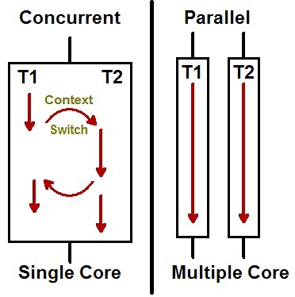

- [동시성, 병렬성](#동시성-병렬성)
  - [동시성(Concurrency) vs 병렬성(Parallelism)](#동시성concurrency-vs-병렬성parallelism)
# 동시성, 병렬성

## 동시성(Concurrency) vs 병렬성(Parallelism)

| 동시성                                        | 병렬성                                   |
| ------------------------------------------ | ------------------------------------- |
| 동시에 실행되는 것 같이 보이는 것                        | 실제로 동시에 여러 작업이 처리되는 것                 |
| 싱글코어, 멀티코어에서 멀티 쓰레드(Multi Thread)를 동작하는 방식 | 멀티 코어에서 멀티 쓰레드(Multi Thread)를 동작하는 방식 |
| 한번에 많은 것을 처리                               | 한번에 많은 일을 처리                          |
| 논리적인 개념                                    | 물리적인 개념                               |

- 순차적/ 동시적/ 병렬적 처리작업 예시 이미지

- 싱글 코어와 멀티 코어에서 동작하는 모습 비교

- 싱글코어에서는 2개의 작업을 동시에 실행되는 것처럼 보이기 위해 번갈아 가면서 작업을 수행한다.

- 다른 작업을 바꾸어 실행할 때, 내부적으로 **Context Switching**발생

---

- 레퍼런스

> [동시성(Concurrency) vs 병렬성(Parallelism)](https://seamless.tistory.com/42)
