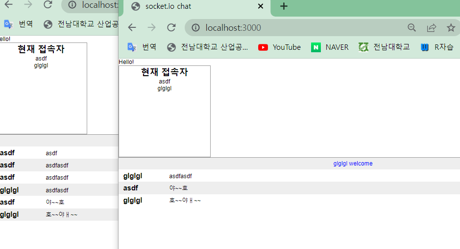

# Subject_00

[TOC]

## Node.js

- 비동기 이벤트 주도 JavaScript 런타임으로써, 확장성있는 네트워크 애플리케이션을 만들 수 있도록 설계되었다.
- 함수의 실행이 함수의 출력으로 이어지지 않는다.
- 동기적(블로킹) 실행에서는 함수 실행 - 함수 처리 - 함수 출력 의 순서
- 비동기적(논 블로킹)에서는 함수 실행 - 함수 처리 - 함수 출력의 순서가 아닌, 함수 처리가 실행되고 다음 함수의 실행이 진행되며, 함수 처리가 완료되면 함수가 출력되는 비동기적 이벤트가 발생한다.

## Express

- Node.js 를 위한 빠르고 개방적인 간결한 웹 프레임워크

## Socket.io

- 브라우저(유저)와 서버간 실시간, 양방향, 이벤트 기반 통신을 가능하게 해주는 라이브러리이다.
- index.js(server-side)와 index.html(client-side)의 파일로 채팅 시스템을 구현 할 수 있따.
- 서버와 클라이언트간에 emit, on을 통해 통신 신호를 주고 받는다.
- 여러개의 room을 통해 서로 다른 채팅 시스템 또한 구현 가능하다.

### 기본 과제

- 비동기적 논리 구조는 순서가 명확하지 않으므로, 그 순서를 명확하게 해줘야 한다..,.

