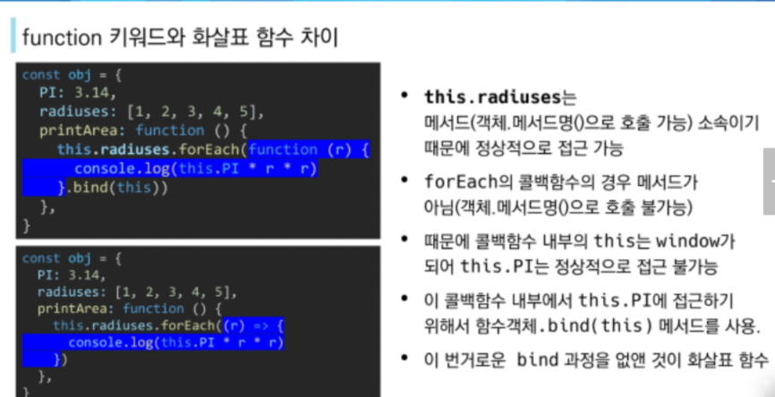

- [JavaScript 01](#javascript-01)
  - [JavaScript 기초](#javascript-기초)
    - [JavaScript Intro](#javascript-intro)
    - [Browser](#browser)
      - [DOM](#dom)
      - [BOM](#bom)
      - [JavaScript Core](#javascript-core)
    - [ECMAScript](#ecmascript)
      - [ECMA](#ecma)
    - [세미콜론](#세미콜론)
    - [코딩 스타일 가이드](#코딩-스타일-가이드)
    - [변수와 식별자](#변수와-식별자)
      - [식별자 정의와 특징](#식별자-정의와-특징)
      - [식별자 작성 스타일](#식별자-작성-스타일)
      - [변수 선언 키워드](#변수-선언-키워드)
    - [데이터 타입](#데이터-타입)
      - [원시 타입(Primitive type): 객체가 아닌 기본 타입/ 변수에 해당 타입의 값이 담김/ 다른 변수에 복사할 때 실제 값이 복사됨](#원시-타입primitive-type-객체가-아닌-기본-타입-변수에-해당-타입의-값이-담김-다른-변수에-복사할-때-실제-값이-복사됨)
      - [참조 타입(Reference type)](#참조-타입reference-type)
      - [연산자](#연산자)
    - [조건문](#조건문)
      - [if](#if)
      - [swtich](#swtich)
    - [반복문](#반복문)
      - [반복문의 종류와 특징](#반복문의-종류와-특징)
      - [while](#while)
      - [for](#for)
      - [for ... in](#for--in)
      - [for ... of](#for--of)
    - [함수](#함수)
      - [함수선언식/ 함수표현식](#함수선언식-함수표현식)
          - [Rest operator](#rest-operator)
          - [Spread operator](#spread-operator)
    - [선언식 vs 표현식](#선언식-vs-표현식)
    - [Arrow Function](#arrow-function)
    - [문자열(String)](#문자열string)
    - [배열(Arrays)](#배열arrays)
      - [배열의 정의와 특징](#배열의-정의와-특징)
    - [객체(Objects)](#객체objects)
      - [객체 관력 ES6 문법](#객체-관력-es6-문법)
    - [this 정리](#this-정리)
    - [lodash](#lodash)
      - [A modern JavaScript utility libray](#a-modern-javascript-utility-libray)


# JavaScript 01
## JavaScript 기초
### JavaScript Intro
- 브라우저 : URL로 웹을 탐색하고 서버와 통신, HTML 문서, 파일을 출력하는 GUI 기반의 소프트웨어
- JavaScript의 필요성 : 브라우저 화면을 '동적'으로 만들기 위함/ 브라우저를 조작할 수 있는 유일한 언어

### Browser
- DOM(Document Object Model) 조작(문서 조작)/ BOM(Browser Object Model) 조작(navigator, screen, location..)/ JavaScript Core(ECMAScript)(Data Structure, Conditional Expression,iteration)

#### DOM
- HTML을 프로그래밍으로 조작 가능한 인터페이스/ 문서를 구조화하고 하나의 객체로 취급하여 다루는 논리적 트리 모델
  - 파싱(Parsing)
  	- 구문 분석, 해석/ 브라우저가 문자열을 해석하여 DOM Tree로 만드는 과정


	
#### BOM
- Browser Object Model
- 자바스크립트가 브라우저와 소통하기 위한 모델/ 브라우저의 창이나 프레임을 추상화하여 프래그래밍적으로 제어할 수 있도록 제공하는 수단

#### JavaScript Core
- 브라우저(BOM & DOM)을 조작하기 위한 명령어 약속

### ECMAScript
#### ECMA
- ECMA(ECMA International) : 정보 통신에 대한 표준을 제정하는 비영리 표준화 기구
- ECMAScript는 ECMA에서 ECma-262 규격에 따라 정의한 언어
- ECMAScript6는 ECMA에서 제안하는 6번째 표준 명세를 말함.

### 세미콜론
- 세미코론 : 자바스크립트는 세미콜론을 선택적으로 사용가능

### 코딩 스타일 가이드
- 코딩 스타일의 핵심은 합의된 원칙과 일관성
	- 절대적인 하나의 정답은 없다, 상황에 맞게 원칙을 정하고 일관성있게 사용
	- 코딩 스타일은 코드의 품질에 직결되는 중요한 요소
	- Airbnb 와 Google의 JavaScript Style Guide를 따른다.

### 변수와 식별자
#### 식별자 정의와 특징
- 식별자(identifier) = 변수명
- 식별자는 문자, $, _ 로 시작
#### 식별자 작성 스타일
- 카멜 케이스(변수, 객체, 함수)/ 파스칼 케이스(클래스, 생성자)/ 대문자 스네이크케이스(상수에 사용)

#### 변수 선언 키워드

- let : 재할당 예정인 변수 선언시 사용/ 변수 재선언 불가능
- const : 재할당 예정이 없는 변수 선언시 사용/ 변수 재선언 불가능
- 위 두개 모두 블록 스코프


- 블록 스코프(block scope)
	- if, for, 함수 등의 **중괄호 내부**를 가리킴
	- 블록 스코프를 가지는 변수는 블록 바깥에서 접근 불가능

```js
let x = 1
if (x==1) {
    let x = 2
    console.log(x)
}
consoloe.log(x)
```

​		- 위 중괄호 안의 x와 밖의 x는 다른 변수주소를 갖는다.

- var 
  - var로 선언한 변수는 재선언 및 재할당 모두 가능하다.
  - 호이스팅되는 특성으로 예기치 못한 문제 발생 가능(let 과 const사용을 권장함)
  - **함수 스코프** : 함수의 중괄호 내부/ 함수 스코프를 갖는 변수는 함수 바깥에서 접근 불가능 하다.
  - **호이스팅** : 변수를 선언 이전에 참조할 수 있는 현상/ 변수 선언 이전의 위치에서 접근시 undefined를 반환


### 데이터 타입


- 자바스크립트의 모든 값은 특정한 데이터 타입을 가짐/ 원시 타입(Primitive type)과 참조 타입(Reference type)

#### 원시 타입(Primitive type): 객체가 아닌 기본 타입/ 변수에 해당 타입의 값이 담김/ 다른 변수에 복사할 때 실제 값이 복사됨
  - 숫자 타입 : 정수 실수 구분이 없는 하나의 숫자타입/ 부동소수점 형식/ NaN : 숫자가 아니라는 의미를 갖는 숫자 타입

  - 문자열 타입 : 텍스트 데이터/ 템플릿 리터럴 - 따옴표 대신 backtick(`)으로 표현

```js
    const firstName = 'b'
    const lastName = 'last'
    const fullName = `${firstName} ${lastName}`
    
    console.log(fullName) // b last 출력됨.
```

  - undefined : 변수의 값이 없음을 나타내는 데이터 타입/ 변수 선언 이후 직접 값을 할당하지 않으면, 자동으로 undefined가 할당됨./ 개발자의 의도가 없음
  - null : 변수의 값이 없음을 의도적으로 표현할때 사용되는 데이터 타입/ 개발자의 의도가 있음
    
  - Boolean : true/ false
    
    - 위는 ToBoolean Conversions(자동 형변환)에 대한 표,
    - Js에서는 빈 배열이라도 참값이 나옴.

#### 참조 타입(Reference type) 
- 객체 타입의 자료형/ 변수에 해당 객체의 참조 값(주소)가 담김/ 다른 변수에 복사할때 참조 값이 복사됨.

#### 연산자
- 할당 연산자 : +=, -=, *=, /=, ++, --

- 비교 연산자 : > <
  동등 비교 연산자(==) : 특별한 경우 제외하고 **사용하지 않음**( 파이썬의 그것과 다름)
  **일치 비교 연산자(===) : 엄격한 비교가 이뤄짐(파이썬의 ==와 같음)**
  
- 논리 연산자 :&&, ||, ! 의 and, or, not 사용

- **삼항 연산자(Ternary Operator) : 조건식 ? a : b의 식으로 표현됨. 조건식이 참이면 a를, 조건식이 거짓이면 b를 반환한다.**

  ```js
  console.log((a가 b보다 ~한가요?) ? 1 : 2) // a가 b보다 ~한다면(true) 1할당, 아니라면(false) 2를 할당한다.
  ```

  

### 조건문
####  if
- if, else if, else : 조건은 소괄호 안에 작성/ 실행할 코드는 중괄호 안에 작성/ 블록 스코프 생성
```js
if (조건문) {
	실행
} else if (조건문) {
	실행
} else {
	실행
}
```
#### swtich
- switch : 많은 분기에 따라 어느 값에 해당하는지 판별/ 표현식(expression)의 결과값을 이용한 조건문/ 표현식의 결과값과 case문의 오른쪽 값을 비교/ break 및 default문은 선택적으로 사용 가능/ break문이 없는 경우 break문을 만나거나 default 문을 실행할때까지 다음 조건문 실행
- 블록 스코프 생성
```js
switch(excpression) {
  case 'first value': {
    실행
    [break]
  }
  case 'second value': {
  	실행
  	[break]
  }
  [default: {
  	실행
  }]
}
```

### 반복문
#### 반복문의 종류와 특징
- while/ for/ for ... int : 객체의 속성들을 순회할 때 사용/ for ... of : 반복 가능한 객체를 순회하며 값을 꺼낼 때 사용(iterable : Array, Map, Set, String)
#### while 
```js
while (condition) {
 실행
}
```
- 조건문이 참인동안 반복 시행/ 블록 스코프

#### for
- 세미 콜론 ; 으로 구분되는 세 부분으로 구성
- initialization : 최초 반복문 진입 시 1회만 실행/ condition : 매 반복 시행 전 평가되는 부분/ expression : 매 반복 시행 이후 평가되는 부분
- 블록 스코프 생성
```js
for (initialzation; condition; expression){
	실행
}
for (let i = 0 ; i < 6; i ++){
	consolo.log(i) // 0,1,2,3,4,5 출력
}
```

#### for ... in 
- **객체의 속성들을 순회**할 때 사용/ 배열도 순회 가능하지만 **권장하지 않음**/ 블록 스코프
- (+) Js에서는 객체는 dict형식의 데이터이다.
```js
for (variable in object) {
	실행
}

const capitals = {
	korea : 'seoul',
	france: 'paris',
	USA: 'washington D.C.'
}
for (let capital in capitals){
	console.log(capital) ## korea, france, USA → capitals의 key값이 출력됨.
}
```
#### for ... of
- **반복 가능한 객체를 순회**하며 값을 꺼낼 때 사용/ 블록 스코프
```js
for (variable of iterables) {
	실행
}

const fruits = ['딸기','바나나','메론']

for (let fruit of fruits){
	fruit = fruit + "!"
	console.log(fruit)
}

for (const fruit of fruits){
	//fruit 재할당 불가, const로 선언했기 때문에
	console.log(fruit)
}
```

- - for ... in 은 객체 순회 적합/ for ... of 는 배열 순회 적합


- for ... in 은 객체의 key를 순회하고/ for ... of는 배열의 인자를 순회한다. 객체(dict형식)은 순회하지 못한다.


### 함수

-  참조 타입 중 하나로써 function 타입에 속함.
-  Js에서 함수는 일급객체(first-class citizen)이다.(변수 할당가능, 함수의 매개변수전달, 함수의 반환값으로 사용가능)

#### 함수선언식/ 함수표현식

-  함수선언식(function declaration)/ 함수 표현식(function expression)의 두가지 방법으로 함수를 정의한다.	

```js
//함수 선언식
function 함수의이름(매개변수) {
	몸통(실행내용)
}
//함수 표현식 - 익명 함수로 정의 가능.
const 함수이름(생략가능) = function (매개변수) {
	몸통(실행내용)
}
```

- function()의 괄호안에 기본인자를 설정 가능하다.
- 매개변수와 **인자의 개수가 불일치**할 경우 많으면 무시하고 부족하면 undefined로 대체하여 함수를 실행한다.

###### Rest operator

- rest operator(...)를 사용하면 함수가 정해지지 않은 수의 매개변수를 배열로 **받는다.**

```js
const restOpr = function(arg1, arg2, ...restArgs) {
	return [arg1,arg2,restArgs]
}
```

​	- ...restArgs에 해당하는 인자들은 취합되어 리스트([a,b,c,..])의 형태로 받아짐.

###### Spread operator

- spread operator()를 사용하면 배열 인자를 전개하여 **전달** 가능.

```js
const spreadOpr = function(arg1,arg2,arg3){
	return arg1+arg2+arg3
}
const numbers = [1,2,3]
spreadOpr(...numbers) // 6 출력
```

​	- numbers의 인자들이 ...numbers를 통해 뿌려지게 됨.	

### 선언식 vs 표현식 


- 선언식, 표현식 함수의 타입은 모두 function으로 동일.
- 선언식은 호이스팅 가능/ 표현식은 불가능

### Arrow Function

- 화살표 함수(Arrow Function) : 함수를 비교적 간결하게 정의할 수 있는 문법

```js
const arrow1 = function(name) {
	return `hello, ${name}`
}
// 1. function 키워드 삭제
const arrow2 = (name) => {return }
// 2. 매개변수가 1개일때, ( ) 생략가능
const arrow3 = name => {return `hello, ${name}`}
// 3, 함수 바디가 return 을 포함한 표현식 1개일 경우
const arrow4 = name => `hello ${name}`
```

- 위와 같은 식으로 화살표 함수는 간단하게 작성할 수 있다.

### 문자열(String)


- string.includes(value) : string에 value가 존재하는지 T/F 반환
- string.split(token) : token로 나눈 배열을 반환(기준이 되는 token줘야함! 없으면 string 그대로 출력.)
- string.replace(from,to)/ string.replaceAll(from,to) : string에 from 값이 존재하면 1개 또는 모두 to 값으로 교체하여 반환
- string.trim() : 공백문자(스페이스, 탭, 엔터 등) 제거후 반환/ trimStart(), trimEnd()

### 배열(Arrays)

#### 배열의 정의와 특징

- 키와 속성들을 담고 있는 참조 타입의 객체(object)
- 순서 보장(iterable)


- array.indexOf(value) : array에 value 값이 존재하는 가장 첫번째 요소의 index 반환/ 없으면 -1 반환
- array.join([separator]) : 배열의 모든 요소를 separator(구분자)로 연결하여 반환
- Spread operator(...): 사용하면 배열 내부에서 배열 전개 가능/ 얉은 복사


```js
// element = 배열요소, array = 배열 그 자체
array.forEach((element,index,array) => {
    실행
}) // 반환값 없음
array.map((element,index,array) => {
    실행
}) // 함수의 반환값을 요소로 하는 새로운 배열 반환
array.filter((element,index,array) => {
    실행
}) // 함수의 반환값이 true인 요소들만 모아서 새로운 배열 반환
// acc = 이전 callback에서 반환 값이 누적되는 변수, initialValue(선택적) = 최초 callback 호출 시 acc에 할당되는 값. default는 arr의 첫번째 값이다.
array.reduce((acc, element, index, array) => {
    실행
}, initialValue)
array.find((element, index, array)){
    실행
} // arr의 각 element에 대해 callback 한번씩 실행. callback의 반환 값이 참이면 조건에 만족하는 첫번째 element 반환.
array.some((element, index, array) => {
    실행
}) // array의 element 중 하나라도 판별함수를 통과하면 true 반환/ 하나도 없으면 false
array.every((element, index, array) => {
    실행
}) // array의 모든 element가 판별함수를 통과하면 true/ 하나라도 통과 못하면 false
```


### 객체(Objects)

- 객체 : 속성(property)의 집합, 중괄호 내부에 key와 value의 쌍으로 표현/ key는 문자열만 가능하다

#### 객체 관력 ES6 문법

- 속성명 축약(shorthand) : 객체를 정의할 때 key와 할당하는 변수의 이름이 같으면 축약가능

```js
const books = ['1','2']
const magazines = ['a','b']
const bookshop = {
	books,
	magazines,
} // 변수 이름(books, magazine)를 key로 갖는 객체 생성
```

- 구조 분해 할당(destructing assighment) : 배열 또는 객체를 분해하여 속성을 변수에 쉽게 할당할 수 있는 문법

```js
const userInfo = {
	name:'name1',
	id : '11233'
}
const { name } = userInfo
const { id } = userInfo // userInfo의 name과 id의 값을 갖는 변수 name, id가 생성 된다.
```

- Spread operator(...) : 해당 연산자를 활용하면 객체 내부에서 객체를 전개 가능하다./ 얕은 복사
- (+) 배열은 객체다! : index를 key로 갖는 객체로, length 프로퍼티를 갖는 특수한 객체이다.

### this 정리

- JS의 this는 실행 문맥(execution context)에 따라 다른 대상을 가리킨다.
- class 내부의 생성자 함수/ 메서드 이 두가지 경우를 제외하면 모두 최상위 객체(window)를 가리킨다.



### lodash

#### A modern JavaScript utility libray

- 모듈성, 성능 및 추가 기능을 제공하는 JS 유틸리티 
- 사용예시


- lodash를 사용하지 않을 경우, 깊은 복사와 같은 함수를 직접 만들어 구현해야함.
