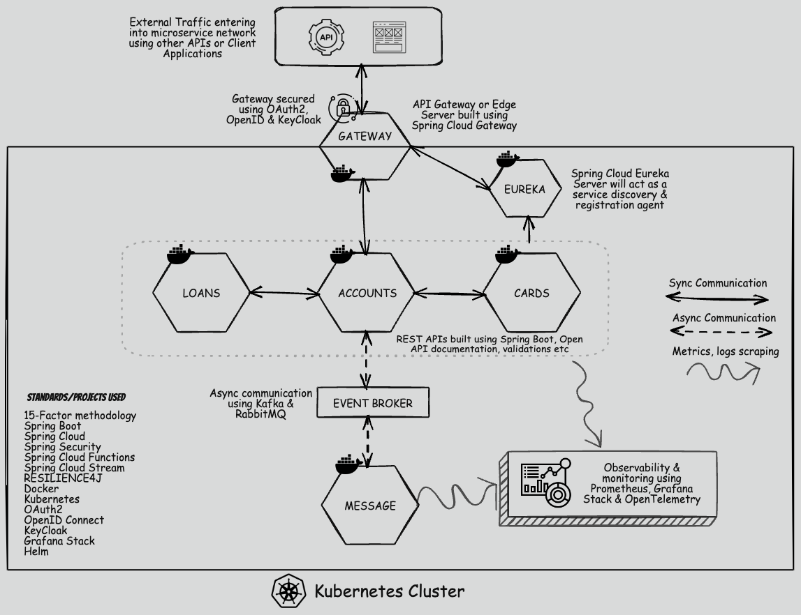

[TOC]

# SpringBoot, Docker, Kubernetes와 함께 마이크로서비스 마스터하기!



- 스프링부트, 도커, k8s를 통해 마이크로서비스를 구축해보자.

## Section 1: 마이크로서비스 아키텍처 소개

### 01. 강의 소개 및 어젠다

- MSA 필요 이유

- 모놀리식 아키텍쳐와 MSA의 차이점

- 스프링 부트를 활용한 MSA 비즈니스 로직

- 다양한 도구를 통한 설정 구성 및 MSA 클러스터 구축

- k8s를 통한 컨테이너 오케스트레이션

### 03. 마이크로서비스 아키텍처의 진화

#### What are Microservices?

- 1개 어플리케이션 (은행을 예로)에서 회원관리, 예금, 채권 등 다양한 기능을 수행하는 전통적인 모놀리식 아키텍처와 구분되는 MSA

##### The SOA(Service-Oriented Architecture)

- 1개 서버에서 FE, BE 의 기능을 다하는 모놀리식에서 진전된 형태로

- FE, BE 등 기능에 따라 서버가 분리되어 구성된다.
  
  - 두 개 서버를 잇는 미들웨어(ESB, Enterprise Service Bus)도 끼어있다.

- 장점으로
  
  - 병렬 개발, 더 나은 재활용성
  
  - 유지보수의 용이함

- 단점으로
  
  - 커뮤니케이션 프로토콜로 인한 복잡한 관리
  
  - FE,BE를 잇는 미들웨어에 대한 투자비용 증가

##### The MSA(Microservice Architecture)

- 비즈니스 도메인에 따라 많은 서비스가 다른 어플리케이션으로 구성된다.
  
  - 각각의 어플은 자신만의 디비를 갖는다.

- 장점으로
  
  - 느슨한 연결로 개발, 테스트, 배포가 쉽다.
  
  - 스케일 아웃의 용이함
  
  - 병렬 개발
  
  - 비즈니스 도메인을 근거로 하는 모델링

- 단점으로
  
  - 복잠함
  
  - 인프라의 오버헤드
  
  - 보안 문제

### 03. 모놀리식, SOA 및 마이크로서비스 아키텍쳐 간의 비교

#### Monolithic vs SOA vs Microservices

- 모놀리식은 싱글유닛, SOA는 입자가 거친 유닛모음, MSA는 입자가 고운 유닛 모음

- 단순할 수록 보안 관리가 쉽지만, 확장성과 유연함이 사라진다.

### 04. 마이크로서비스의 정의

- 단일 응용 프로그램을 작성하는 접근법

## Section 02: Spring Boot를 사용하여 마이크로서비스 구축하기

### 07. SpringBoot framework 소개

- 왜 스프링부트가 마이크로서비스에 적합할까?
  
  - 스프링부트의 어플리케이션은 컨테이너로 동작이 가능하다.
  
  - 기본 설정이 제공되므로, 자잘한 옵션값을 할당해주지 않아도 된다.(auto configuration)
    
    - 설정 변경도 언제든 가능하다.
  
  - 의존성, 종속성 설정이 간편함
  
  - 생태계에서 제공하는 다양한 기능(메트릭, 외부 연결 설정)
  
  - k8s, docker 와 같은 도구로 쉬운 조정이 가능한 클라우드 네이티브 개발도구

- 전통적으로 jvm 위에 tomcat, jetty와 같은 서버가 묶인 와르파일로 어플리케이션 배포가 진행되나,
  
  - springboot의 경우 tomcat과 같은 외부 서버는 내장되어 있고, 자르 파일로서 컨테이너화가 가능하다.

### 08. Springboot framework 관련 재미있는 밈(?) 소개

갑자기 왠 밈?..

- ; 

### 09.  REST API 및 모범 사례 소개

#### Implementing REST Services

- REST 서비스 구현시 따라야할 사항
  
  - 비즈니스 로직과 부합하며 CRDU 실행에 따른 HTTP method 사용
  
  - 적절한 입력값 유효성 확인/ 예외 핸들링
  
  - REST 서비스 문서화

### 11. SpringBoot 프로젝트 만들기

- 스프링 이니셜라이져에서
  
  - Spring Web
  
  - H2 Database
  
  - Spring Data JPA
  
  - Spring Boot Actuator: 어플리케이션 실행 중 메트릭 확인 도구
  
  - Spring Boot DevTools
  
  - Lombok
  
  - Validation
  
  를 추가하여 프로젝트 생성

### 13. H2 DB 및 YAML 속성 구현하기

- 그냥 h2 설정하고 `yml`로 필요 설정값 구현, `schema.sql`로 디비 설정

### 15. DTO(데이터 전송 객체) 패턴 소개

#### DTO(Data Transfer Object) pattern

- 앱의 다양한 부분으로 데이터 전송을 허용하는 패턴

- DB 엔티티에서 필요한 정보를 갖는 객체
  
  - `Mapper` 를 통해 DTO의 값들은 DB의 스키마에 따라 알맞게 저장된다.
  
  - 오우 이제까지는 dto 클래스에 매퍼 기능을 하도록 생성자를 넣었는데.. 생각해보니 관심사 분리하려면 이것도 맞는듯

- DTO를 사용함으로 다양한 이점
  
  - 네트워크 트래픽 감소: 1개 DTO가 여러개의 디비에서 원하는 정보를 한번에 담아 1번에 요청을 받아 처리할 수 있다.
  
  - 직렬화 캡슐화: 분리된 클래스로 DTO 클래스 내부에서 원하는 직렬화를 사용할 수 있다.
  
  - 레이어 분리: 프레젠테이션 레이어와 데이터액세스 레이어의 분리가 가능하다. 화면 단에서는 데이터베이스 엔티티가 어떤 형태를 띄고 있는지 알고있지 않아도 된다.

### 30. REST 서비스 구축을 지원하는 중요 Annotations 및 클래스

#### Different Annotations & Classes that supports building REST Services

- `@RestController`

- `@ResponseBody`

- `@ResponseEntity`

- `@ControllerAdvice`

- `RequestEntity`

- `@RequestHeader`, `@RequestBody`

### 31. Loans & Cards 마이크로 서비스 구축 과제 수행

- 수행 중 알게된 학습 내용 기록

- 역할에 따라 포트번호를 다르게해서 1개 머신에 구동하는건 같은데..이게 MSA?..

## Section 03: 마이크로서비스의 사이즈를 적절히 조정하고 경계를 식별하는 방법

### 34. 경계 및 적정 사이즈의 마이크로서비스를 식별하는 접근 방식

#### 마이크로서비스를 정의할때 적절한 크기와 서비스 바운더리는 어떻게 고려해야할까?

- 도메인 기반 크기 조정(Domain-Driven Sizing)과 이벤트 스토밍 크기조정(Event Storming Sizing)

##### Domain Driven Sizing

- 비즈니스를 이루는 다양한 기능(부서)별로 분리하는 방법

- 개발자가 단독으로 결정하는게 아닌, 고객과 현업의 의견을 수렴하여 각각의 기능을 마이크로서비스로 정의한다.

##### Event Storming Sizing

- 중재자가 여러 이해관계자 사이에서 각 기능간의 관계를 파악하고 브레인스토밍, 리스트업한다.

- 다양한 의견을 종합하여 비즈니스 중 1개의 기능을 시작과 끝을 연결하여 정의한다.
  
  - 어떤 사건(Event)에 대한 명령(Command)와 결과(Reaction)을 정의한다.

- 비즈니스 기능을 정의하기 위해 분석보다는 다양한 의견을 수렴하여 정의하는 방향으로 진행한다.

### 35. 은행 어플리케이션을 예로하는 Sizing & Identifying

- 은행의 3개 부서를 불러 각각의 의견을 수렴
  
  1. 저축 계좌와 거래 계좌/ 카드와 대출이  1팀에서 도출
  
  2. 저축 계좌/ 거래 계좌/ 카드/ 대출을 2팀에서 도출
  
  3. 저축 계좌/ 거래 계좌/ 예금 카드/ 신용 카드/ 주택 대충/ 차량 대출/ 개인 대출 을 3팀에서 도출
  
  4. 1팀의 의견은 각 기능들이 독립적이지 않으므로 적절하지 않다.
  
  5. 2팀의 의견의 가장 합리적인 도출로 느슨하게 연결되고 강한 응집성을 갖는 독립적인 성격의 서비스로 분리되었다.
  
  6. 3팀의 의견은 너무 과하게 분리되어 운영 오버헤드를 유발할 수 있는 위험이 있다.

- 정해진 답은 없고 여러 가능성을 고려하고 가장 합리적인 마이크로서비스 구조를 구상해야 한다.

### 36. 전자 상거래 마이그레이션 사용 사례를 통한 사이즈 조정 및 경계 식별

- 모놀리식으로 설계된 전자 상거래 어플리케이션이 있다고 할때,
  
  - 1개 어플리케이션 안에는 식별, 주문, 카탈로그, 주문서, 판매, 마케팅의 기능을 수행하고, 1개의 관계형 디비에 정보를 저장한다.
  
  - 업계 1위를 달리는 중인 스타트업이지만.. 너무나 커져버린 모놀리식에서는 변화가 두렵기만 하다.
  
  - 배포 반영에도 모놀리식 속에서 서로간의 굳은 연결로 1개의 불안정한 구성으로도 큰 장애가 유발될 수 있다.

- 이러한 상황에서 API gateway를 두고 6개의 기능을 각각의 마이크로서비스로 분리하여 MSA를 구축한다.
  
  - 각 기능의 변경 반영은 독립성으로 서로간의 영향도가 적고, 변화에 유연하다.
  
  - 각각의 마이크로서비스는 각자의 DB를 갖으므로 데이터 활용 측면에서도 유연함을 갖는다.

- 마이크로서비스의 사이즈조정 및 경계 식별에서 너무나 큰 단위의 분리는 MSA의 의미가 없고, 너무나 작은 단위의 분리는 운영 오버헤드를 높임을 주의하자.

## Section 04: Docker를 사용하여 마이크로서비스의 배포, 이동성 및 확장성 처리

### 37. 마이크로서비스를 구축하고 배포할 때 마주칠 어려움 소개

- "큰 힘에는 큰 책임이 따른다." 

- 마이크로서비스는 서비스 운영에 큰 이점이 있지만, 그 만큼 신경써야하는 부분이 많다.

#### Deployment, Portability & Scalability of Microservice

- 100개 가량의 각 vm에 마이크로서비스를 배포한다면, 얼마나 최소한의 노력과 비용이 필요할까?

- 100개 가량의 마이크로서비스의 환경을 옮길때나, vm의 개수를 조정하거나 스펙을 조정(scale out, scale up)할때는?

- 새로운 기술이 필요하다.
  
  - 바로 **앱 컨테이너화**(Containerize)
  
  - 어플리케이션을 각각의 독립적인 컨테이너로 패키징하여 배포를 진행한다.
  
  - 이러한 컨테이너는 환경에 구애받지 않고 실행하려는 플랫폼의 형식과 일지만 한다면 쉽게 운영이 가능하다.

### 38. 컨테이너란 무엇이며 VM과 어떻게 다른가요?

#### Whare are containers & how they are different from VMs?

#### VM

- 1개의 머신(물리적 기계)에 hypervisor라는 소프트웨어를 통해 다중의 가상 머신(컴퓨터)를 만들 수 있다.
  
  - 각각의 vm들은 자신만의 운영체계, 필요한 프로그램들을 갖게 된다.
  
  - 이렇게 여러개 생긴 vm은 클라우드 기업에는 각각의 vm을 고객에게 제공해준다.

- 1개 VM에 운영체제를 설치하고 필요한 라이브러리와 프로그래밍 언어를 설치한다면 대략 15분가량 소요된다.
  
  - 실제 운영중인 서비스에서 특정 서비스의 트래픽이 급증하여 해당 서비스의 VM 개수를 늘리려는(scale out) 시도를 한다면, 필요한 각 vm마다 15분의 시간이 소요된다.
  
  - 즉각적으로 대응이 불가하다.

- 컨테이너의 경우는 VM과 구성이 다르다.
  
  - 1개 머신에서 Host OS에 따른 컨테이너 엔진(대부분 도커)가 실행되고, 모든 컨테이너는 컨테이너 엔진에서 제공하는 자원을 사용할 수 있게 된다.
  
  - VM과 다르게 각각의 OS를 설치해주고 필요한 라이브러리나 프로그래밍 언어를 설치하는게 아닌, 컨테이너 엔진에서 OS의 기능을 대체하고 필요한 라이브러리, 프로그래밍 언어를 가져와 사용하면 된다.
  
  - Java 컴파일링을 위해 JVM을 사용하는 것 비슷하다.

### 39. 컨테이너, 컨테이너화, 도커의 정의

#### What are Containers & Docker?

##### Container

- 서버나 가상 컴퓨터 혹은 로컬 시스템 내에서 독립된  환경

- 실행 머신 내부의 환경과 느슨한 연결을 갖기 때문에, 어떤 환경에서든 실행이 간단하다.

- 이렇게 어떤 환경에서든 실행 가능한 어플리케이션 패키징을 "컨테이너 이미지"라고 부른다.

##### Software Containerization

- 소프트웨어 컨테이너화는 VM의 하이퍼바이저가 1개의 물리적 컴퓨터를 가상화하는 것 과 다르게, 1개의 어플리케이션을 가상화하는 것

##### Docker

- 도커는 도커다

- 플랫폼으로 소프트웨어 컨테이너화와 컨테이너들을 실행하는 환경을 제공한다. 물론 생성도 해줌

#### 컨테이너화에는 어떻게 실행되나?

- 운영체제 가상화 개념으로 기반으로 각각의 다른 os를 갖는 vm과 다르게 동일한 운영체제 환경(동일 os 커널)에서 컨테이너를 실행한다.

- Namespaces: 리눅스 내부의 개념으로 동일한 운영체제 내에서 독립된 환경을 생성한다. 
  
  - 각 컨테이너는 고유의 네임스페이스를 갖게 된다.
  
  - 프로세스, 네트워크, 마운트 등 격리된 환경을 갖는다.

- Control groups(cg group): 컨테이너의 리소스 사용을 제어하는 부분
  
  - cpu, 메모리, 네트워크 대역폭들이 컨테이너에서 사용되는 정도를 공평하게 할당되도록 제어된다.

- 네임스페이스와 컨트롤 그룹은 리눅스 내부의 개념이기 때문에 mac과 windows에서는 실행이 불가할까?
  
  - 도커에서 해당 개념을 사용하는 것으로, 도커는 mac과 windows에서 실행이 가능하고 도커 내부적으로 해당 개념을 사용한다.

### 42. Docker 이미지 생성을 위한 세 가지 접근 방식 소개

- 세 가지 접근 법
  
  1. Dockerfile 따라가기: 가장 기본 접근법으로 작성한 도커 파일에 따라 이미지가 생성된다
  
  2. buildpack: 로우 레벨의 도커파일을 작성하지 않고, 이미지 생성
  
  3. Google jib: 자바로 구동되는 오픈 소스로 역시 로우레벨의 도커파일을 작성하지 않아도 된다.

### 43. Dockerfile을 사용한 마이크로서비스의 이미지 생성

- 이미지 생성
  
  1. 베이스 이미지 추가
  
  2. 라벨링
  
  3. 빌드된 파일을 도커이미지로 복사
  
  4. `ENTRYPOINT` 명령어로 어플리케이션 실행 명령어 입력

- 도커 명령어로 도커파일 실행
  
  - 도커파일에 명시된 내용대로 이미지 생성됨
  
  - 실행중에 크레덴셜 어쩌고 에러떴는데.. 암호키값을 로컬에서 찾으려고 그래서 에러난거였음. 도커 config에서 credStore 값 삭제해주니 해결

### 46. Accounts 마이크로서비스를 Docker 컨테이너로 실행하기

#### 사용명령어

- `docker images` : 생성된 이미지 리스트 업

- `docker run -p ${호스트 포트}:${컨테이너 포트} ${이미지이름}`
  
  - 호스트 포트는 머신에서 할당하는 포트, 컨테이너 포트는 도커 네트워크 내부에서 할당하는 포트. 컨테이너 포트는 외부에서 직접 접근이 불가하고 호스트 포트와 포트 매핑이 된 상태에서 호스트 포트를 통해 접근이 가능하다.
    
    - 8080:8080, 8081:8080 2개의 포트로 컨테이너를 실행하면 2개의 컨테이너의 각 호스트 포트가 1개의 컨테이너 포트를 향한다.
  
  - 디태치모드는 run뒤에 `-d` 붙여준다
  
  - `docker ps` 로 현재 실행중인 컨테이너를 확인 가능하다.
  
  - `docker start ${컨테이너id}` 로도 실행 가능

### 47. Docker 이미지를 생성하기 위한 Dockerfile 접근 방식의 문제점

- 단점
  
  - 도커 파일 작성에 잘 알아야 한다. 알아야하는 옵션이 매우 많다.
  
  - 러닝 커브가 높다

- 100개의 마이크로서비스를 위해 100개의 도커파일을 작성하는게 아닌, 자동으로 이미지를 생성하는 방법이 있다.(buildpacks, Google jibs)

### 48. Buildpack으로 Loans 마이크로서비스의 도커 이미지 생성하기

- 빌드팩이 소스의 모든 종속성을 탐색하여 클라우드 네이티브 빌드팩을 생성한다.

- 프로젝트 폴더로 이동해 `mvn spring-boot:build-image` 실행하면 빌드팩이 자동으로 스프링부트를 빌드한다.
  
  - `pom.xml`에서 project.packaging 태그를 추가하고 `jar`로 설정하고
  
  - project.build.plugins.plugin.image.name 태그를 추가하고 생성할 이미지 이름을 설정한다.
  
  - 이후 `mvn ~`으로 이미지 생성
  
  - `docker images` 로 생성된 이미지를 확인 가능하다

- 도커파일을 사용하는 대신 `pom.xml`에 필요한 옵션을 추가하는 걸 잊지 말자.

### 49. Google jib으로 Cards 마이크로서비스의 도커 이미지 생성하기

- 관련 레포 : [GitHub - GoogleContainerTools/jib: 🏗 Build container images for your Java applications.](https://github.com/GoogleContainerTools/jib)

- 자바로 동작한다.

- `mvn complie jib:dockerBuild` 로 이미지 생성

- 안되냐 왜...
  
  - 깃배쉬가 아니라 cmd에서 실행하니 됨 ^^77;;;

### 50. Dockerfile, buildpack, jib 접근 방식 비교하기

- Dockerfile: 도커 전문가가 필요하며, 공식 가이드라인을 따라야 함

- Buildpack: 도커와 jib에 비해 지원하는 부분이 많고 접근성이 좋음/ 자바 기반 어플리케이션만 사용 가능

- jib: 도커 이미지 생성하는데 매우 적은 시간과 자원이 소요됨

### 51. 로컬에서 원격 Docker 허브 리포지토리로 Docker 이미지 푸시하기

- 로컬에서 생성한 이미지를 로컬에 보관하는게 아닌, 온라인상의 깃헙과 같은 도커 허브 리포지토리로 푸시해야 한다.
  
  - 그래야 어떤 원격 머신에서 땡겨와서 배포가 가능하니까
  
  - `docker image push docker.io/${사용자계정}/${서비스이름}:${태그}`
    
    - 이미지를 생성할때 만든 이미지 이름대로 퓨시하면 된다.
  
  - 이때 로컬에서 푸시하려면 docker hub에 로그인이 필요하며 `docker login`으로 가능하다.
    
    - 어메이징하네, 이거하면 코드나오고 그걸로 브라우저 통해서 로긴함;

- 반대로 리포지토리에 저장된 이미지를 풀로 땡겨올 수 있다.
  
  - `docker pull ${사용자계정}/{서비스이름}:${태그}"`

### 52. Docker Compose 소개

- 서로 다른 여러개의 이미지들을 어떻게 한번에 실행할 수 있을까?
  
  - 이미지 개수만큼 `docker` 명령어로 실행하는게 아닌 정해진 순서대로 원하는 방식대로 이미지들로 컨테이너들을 실행 할 수 있다.

- `yaml` 파일에 원하는 명령을 정의하여 작업을 수행한다.
  
  - `docker-compose.yml` 이란 파일을 생성하고 `docker compose up`을 실행하면, 도커가 자동으로 `docker-compose.yml` 파일을 찾고 정의한 내용을 수행한다.
    
    - 정확히는 컨테이너가 띄워지는거고
  
  - `docker compose down` 실행시 컴포즈에 정의된 서비스들은 중단된다.
    
    - 정확히는 컨테이너들이 삭제된다.
  
  - `docker compose start/stop`으로 생성된 컨테이너를 실행, 중지할 수 ㅣㅆ다.

- 서비스에 대해
  
  - 이미지, 컨테이너 이름, 컨테이너-호스트 포트 매핑, 배포 옵션, 네트워크 옵션을 할당해준다.

## Section 05: 클라우드 네이티브 앱 및 15 factor 방법론에 대해 자세히 알아보기

### 58. 클라우드 네이티브 애플리케이션 소개

- 클라우드 네이티브 애플리케이션: 클라우드 컴퓨팅 원칙을 활용하고 클라우드 이점을 최대한 활용하기 위해 개발된 어플리케이션. 
  
  - 클라우드 환경에 적합한 어플리케이션
  
  - The Cloud Native Computing Foundation에서는 클라우드 환경에서 탄력적이고 관리가 쉬운 어플리케이션을 의미한다.

### 59. 클라우드 네이티브 애플리케이션의 중요한 특징

1. 마이크로 서비스:

2. 컨테이너: 컨테이너형식의 배포를 통한 환경에 구애받지 않음

3. 확장성(Scalability)과 탄력성(Elasticity): 클라우드 플랫폼나 쿠버네티스의 도움으로 트래픽 변화에 대응 가능하다.

4. 데브옵스: 자동화된 CI/CD

5. 내구성(Resilience)와 내결함성(Fault Tolerance): 분산 아키텍쳐로 실패나 에러에 대해 대응이 가능하다. 

6. 클라우드 네이티브 서비스: 클라우드 환경에 적합하게 설계됨

### 60. 클라우드 네이티브 앱과 기존 엔터프라이즈 앱의 차이점

- 예측 가능한 행동: MSA는 다수의 기능이 마이크로서비스로 분리되어, 문제가 발생하면 파악이 용이하다. 모놀리식의 경우 쉽지 않음

- OS 독립적: 도커 컨테이너, 도커 이미지로 어떤 OS에서도 실행 가능

- 가벼운 용량과 독립성: 도커와 같은 도구로 얻는 이점

- Continious Delivery: devops로 끊임없는 개발

- 빠른 회복과 자동화된 확장: 클라우드나 K8s로 얻는 이점

### 61. 12 factor 및 15 factor 방법론 소개

- Heroku 팀에서 제창한 12 factor 방법론
  
  - 클라우드 환경에서 클라우드 네이티브 어플리케이션을 위한 개발 12가지 원칙

- 여기서 케빈 호프만이 3개의 원칙을 추가하여 15 factor 방법론이 완성됨

#### 15-Factor methodology

1. one codebase, one appication

2. API first

3. Dependency management

4. Design, build, release, run

5. Configuartion, credentials & code

6. Logs

7. Disposability

8. Backing serivces

9. Environment parity

10. Administrative processes

11. Port binding

12. Stateless process

13. Concurrency

14. Telemetry

15. Authentication & authorization

### 62. factor 방법론 심층 분석

##### one codebse, one application

- 코드베이스와 앱은 1대1 매핑

- 아무리 분리된 마이크로서비스라고 해도 동일한 형태의 코드베이스를 따라야 한다.

- 여기서 코드베이스는 깃헙같은 플랫폼

##### API first

- 개발에 있어서 Api를 최우선으로 고려한다.

##### Dependency management

- 중앙 레포지토리에서 다운로드 가능한 종속성으로 관리한다.

##### Design, build, release, run

- Design: 어플리케이션을 위한 기술, 종속성, 도구, 특징을 결정한다.

- Build: 불변(immutable)의 아티팩트를 만든다. 빌드마다 고유한 id를 갖는다.

- Release: 빌드 파일을 특정 배포 설정과 결합한다. 각 release는 immutable하고 유일하다.

- run: 릴리스에서 결정한 어플리케이션을 설계된 런타임 환경에서 실행한다.

##### Configuration, credentials & code

- 앱 구성을 설정할 수 있는 Configuration(디비에 설정 정보를 저장하거나 하는 가변이 쉬운 설정 플랫폼)
  
  - 코드베이스와 분리되어야 한다.

- 기본설정을 제외하고는 코드와 레포지토리에 포함되면 안된다.

- 디벨롭 환경과 릴리즈 환경에서 다르게 적용되는 설정 값들은 코드베이스가 아닌 설정 플랫폼에서 관리되고 결정되어야 한다.

##### Logs

- 로그 수집기를 통해 각 마이크로서비스의 로그가 출력되어야 한다.

- 모든 로그는 동일한 규격, 연속적, 시간에 기반하여 기록한다.

##### Disposablilty

- 어플리케이션 일회성

- 만약 어플리케이션이 실행 불가인 상태라면, 당장 셧다운하고 새로운 인스턴스를 띄울 수 있어야 한다.

##### Backing services

- 디비, 메시지 브로커, 캐싱 등등등 어플리케이션과 분리되는 다양한 지원 서비스(backing services)는 어플리케이션과 분리된다.

- 만약 백킹 서비스가 변경이 필요하다면 어플리케이션 코드가 아닌 외부에서 변경이 가능해야 한다.  

##### Environment parity

- 환경 통합, 다양한 환경에서 차이를 최소화한다.

- 컨테이너 채택은 같은 동일 환경에서 어플리케이션을 실행하는데 일조한다.

- Time gap, People gap, Tools gap 과 같은 시간, 사람, 도구에 가 환경마다 달라질 수 있는 걸 동일한 상태로 통일하여 환경을 조성하는 것

##### Administrative process

- 코드 반영, 버전 컨트롤, 패키징, 동일 환경 실행 등등 관리적 측면의 프로세스를 구성하고 준수한다.

##### Port binding

- 어플리케이션 내부의 포트는 외부환경에 의존하지 않고 외부에 노출되어야 한다

- 1개 포트에는 1개 서비스만 할당된다.

- 포트 바인딩이나 포트 매핑을 통해 외부와 연결된다.

##### Stateless process

- 클라우드 네이티브 어플리케이션을 고확장성을 염두에 두고 설계되었다.

- 특정 서비스가 트래픽이 과도하여 컨테이너를 늘리게 되면, 각 컨테이너 들은 상태를 공유하지 않는다. 각각의 state를 갖는다.

##### Concurrency

- 동시성

- statless 어플리케이션을 구축한다고 해서 확장성을 갖는게 아닌, 10개의 컨테이너가 순차적으로 요청을 처리하는게 아닌, 10개의 요청을 10개의 컨테이너가 한번에 처리하는 동시성을 갖어야 확장성이 성립된다.

##### Telemetry

- MSA에서 아주 많은 컨테이너들을 어떻게 모니터링할까

- 관측성(Observablilty)은 클라우드 네이티브 어플리케이션의 기본 특성으로, 클라우드 내의 분산 시스템을 관리할 수 있는 척도

- 원격 측정 데이터(telemetry)로 많은 마이크로서비스의 성능 지표를 확인하고 모니터링할 수 있다.

- 모든 앱의 텔레메트리는 중앙 구성 요소로 관리된다.

##### Authentication and authorization

- MSA와 클라우드 네이티브 어플리케이션에서의 요청과 통신은 보안 가이드를 필수로 따라야 한다.

## Section 06: 마이크로서비스의 구성 관리

### 65. 마이크로서비스 내부의 구성 관리 관련 어려움 소개

- 구성 관리(Configuration management)는 왜 어려울까

- 속성을 분리하지 않으면 docker 이미지를 다양한 환경에서 실행할 수 없다.

### 66. Spring boot에서 구성이 작동하는 방식

- Configuration은 SpringBoot에서 어떻게 작동할까?

- 스프링부트는
  
  - 설정 정보를 외부에 놓아 같은 어플리케이션을 다른 환경에서 실행할 수 있게 한다.
  
  - properties, yaml 파일등이 그 예시이다.

- 보통
  
  - @Value 어노테이션 사용 `@Value("${property.name}$)`과 같이 외부 설정에서 특정 값을 가져와 사용한다.
  
  - 환경 변수 사용, 머신의 환경 변수에 필요한 값을 할당
  
  - @Configuration 어노테이션 사용, @Value는 하드코딩하는 방법이고 환경 변수는 환경 인터페이스를 통해 호출해야한다. @Configuration은 사전에 설정한 설정 값들을 하드코딩하지 않고 가져올 수 있다.  

### 69. @ConfigurationProperties를 사용하여 구성 읽기

- 3번째 방법
  
  - 추가로 `record`라는 클래스는 자바 17부터 생긴 클래스로, 읽기만 가능함

- `application.yml` 파일에 설정값을 저장하고
  
  - 추가한 설정값과 매핑되는 record 클래스를 생성한 후 `@ConfigurationProperties(prefix = "추가한 설정값 키")`를 붙여준다.

- `application.java` 에서 `@EnableConfigurationProperties(value = {설정값과 매핑되는 레코드 객체의 클래스})` 를 추가하여 어플리케이션에게 ConfigurationProperties를 사용함을 명시한다.

### 70. 스프링 프로필 소개

- 실행 환경에 따라 설정값을 가변적으로 설정할 수 있는 기능
  
  - 개발, 운영, 검증 등 환경에 따라 다른 값을 구분할 수 있다.
  
  - 굳이 어디처럼 디비에 설정값 저장하는게 아닌
    
    - 근데 이건 또 굳이 코드에 접근값 박아놓는것도 별로네

- 근데 이것도 가변적으로 설정이 불가함..
  
  - 외부 매개변수로 어떻게 설정값을 가변적으로 적용할 수 있는가?

- 만약 도커 이미지를 생성해야 한다면, 실행 환경 변수값을 바꿔줄때마다 이미지 빌드를 해줘야 함.
  
  - 그럼..디비 활용해서 참고하는게?..

### 72. 명령줄, JVM 및 환경 옵션을 사용하여 구성 외부화하기

- JVM 실행시 매개변수 값을 주던가, 환경 변수값을 활용할 수 있다,

#### 명령줄, JVM 및 환경 옵션을 사용하여 프로필 활성화

- 인텔리제이에서 어플리케이션 클래스의 설정에서 VM.options, Environment Variable 등으로 옵션을 주고 원하는 프로필을 활성화할 수 있다.

### 76. Springboot만 사용하는 외부화 구성의 단점

- External Configuration을 사용할때의 단점
  
  - 인자(parameter)를 일일히 넣어줘야한다.
  
  - 실행하는사람(개발자)에 의존하게 된다.
  
  - 수백개의 마이크로서비스를 사용한다면, 수 천개의 설정을 관리해야 할 수 있다.
  
  - 실행 환경(운영, 검증)에 따라 액세스 권한을 제어할 수 없다.
  
  - 여러 마이크로서비스를 각각의 다른 개수의 컨테이너를 실행한다면 설정 관리가 힘들어진다.
  
  - 데이터베이스 암호를 스프링부트 프로퍼티나, 환경 변수로 제공한다면 소스코드에 접근 가능한 사람 모두에게 접근 정보가 노출된다.
  
  - 현재 실행 중인 런타임에서 설정값을 바꿀려면 무조건 어플리케이션을 재실행해야한다.

- 이러한 단점을 Spring Cloud config에서 해결할 수 있다.

### 77. Spring Cloud Config 소개

- 수많은 마이크로서비스가 수많은 각각의 컨테이너로 실행된다면 각 컨테이너의 설정값을 어떻게 관리할 수 있을까

- 스프링 클라우드 컨피그는 중앙집중형 서비스로 마이크로서비스의 설정값 관리가 용이하다.
  
  - 모든 구성과 속성을 안전하게 저장할 수 있는 공간과
  
  - 저장한 값들을 관리할 수 있는 공간이라는 조건이 만족되야함
  
  - Github, DB, File system이 그 예가 될 수 있다.
  
  - Spring Cloud config 서버가 설정값이 저장된 공간에서 필요한 정보를 각 마이크로 서비스에 할당한다.

- 공식문서: [Spring Cloud Config](https://docs.spring.io/spring-cloud-config/docs/current/reference/html/)

- 중앙집중형 설정 관리 서버를 위해 기존 마이크로서비스 프로젝트가 있는 디렉토리에 Spring Cloud Config를 위한 프로젝트를 생성한다.

### 79. 구성 서버의 특정위치에서 파일 읽기

- 프로젝트 내부의 경로나

- 로컬 머신의 경로나

- 깃허브 레포지토리의 경로를 참고하여

- 설정파일을 읽어오게 할 수 있다.
  
  - 이외에도 DB, AWS, 클라우드 등 다양한 저장소를 활용할 수 있다.

### 84. 구성 서버 내부의 속성 암호화 및 복호화

- 설정값들이 어디든 그대로 노출하기엔 보안의 문제로 꺼림직하다.. 암호화하는 방법은 없을까?

### 85. 새로고침 actuator 경로를 사용하여 런타임에 구성 새로 고침

- 설정값이 바뀔때마다 마이크로서비스를 재시작하는게 아닌, 실행중인 마이크로서비스에 설정값을 바꾸는 방법은 없을까?
  
  - 100개의 마이크로서비스가 있고, 설정값이 바뀐다고 하면 100번의 재시작이 있어야 한다.

- 해당 프로젝트에서는 기존에 각 마이크로서비스의 프로퍼티값을 갖는 dto를 record로 선언하여 사용했는데, 그걸 class로 변경하고 getter, setter를 달아준다.
  
  - final로 로컬 캐시에 저장되어 추후 변경이 불가한 record 대신 class를 할당하여 설정값을 저장소에서 조회함으로 실시간 변경이 반영된다.

- 하지만 actuator를 활용해서 refesh API를 호출해야 저장소에서 설정값을 조회하여 갱신한다.
  
  - 사람의 행동을 필요로 한다.

### 86. Spring Cloud Bus를 사용하여 런타임에 구성 새로고침

- 스프링 클라우드 버스는 가벼운 메세지 브로커를 통해 상태 변화(구성, 설정 값)을 브로드캐스트한다.
  
  - 래빗엠큐나 카프카를 활용한다.

- 상태값의 변화를 감지하여 관련된 노드를 갱신한다.

#### RabbitMQ 구성

- RabbitMQ 공식 문서에서 docker를 사용해 쉽게 로컬에서 실행할 수 있다.
  
  - ```cmd
    docker run -it --rm --name rabbitmq -p 5672:5672 -p 15672:15672 rabbitmq:4.0-management
    ```
  
  - wow.. 설치하고 환경변수바꾸고 뭐 귀찮지가 않네

### 87. Spring Cloud Bus & Spring Cloud Config monitor를 사용하여 런타임에 설정 새로 구성

- 스프링 클라우드 버스를 사용해도 결국 사람의 손길이 필요하다
  
  - 수동으로 리프레쉬를 해주는 api를 호출해야 한다.

- 깃헙 웹훅과 같은 기능과 `spring-cloud-config-monitor`로 깃헙의 변화를 감지하고 자동으로 설정값을 갱신할 수 있다.
  
  - 사전에 깃헙 웹훅을 어플리케이션에 걸어놓고 깃헙의 변경이 발생할 시 웹훅을 트리거로하여 스프링 클라우드 버스와 메시지 브로커로 자동으로 리프레쉬를 진행한다.

- 총 정리하면 자동화 순서는 아래와 같다
  
  1. 컨피그 서버와 클라이언트 서비스에 actuator 종속성 추가
  
  2. 새로고침 API 활성화
  
  3. 컨피그 서버와 클라이언트 서비스에 Spring Cloud Bus 종속성 추가
  
  4. 컨피그 서버에 Spring Cloud Config monitor 종속성 추가
  
  5. 메시지 브로커 세팅
  
  6. 저장소 웹훅으로 푸시 커밋 감지하도록 설정

### 88. 구성 서버 변경 사항을 적용하기 위해 Docker compose 파일 업데이트 하기

- 도커 컴포즈를 통해 컨피그 서버와 마이크로서비스를 업데이트 해보자.

### 89. Liveness와 Readiness 탐지

- Liveness and Readiness probes

- 쿠버네티스와 같은 컨테이너 오케스트레이션 도구를 사용할 때는, 컨테이너의 상태를 수시로 확인하여 조치(재기동)을 취하거나 스케일업 시나리오에서 얼마나 많은 자원을 증설할건지 결정한다. 이러한 결정을 내리기 위해 컨테이너의 상태를 지속적으로 탐지한다.

##### Liveness

- 컨테이너가 제대로 작동하는 상태. 생동성?

- 컨테이너가 죽었다면 오케스트레이션은 적절한 조치를 취한다.

##### Readiness

- 컨테이너가 네트워크 트래픽을 받을 준비가 된 상태. 준비 상태

- 컨테이너가 살아(live)있지만, 준비(ready)가 되지 않을 수 있다.

### 90. 구성 서버 변경 사항을 적용하기 위해 Docker Compose 파일 업데이트하기

- Docker compose 파일 내에서 특정 서버에 헬스체크가 가능하다.
  
  - 해당 프로젝트에서 사용하는 actuator의 기본 헬스체크 API를 통해 지속적인 헬스체크가 가능하다.

- 또한 마이크로서비스간 의존관계를 두어 특정 서비스가 실행된 후에 다음 서비스를 실행하도록 순서를 줄 수 도 있다.

- 해당 프로젝트에서는 
  
  1. 메시지 브로커(래빗mq)를 우선 실행하여 설정값 저장소와 연결할 준비를 하고
  
  2. 구성 서버가 메시지 브로커를 의존하여, 메시지 브로커 이후 구성서버가 실행된다.
  
  3. 이후 accounts, loans, cards 서비스들은 구성서버에 의존하여, 구성 서버가 실행됨을 확인하면 실행된다.
  
  4. 이때, 구성 서버에서는 actuator를 활용하여 서비스 실행의 헬스체크를 관리한다.

- 도커 컴포즈 파일을 작성하다 보면 여러 서비스에 동일하게 작성되는 부분이 있는데, 이러한 부분은 공용 yml 파일을 활용하여 중복으로 작성되는 부분을 방지할 수 있다.

#### detail-index1

## Section ##:

### index1

#### detail-index1

## Section ##:

### index1

#### detail-index1

## Section ##:

### index1

#### detail-index1

## Section ##:

### index1

#### detail-index1

## Section ##:

### index1

#### detail-index1

## Section ##:

### index1

#### detail-index1

## Section ##:

### index1

#### detail-index1

## Section ##:

### index1

#### detail-index1

## Section ##:

### index1

#### detail-index1

## Section ##:

### index1

#### detail-index1

## Section ##:

### index1

#### detail-index1

## Section ##:

### index1

#### detail-index1

## Section ##:

### index1

#### detail-index1

## Section ##:

### index1

#### detail-index1

## Section ##:

### index1

#### detail-index1

---

- 레퍼런스

> 
