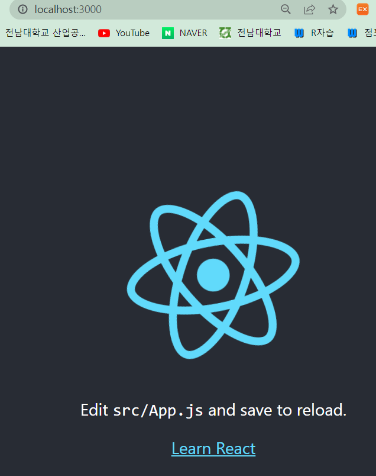
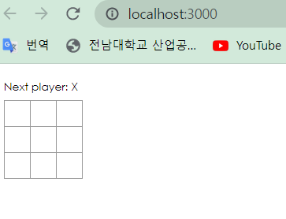
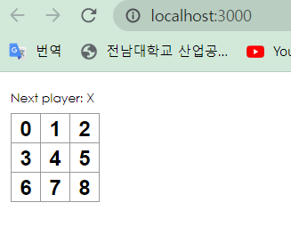
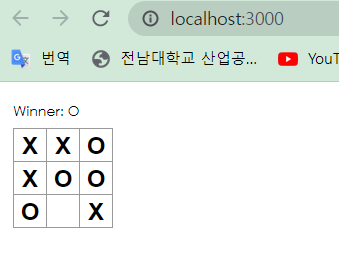

- [React 시작하기](#react-시작하기)
  - [개요](#개요)
    - [React 란 무엇인가요?](#react-란-무엇인가요)
  - [틱태토 게임 만들기](#틱태토-게임-만들기)
    - [Create React App](#create-react-app)
    - [틱태토 스켈레톤 코드 작성](#틱태토-스켈레톤-코드-작성)
    - [Props를 통해 데이터 전달하기](#props를-통해-데이터-전달하기)
    - [사용자와 상호작용하는 컴포넌트 만들기](#사용자와-상호작용하는-컴포넌트-만들기)
  - [게임 완성하기](#게임-완성하기)
    - [State 끌어올리기](#state-끌어올리기)
    - [불변성이 왜 중요할까?](#불변성이-왜-중요할까)
    - [함수 컴포넌트](#함수-컴포넌트)
    - [순서 만들기](#순서-만들기)
    - [승자 결정하기](#승자-결정하기)
  - [시간 여행 추가하기](#시간-여행-추가하기)
    - [동작에 대한 기록 저장하기](#동작에-대한-기록-저장하기)
    - [다시 state 끌어올리기](#다시-state-끌어올리기)
    - [과거의 이동 표시하기](#과거의-이동-표시하기)
    - [Key 선택하기](#key-선택하기)
    - [시간 여행 구현하기](#시간-여행-구현하기)
## React 시작하기
### 개요
#### React 란 무엇인가요?
- React 는 사용자 인터페이스를 구축하기 위한 선언적이고 효율적이며 유연한 JavaScript 라이브러리 이다.
- "컴포넌트" 라는 작고 고립된 코드의 파편을 이용하여 복잡한 UI를 구성한다.
- 아래의 코드를 통해 "컴포넌트"를 살펴보자

```react
class ShoppingList extends React.Component {
  render() {
    return (
      <div className="shopping-list">
        <h1>Shopping List for {this.props.name}</h1>
        <ul>
          <li>Instagram</li>
          <li>WhatsApp</li>
          <li>Oculus</li>
        </ul>
      </div>
    );
  }
}
```

- ShoppingList 는 **React 컴포넌트 클래스, React 컴포넌트 타입** 이라고 한다.
- render 함수를 통해 화면에서 보고자 하는 내용을 경량화한 React 엘리먼트로 반환한다.


### 틱태토 게임 만들기

#### Create React App

- 새로운 프로젝트 만들기

```npm
npx create-react-app [AppName] // App 생성
cd my-app
npm start // 서버 실행
```



- npx ~~ 은 실수가 아니며, npm 5.2+ 버전의 패키지 실행 도구 라고 한다.
- Create React App 은 백엔드 로직과 DB를 제어할 수 없다./ **오직 프론트엔드 빌드 파이프라인 만 생성**
- Babel, webpack 과 같은 build 도구를 사용하나, 설정없이도 동작
- 프로젝트가 배포 준비되고, npm run build 를 실행하면 build 폴더 안에 제작한 앱의 최적화된 build를 생성한다.

#### 틱태토 스켈레톤 코드 작성
- my-app 프로젝트를 생성하고, scr 를 비우고 해당 scr 폴더에 index.js, index.css 를 생성하고 제시된 코드들을 입력해준다.



- index.js 파일을 살펴보면, Square, Board, Game 의 3가지 컴포넌트를 확인할 수 있다.
- Game 은 Board를, Board는 Square를 렌더링함을 알 수 있다.

#### Props를 통해 데이터 전달하기

```react
class Board extends React.Component {
  renderSquare(i) {
    return <Square value={i} />;
  }
}
class Square extends React.Component {
  render() {
    return (
      <button className="square">
        {this.props.value}
      </button>
    );
  }
}
```

- Board 컴포넌트의 renderSquare 함수와 Square 컴포넌트의 render 함수를 위와 같이 수정해주면
  틱택토가 아래와 같이 숫자가 기입된다.



- 부모 컴포넌트 Board 에서 자식 컴포넌트 Square 로 "prop을 전달"했다.

#### 사용자와 상호작용하는 컴포넌트 만들기
- Square 컴포넌트를 "클릭"하면 "X"가 체크되도록 만들어보자
  아래의 코드 추가

```react
class Square extends React.Component {
  render() {
    return (
      <button className="square" onClick={function() { console.log('click'); }}>
        {this.props.value}
      </button>
        // 아래와 같이 화살표 함수를 사용하면 this 의 혼란스런 동작을 피하고 타이핑 횟수가 감소한다!
       <button className="square" onClick={() =>console.log('click');}>
        {this.props.value}
      </button>
    );
  }
}
```

- button  태크에 "onClick" 이 추가되고 click 이벤트 발생시 할당된 function이 작동한다.
- 해당 funtion은 브라우저 개발자 도구에 "click"을 출력한다.


- 다음단계, Square 컴포넌트의 "click"을 "기억"하기 위해 **state**를 사용한다.
- onClick 핸들러에 할당된 함수를 아래와 같이 수정해준다.
- 변경된 함수에 의해, 클릭을 발생하면 Square 컴포넌트의 state의 value가 "X"가 되어 렌더링된다.

```react
class Square extends React.Component {
  constructor(props) {
    super(props);
    this.state = {
      value: null,
    };
  }

  render() {
    return (
      <button
        className="square"
        onClick={() => this.setState({value: 'X'})}
      >
        {this.state.value}
      </button>
    );
  }
}
```

- JavaScript 에서는 하위 클래스의 생성자를 정의할때, 항상 **super()**를 호출해야 한다.
- == **모든 React 컴포넌트 클래스는 생성자를 가질때, super(props) 호출 구문부터 작성해야 한다.**


### 게임 완성하기

#### State 끌어올리기

- 현재는 클릭 유무를 나타내는 value가 개별적인 Square 컴포넌트에 유지되고 있다.
- 틱택토에서는 X와 O를 표시해야 하는데, 이를 위해 부모 컴포넌트인 Board에서 자식 컴포넌트인 Square로 state를 요청한다고 생각할 수 있는데, 이러한 접근은 가능하지만 코드를 복잡하게 하고, 버그에 취약하고 리팩토링이 어렵다(추천하지 않는다.)
- 따라서 부모 컴포넌트에 상태를 저장하는 state를 만들어준다.

> **여러개의 자식으로부터 데이터를 모으거나 두 개의 자식 컴포넌트들이 서로 통신하게 하려면 부모 컴포넌트에 공유 state를 정의해야 합니다. 부모 컴포넌트는 props를 사용하여 자식 컴포넌트에 state를 다시 전달할 수 있습니다. 이것은 자식 컴포넌트들이 서로 또는 부모 컴포넌트와 동기화 하도록 만듭니다.**

- state를 부모 컴포넌트로 끌어올리는건 React 컴포넌트를 리팩토링할 때 흔히 사용한다.

```react
class Board extends React.Component {
  constructor(props) {
    super(props);
    this.state = {
      squares: Array(9).fill(null),
    };
  }

  handleClick(i) {
    const squares = this.state.squares.slice();
    squares[i] = 'X';
    this.setState({squares: squares});
  }

  renderSquare(i) {
    return (
      <Square
        value={this.state.squares[i]}
        onClick={() => this.handleClick(i)}
      />
    );
  }

  render() {
    const status = 'Next player: X';

    return (
      <div>
        <div className="status">{status}</div>
        <div className="board-row">
          {this.renderSquare(0)}
          {this.renderSquare(1)}
          {this.renderSquare(2)}
        </div>
        <div className="board-row">
          {this.renderSquare(3)}
          {this.renderSquare(4)}
          {this.renderSquare(5)}
        </div>
        <div className="board-row">
          {this.renderSquare(6)}
          {this.renderSquare(7)}
          {this.renderSquare(8)}
        </div>
      </div>
    );
  }
}
```

- 위와 같이 index.js의 Board 컴포넌트를 수정했을때,
  1. 내장된 DOM <button> 컴포넌트에 있는 onClick prop 은 React 에게 클릭 이벤트 리스너를 설정하라고 한다.
  2. 버튼이 클릭되면, React는 render() 함수에 정의된 onClick 이벤드 핸들러를 호출한다.
  3. 이벤트 핸들러는 this.props.onClick()을 호출한다. Square의 `onClick` prop은 Board에서 정의되었습니다.
  4. Board에서 Square로 `onClick={() => this.handleClick(i)}`를 전달했기 때문에 Square를 클릭하면 Board의 `handleClick(i)`를 호출합니다.

- Dom <button> 엘리멘트의 **onClick 어트리뷰트**는 **내장된 컴포넌트**임으로 React에게 특별한 의미가 있다.


#### 불변성이 왜 중요할까?
- 일반적으로 데이터 변경하는 두 가지 방법
   	1. 데이터의 값을 직접 변경하는 방법(객체 변경을 통한 데이터 수정)
   	2. 원하는 변경값을 가진 새로운 사본으로 데이터를 교체하는 방법.(객체 변경 없이 데이터 수정)

- 객체 변경없이 데이터 수정할 경우의 이점

  1. 복잡한 특징들을 단순하게 만듦
  2. 변화를 감지함
  3. React에서 다시 렌더링하는 시기를 결정함
  
  
  
#### 함수 컴포넌트
- React에서 컴포넌트를 더 간단하게 작성하는 방법.

- state없이 render 함수만을 가짐.

```react
// 컴포넌트
class Square extends React.Component {
  render() {
    return (
      <button 
        className="square" 
        onClick={() => this.props.onClick()}
      >
        {this.props.value}
      </button>
    );
  }
}

// 함수 컴포넌트
function Square(props) {
  return (
    <button className = "square" onClick={props.onClick}>
      {props.value}
    </button>
  )
}
```

  

#### 순서 만들기

```react
class Board extends React.Component {
  constructor(props) {
    super(props);
    this.state = {
      squares: Array(9).fill(null),
      xIsNext: true,
    };
  }
```

- Board 컴포넌트의 생성자(constructor)에서 초기 state의 값에 "xIsNext" 값을 추가한다.
- 플레이어가 수를 둘때마다, xIsNext 값이 뒤집혀, 현재 플레이어가 누군지 결정한다.
- 그럼 xIsNext 값에 따라 "X"인지, "O"인지를 표시할 내용을 정할 수 있다.

```React
// Board 내의 handleClick 과 render 를 아래처럼 수정
  handleClick(i) {
    const squares = this.state.squares.slice();
    squares[i] = this.state.xIsNext ? 'X' : 'O'; // state의 xIsNextg에 따라 square의 값이 달라짐.
    this.setState({
      squares: squares,
      xIsNext: !this.state.xIsNext, // 차례를 넘겨준다.
    });
  }

  render() {
    const status = 'Next player: ' + (this.state.xIsNext ? 'X' : 'O');

    return (
      // 나머지는 그대로입니다.
```


#### 승자 결정하기
- 이제 선수 차례를 확인하게 하였으니, 승부가 나는 때와 더 이상 둘 곳이 없을때를 알려줘야 한다.
- 아래 함수를 추가한다.

```react
function calculateWinner(squares) {
  const lines = [
    [0, 1, 2],
    [3, 4, 5],
    [6, 7, 8],
    [0, 3, 6],
    [1, 4, 7],
    [2, 5, 8],
    [0, 4, 8],
    [2, 4, 6], // 3*3 배열의 틱택토에서 승리하는 경우의 수
  ];
  for (let i = 0; i < lines.length; i++) {
    const [a, b, c] = lines[i];
    if (squares[a] && squares[a] === squares[b] && squares[a] === squares[c]) {
      return squares[a];
    }
  }
  return null;
}
```


- Board의 render  함수에서 위의 calculateWinner(squares)를 호출하여 누가 승자인지 할당한다.

```React
  render() {
    const winner = calculateWinner(this.state.squares);
    let status;
    if (winner) {
      status = 'Winner: ' + winner;
    } else {
      status = 'Next player: ' + (this.state.xIsNext ? 'X' : 'O');
    }

    return (
      // 나머지는 그대로입니다.
```


- 승자가 정해지거나, Squares가 모두 채워지면 Board의 handleClick 함수가 클릭을 무시하도록 변경한다.

```react
  handleClick(i) {
    const squares = this.state.squares.slice();
    if (calculateWinner(squares) || squares[i]) {
      return;
    }
    squares[i] = this.state.xIsNext ? 'X' : 'O';
    this.setState({
      squares: squares,
      xIsNext: !this.state.xIsNext,
    });
  }
```


- 아래와 같이 게임의 끝과 승자 확인이 가능해졌다.



### 시간 여행 추가하기

- 게임에서 이전에 행해진 차례로 이동하는 "시간 되돌리기" 기능을 구현한다.

#### 동작에 대한 기록 저장하기

- squares 배열을 직접 변경하였다면, 시간 여행을 구현하기 어렵다.
- 해당 구현에서는 slice()를 통해 squares 배열의 복사본을 만들고 이를 **불변객체**로 취급하였다.
- 이 과정을 통해 squares 배열의 모든 버전을 저장하고 이미 지나간 차례를 탐색할 수 있다.
- history 라는 새로운 배열에 squares 배열을 기록한다.


#### 다시 state 끌어올리기

- 최상위 단계의 Game 컴포넌트를 생성하고 그 아래 Board 컴포넌트를 추가한다.
- Game 컴포넌트에 history 배열을 state로 둘 것이다.
- 그러면.. 기존의 Board 컴포넌트의 squares state는 필요없어지고, Game 컴포넌트에 추가된 history state의 마지막 배열을 사용하면 그 기능이 대체된다. === "state 끌어올리기"
- 이제 Game 컴포넌트에서 Board의 데이터를 완벽히 제어할 수 있다.


- Board 컴포넌트의 생성자를 Game 컴포넌트로 옮기고, history를 추가한다.

```react
class Game extends React.Component {
  constructor(props) {
    super(props);
    this.state = {
      history: [{
        squares: Array(9).fill(null),
      }],
      xIsNext: true,
    };
  }

  render() {
    return (
      <div className="game">
        <div className="game-board">
          <Board />
        </div>
        <div className="game-info">
          <div>{/* status */}</div>
          <ol>{/* TODO */}</ol>
        </div>
      </div>
    );
  }
}
```


- Game 컴포넌트로의 변화에 따라 Board 컴포넌트를 아래와 같이 변경한다.

```react
class Board extends React.Component {
  handleClick(i) {
    const squares = this.state.squares.slice();
    if (calculateWinner(squares) || squares[i]) {
      return;
    }
    squares[i] = this.state.xIsNext ? 'X' : 'O';
    this.setState({
      squares: squares,
      xIsNext: !this.state.xIsNext,
    });
  }

  renderSquare(i) {
    return (
      <Square
        value={this.props.squares[i]}
        onClick={() => this.props.onClick(i)}
      />
    );
  }

  render() {
    const winner = calculateWinner(this.state.squares);
    let status;
    if (winner) {
      status = 'Winner: ' + winner;
    } else {
      status = 'Next player: ' + (this.state.xIsNext ? 'X' : 'O');
    }

    return (
      <div>
        <div className="status">{status}</div>
        <div className="board-row">
          {this.renderSquare(0)}
          {this.renderSquare(1)}
          {this.renderSquare(2)}
        </div>
        <div className="board-row">
          {this.renderSquare(3)}
          {this.renderSquare(4)}
          {this.renderSquare(5)}
        </div>
        <div className="board-row">
          {this.renderSquare(6)}
          {this.renderSquare(7)}
          {this.renderSquare(8)}
        </div>
      </div>
    );
  }
}
```

- 생성자 제거
- renderSquare 안의 this.state.squares 를 this.props.squares[i]로 변경(state가 올라갔으므로)
- renderSquare 안의 this.handleClick(i)을 this.props.onClick(i) 로 변경한다.


- Game 컴포넌트의 render 함수를 가장 최근 기록을 사용하도록 업데이트하여 게임의 상태를 확인하고 표시하도록 한다.

```react
   constructor(props) {
    super(props)
    this.state = {
      history: [{
        squares: Array(9).fill(null),
      }],
      xIsNext : true,
    }
  }

  handleClick(i){
    const history = this.state.history
    const current = this.state.current
    const squares = current.squares.slice()
    if (calculateWinner(squares) || squares[i]){
      return
    }
    squares[i] = this.state.xIsNext ? "X" : "O"
    this.setState({
      history : history.concat([{ // concat 을 사용하여 배열에 추가
        squares: squares,
      }]),
      xIsNext: !this.state.xIsNext
    })
  }

  render() {
    const history = this.state.history
    const current = history[history.length - 1] 
    const winner = calculateWinner(current.squares)
    let status
    if (winner){
      status = "Winner: "+winner
    } else {
      status = "Next player: " + (this.state.xIsNext ? "X" : "O")
    }
    
    return (
      <div className="game">
        <div className="game-board">
          <Board 
            squares = {current.squares}
            onClick={(i) => this.handleClick(i)}
          />
        </div>
        <div className="game-info">
          <div>{status}</div>
          <ol>{/* TODO */}</ol>
        </div>
      </div>
    );
  }
}
```

- 또한 handleClick 함수를 Board에서 Game 컴포넌트로 이동하낟.
- Game 컴포넌트의 state가 다르게 구성되므로 그에 따라 수정한다.


#### 과거의 이동 표시하기

- 틱택도 게임의 이동 정보를 갖게 되었으므로 이제 과거로 이동이 가능하다.
- React 엘리먼트는 애플리케이션에 전달할 수 있는 클래스형 JS 객체이다.
- JavsScript 에서 배열은 데이터를 다른 데이터와 함께 매핑할때 map() 함수를 사용한다.

```javascript
const numbers = [1,2,3]
const doubled = numbers.map(x => x * 2) // [2,4,6] 저장
```

- render 함수에 history를 map 해보자.


#### Key 선택하기

- 리스트를 렌더링할 때 React 는 렌더링하는 리스트 아이템에 대한 정보를 저장한다.
- 리스트를 업데이트 할 때 React는 무엇이 변했는지 결정해야 한다.

```react
<li key={user.id}>{user.name}: {user.taskCount} tasks left</li>
```

- 위와 같이 key 를 통해 리스트를 렌더링할때, React는 각 리스트 아이템의 키를 가져가며 이전 리스트 아이템에서 일치하는 키를 탐색한다. 이전에 존재하지 않는 키를 가지고 있다면 React는 새로운 컴포넌트를 생성한다.
- React에서 key는 심화기능인 ref 와 같이 미리 지정된 prop 이다.


- **동적인 리스트를 만들 때마다 적절한 키를 할당할 것을 강력하게 추천하다.**
- 키가 지정되지 않으면 React는 경고하며 배멸의 인덱스를 기본 키로 사용한다.
- 이는 리스트 아이템을 업데이트할 때 문제가 되므로 추천하지 않는다.


#### 시간 여행 구현하기

- 해당 틱택토 게임의 기록에서 과거의 이동 정보는 이동의 순차적인 숫자를 고유한 ID로 가졌다.
- 이동은 순서가 바뀌거나 삭제, 중간 삽입등의 업데이트가 불가하기 때문에 해당 배열은 인덱스 번호를 키로 사용해도 안전하다.

```react
  render() {
    const history = this.state.history
    const current = history[this.state.stepNumber] 
    const winner = calculateWinner(current.squares)
    
    const moves = history.map((step, move) => {
      const desc = move ?
        "Go to move #" + move : 
        "Go to game start"
      return (
        <li key={move}>
          <button onClick={() => this.jumpTo(move)}>{desc}
          </button>
        </li>
      )
    })

    let status
    if (winner){
      status = "Winner: "+winner
    } else {
      status = "Next player: " + (this.state.xIsNext ? "X" : "O")
    }
    
    return (
      <div className="game">
        <div className="game-board">
          <Board 
            squares = {current.squares}
            onClick={(i) => this.handleClick(i)}
          />
        </div>
        <div className="game-info">
          <div>{status}</div>
          <ol>{moves}</ol>
        </div>
      </div>
    );
  }
```

- 위와 같이 render() 함수를 수정하고,


```react
class Game extends React.Component {
  constructor(props) {
    super(props);
    this.state = {
      history: [{
        squares: Array(9).fill(null),
      }],
      stepNumber: 0,
      xIsNext: true,
    };
  }
```

- Game 컴포넌트의 constructor 생성자에 초기 state로 stepNumber 을 추가한다.
- stepNumber가 jumpTo를 통해 업데이트한다.


```react
  handleClick(i) {
    // 이 함수는 변하지 않습니다.
  }

  jumpTo(step) {
    this.setState({
      stepNumber: step,
      xIsNext: (step % 2) === 0,
    });
  }

  render() {
    // 이 함수는 변하지 않습니다.
  }
```

- Game 컴포넌트에 jumpTo() 함수 추가.

- jumpTo(num) 실행시, stepNumber : num 으로 업데이트되고, board 컴포넌트 상의 O, X는 history[num]의 square를 보여준다.
- stepNumber가 업데이트 되고, board 상의 박스를 Square 컴포넌트를 "Click" 하면 stepNumber 이후 history는 삭제된다.

워우 복잡한데

 
