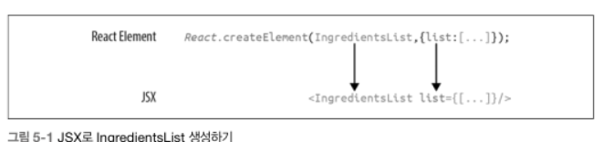

[toc]
# Learning React
## Ch.5 JSX를 사용하는 리액트
- JSX : JavsScript + XML, 자바스크립트 코드 안에서 바로 태그 기반의 구문을 써서 리액트 엘리먼트를 정의할 수 있게 해주는 자바스크립트 확장.

### 1. JSX로 리액트 엘리먼트 정의하기

- JSX에서는 태그를 사용해 엘리먼트의 타입을 지정한다. 태그의 속성은 프로퍼티를 표현한다. 여는 태그와 닫는 태그 사이에 엘리먼트의 자식을 넣는다.



- 위와 같이 중괄호로 감싼 재료 배열을 JSX 프로퍼티로 넘길 수 있다.(이렇게 중괄호로 감싼 코드를 **자바스크립트 식(JavaScript expression, JSX)**이라고 부른다.)
- 자바스크립트 식에는 배열, 객체, 함수 등이 포함된다.

#### 1.1 JSX 팁

##### 내포된 컴포넌트

- JSX에서는 다른 컴포넌트의 자식으로 컴포넌트를 추가할 수 있다.

  ```react
  <ingredientsList>
  	<ingredient/>
  	<ingredient/>
  	<ingredient/>
  	<ingredient/>
  </ingredientsList>
  ```

##### className

- 자바스크립트에서 class가 예약어이므로, class 속성대신 className을 사용한다.

  ```react
  <h1 clasName = "fancy">구운 연어</h1>
  ```

##### 자바스크립트 식

- 중괄호로 자바스크립트 식을 감싸면 중괄호 안의 식을 평가해서 결괏값으로 사용해야 한다.

```react
const title = "WOW!!";
<h1>{title}</h1> // "WOW!!" 출력
```

##### 평가

- 중괄호 안에 들어간 자바스크립트 코드는 그 값을 평가받는다. === 함수 호출 및 연산이 가능하다.

```react
<h1>{"HELLO" + title}</h1>
<h1>{title.toLowerCase().replace}</h1>
```

#### 1.2 배열을 JSX로 매핑하기

```react
<ul>
	{props.ingredients.map((ingredient,i) => {
        <li key={i}>{ingredient}</li>
    })}
</ul>
```

- 위와 같이 JSX를 통해 배열을 JSX 엘리먼트로 변환할 수 있다.


### 2. 바벨

- 소스 코드를 브라우저가 해석할 수 있는 코드로 변환해주는 수단.

```html
<script type="text/babel">
	// JSX 코드를 넣거나 별도의 자바스크립트 파일에 대한 링크를 script 태그에 넣는다.
</script>
```

- 위와 같은 방법으로 바벨로 자바스크립트 코드를 변환 가능하다.
- 프로덕션에 적합하진 않지만, 접근하기 쉬운 방법

### 3. JSX로 작성한 조리법

- JSX의 단점은 브라우저가 JSX를 해석하지 못한다는 점.
- JSX를 순수 리액트로 변환해야한다.

```react
<!DOCTYPE html>
<html lang="en">
<head>
  <meta charset="UTF-8">
  <meta http-equiv="X-UA-Compatible" content="IE=edge">
  <meta name="viewport" content="width=device-width, initial-scale=1.0">
  <title>JSX로 만드는 조리법</title>
</head>
<body>
  <div id = "root">

  </div>
  <script src="https://unpkg.com/react@16/umd/react.development.js"></script>
  <script src="https://unpkg.com/react-dom@16/umd/react-dom.development.js"></script>

  <script>
    const data = [
      {
        'name':"baked salmon",
        'ingredients' : [
          { 'name' : "salmon", 'amount': 500, 'measurement':'gram'},
          { 'name' : "butter lettuece", "amount" : 2, 'measurement':'cup' },
          { 'name' : "yellow squash", "amount" : 1, 'measurement':'unit' },
          { 'name' : "olive oil", "amount" : 0.5, 'measurement':'cup' },
          { 'name' : "garlic", "amount" : 3, 'measurement':'unit' },
        ],
        "steps": [
          "hit the oven to 350",
          "pour olive oil in the glass baking bour",
          "put salmon, garlic, nut in the bour",
          "bake ingredients in the bour 15 minutes",
          "add yellow squash bake the bour 30 minutes again",
          "put out the bour, cool down about 15 minutes. put some butter lettuce and all done"
        ]
      },
      {
        'name':"fish taco",
        'ingredients' : [
          { 'name' : "white fish", 'amount': 500, 'measurement':'gram'},
          { 'name' : "cheese", "amount" : 1, 'measurement':'cup' },
          { 'name' : "icebug lettuce", "amount" : 2, 'measurement':'cup' },
          { 'name' : "tomato", "amount" : 2, 'measurement':'unit' },
          { 'name' : "tortia", "amount" : 3, 'measurement':'unit' },
        ],
        "steps": [
          "bake fist on the grill",
          "put baked fish on the three of tortia",
          "add lettuce, tomato and cheese. it is all done"
        ]
      },
    ];
    
    function Recipe({ name, ingredients, steps}) { // 구조분해로 바로 인수 받기
      return(
        <section id = {name.toLowerCase().replace(/ /g,"-")}>
          <h1>{name}</h1>
          <ul className="ingredients">
            {ingredients.map((ingredient,i) => (
              <li key = {i}>{ingredient.name}</li>))}
          </ul>
          <section className="instructions">
            <h2>how to cook</h2>
            {steps.map((step,i) => (
              <p key={i}>{step}</p>
            ))}
          </section>
        </section>
      )
    };

    function Menu({ title, recipes}) {
      return (
        <article>
          <header>
            <h1>{title}</h1>  
          </header>
          <div className="recipes">
            {recipes.map((recipe,i) => (
              <Recipe key={i} {...recipe}/>))}
          </div>
        </article>
      )
    };

    ReactDOM.render(
      <Menu recipes= {data} title = "delicious recipe"/>,
      document.getElementById('root')
    )
  </script>
</body>
</html>
```

- 위와 같은 HTML을 실행하면 캐시가 이미 등록이 되었더니..어쩌니로 출력이 되지 않는다.
- 넘어가도록 하자.


### 4. 리액트 프래그먼트

- 앞의 HTML 상에서 순수 리액트를 사용하여 Menu 컴포넌트를 렌더링했다.
- Menu 컴포넌트는 부모 컴포넌트로, 자식 컴포넌트인 Recipe를 렌더링한다.
- **리액트 프래그먼트(React fragement, 리액트조각)**을 사용하여 두 형제 컴포넌트를 렌더링해보자

```react
function Cat({name}) {
    return (
    <h1>cat name is {name}</h1>
    <p>this cat is fancy</p>
	)
}
ReactDom.render(<Cat name="navy"/>, document.getElementById("root"))
```

- 위와 같이 컴포넌트를 구성시 콘솔에서 "Adjacent JSX elements must be wrapped in an enclosing tag"가 출력된다.
- 아래와 같이 수정하여 리액트 프래그먼트를 사용하여 오류를 해결.

```react
function Cat({name}) {
    return (
    <React.Fragment>
    <h1>cat name is {name}</h1>
    <p>this cat is fancy</p>
	</React.Fragment>
    )
}
ReactDom.render(<Cat name="navy"/>, document.getElementById("root"))
```


### 5. 웹팩 소개

- 리액트로 프로덕션을 할때, JSX와 ESNext의 변환 처리, 프로젝트의 의존관계 관리, 이미지와 CSS 최적화 등의 고려사항이 발생한다. 이러한 사항들을 **웹팩(webpack)**을 통해 해결가능하다.
- 웹팩은 모듈 번들러(module bundler)로 알려져있다. 여러 다른 파일들(JS, LESS, CSS, JSX 등)을 받아서 한 파일로 묶어준다.
- 모듈을 하나로 묶어서 얻는 2가지 이익은 **모듈성(modularity)**과 **네트워크 성능(network performance)**이다
  - 모듈성 : 소스 코드를 작업하기 쉽게 여러 부분 또는 모듈로 나눠 다룰 수 있게 한다.
  - 네트워크 성능 : 여러 파일들을 묶은 번들을 브라우저가 한 번만 읽기 때문에 네트워크 성능의 좋아진다.
- 이외에 코드 분리/ 코드 축소/ 특징 켜고 끄기/ HMR 등의 기능을 한다.
- 웹팩 모듈 번들러를 사용하면 **모듈성, 조합, 속도, 일관성**등의 이점을 얻을 수 있다.

#### 5.1 프로젝트 설정하기

- 해당 구간에서는 아래와 같은 단계를 거친다
  1. 프로젝트 생성
  2. 조리법 앱을 컴포넌트로 나눠서 서로 다른 파일에 넣는다
  3. 바벨을 사용하는 웹팩 빌드를 설정
- 위와 같은 과정은 설정이 미리 정리된 **create-react-app**이라는 도구로 대체할 수 있으나,, 과정의 이해를 위해 해보자.

```bash
mkdir recipes-app
cd recipes-app
```

##### 1.프로젝트 생성하기

```bash
npm init -y
npm install react react-dom serve
```

##### 2. 컴포넌트를 모듈로 나누기

- Menu
  - Recipe
    - IngredientsList
      - Ingredient
    - Instructions

- 위와 같은 컴포넌트 트리 구조를 갖게 된다.
- 컴포넌트를 나누어 구현하고, 해당 컴포넌트들 중 필요한 사항만 조립하면 되므로 훨씬 더 편리하다.

##### 3. 웹팩 빌드 만들기

- 모듈화한 조리법 앱이 작동하게 하려면 소스 코드가 어떻게 한 번들 파일로 만들 수 있는지 웹팩에게 알려줘야 한다. -> webpack.config.js 의 디폴트 웹팩 설정 파일을 통해 설정한다.

- 필요한 바벨 의존 관계 설치

  ```bash
  npm install babel-loader @babel/core --save-dev
  ```

- 바벨 실행시 사용할 프리셋 지정. 바벨에게 어떤 식으로 파일을 변환할지 알려주게 된다.

  ```bash
  npm install @babel/preset-env @babel/preset-react --save-dev
  ```

- 웹팩 실행

  ```bash
  npx webpack --mode development
  ```

#### 5.2 번들 로딩하기

- 5.1.3의 과정을 통해 번들이 생성되었다.
- dist 폴더에는 웹 서버에서 번들을 실행할 때 필요한 파일들이 포함된다.

#### 5.3 소스 맵

- 코드를 한 번들 파일로 만들면 브라우저에서 앱을 디버깅할 때 곤란하다. 이런 문제를 소스맵을 통해 해결한다.

- 아래 코드를 webpack.config.js에 포함시킨다

  ```js
  module.exports = {
      ...
      devtool: '#source-map' // 해당 옵션 추가로 소스 맵 추가
  }
  ```

#### 5.4 create-react-app

- 기본 필요 설정이 마쳐진 리액트 프로젝트를 손쉽게 생성할 수 있는 명령줄 도구이다.
- 해당 명령으로 리액트 프로젝트를 생성하고, React, ReactDOM, react-scripts에 대한 의존 관계를 설정해준다.
