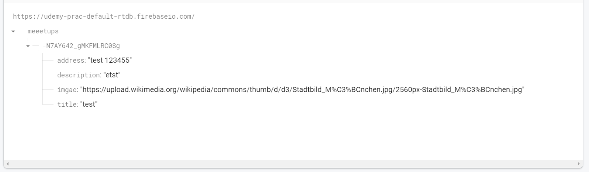

- [udemy React](#udemy-react)
  - [React 04](#react-04)
    - [Http용 앱 준비하기](#http용-앱-준비하기)
      - [POST 요청 보내기](#post-요청-보내기)
        - [fetch](#fetch)
        - [JSON.stringfy](#jsonstringfy)
    - [요청후 사용자에게 피드백 전달](#요청후-사용자에게-피드백-전달)
      - [useNavigate](#usenavigate)
    - [데이터 가져오기](#데이터-가져오기)
      - [렌더링 전 데이터 요청](#렌더링-전-데이터-요청)
    - [useEffect 훅 사용하기](#useeffect-훅-사용하기)
      - [useEffect](#useeffect)
# udemy React
## React 04
### Http용 앱 준비하기
- Firebase의 Realtime Database를 서버로 활용하여 React에서의 프론트엔드와 백엔드간의 요청을 구현한다.
- (대충 알던 서버와 브라우저의 데이터 요청 및 반환)

```react
import NewMeetupForm from "../components/meetups/NewMeetupForm";

function NewMeetupPage() {
  function addMeettupHandler(meetupData) {
    ...
  }
  return (
    <section>
      <h1>Add New Meetup</h1>
      <NewMeetupForm onAddMeetup={addMeettupHandler} />
    </section>
  );
}

export default NewMeetupPage;
```
#### POST 요청 보내기
- Javascript의 `fetch`함수를 사용한다.
- `NewMeetupForm`에 `onAddMeetup` prop에 `NewMeetupPage`의 `addMeettupHandler` 함수를 할당해준다.
- `NewMeetupForm`에서는 submit 시 할당된 함수가 실행되고 서버로 'POST' 요청을 보내게 된다.

```react
  function addMeettupHandler(meetupData) {
    fetch("https://udemy-prac-default-rtdb.firebaseio.com/meeetups.json", {
      method: "POST",
      body: JSON.stringify(meetupData),
      headers: {
        "Content-Type": "application/json",
      },
    });
  }
```
##### fetch
- JavaScript의 기본 내장 함수
- 기본적으로 'GET'요청을 보내기 때문에, 데이터베이스에 접근하여 데이터 수정을 위해선 'POST' 요청을 보내야한다.
- 함수의 인자로 
  - 요청할 서버 url
  - 옵션으로
    - method : 요청 방식
    - body : 전송할 데이터
    - headers : 클라이언트와 서버간 요청, 응답의 부가적인 정보
- Axios와 같은 패키지로 대체 가능하다. 

##### JSON.stringfy
- 서버에 'POST' 요청으로 데이터를 전송할때 `JSON` 형식으로 보내야 한다.
- `stringfy` 함수는 입력된 데이터를 string화 해준다.
- string화 된 데이터를 JavaScript의 기본 내장 함수 `JSON`으로 json 파일로의 변환한다.


- 요청에 의해 fierbase의 데이터베이스에 데이터가 저장됨을 확인 할 수 있다.

### 요청후 사용자에게 피드백 전달
- 요청후 결과에 따라 사용자에게 피드백(ex : 메인페이지이동, 저장 실패 ...etc)을 출력한다.
#### useNavigate
- 사용자의 히스토리를 조작하는 함수이다.
- `react-router-dom`에서 import 한다
```react
const navigate = useNavigate()

  function addMeettupHandler(meetupData) {
    fetch("https://udemy-prac-default-rtdb.firebaseio.com/meeetups.json", {
      method: "POST",
      body: JSON.stringify(meetupData),
      headers: {
        "Content-Type": "application/json",
      },
    }).then(() => {
      navigate('/', {replace : true})
    })
  }
  ```
- `navigate`라는 객체에 `useNavigate`를 생성하고, 아래 옵션을 설정한다.
  - 옵션으로
    - url 주소
    - { push : bool } : 이동 후 뒤로가기가 가능한 navigate
    - { replace : bool } : 이동 후 뒤로가기가 불가능한 navigate
- 이제 데이터를 입력, 요청을 통해 DB에 저장하고 이후 사용자는 메인페이지로 이동하게 된다.

### 데이터 가져오기
- 해당 예시에서는 `DUMMY_DATA`를 미리 마련하여 해당 데이터를 메인화면에 출력하였다. 
- 이젠 `DUMMY_DATA`를 출력하는게 아닌 DB에 저장된 정보를 가져와 메인페이지에 출력하도록 하겠다.
- 이를 위해 페이지 렌더링이 되기전 DB에 데이터를 요청('GET') 후 응답을 받아야 한다.

#### 렌더링 전 데이터 요청
- 메인페이지인 `AllMeetup` 컴포넌트에서 렌더링 이전에 `fetch` 함수를 통해 DB에 접근 후 meetup 데이터를 갱신한다.
```react
function AllMeetupsPage() {
  const [isLoading, setIsLoading] = useState(true)
  const [loadedMeetups, setLoadedMeetups] = useState([])

  fetch("https://udemy-prac-default-rtdb.firebaseio.com/meeetups.json",{}
  ).then(response => {
    return response.json()
  }).then(data => {
    setIsLoading(false)
    setLoadedMeetups(data)
  })

  if (isLoading) {
    return <section>
      <p>Loading...</p>
    </section>
  }
  return (
    /// 렌더링
  )
}
```
- Load 중인지를 나타내는 지와 Load 된 데이터를 **State**를 활용하여 할당한다.
- Load 이 진행중임을 나타내는 `isLoading` state에 초기값으로 true를 할당한다.
- fetch
  - DB에 접근하여 `response`에 응답을 저장
  - `response`를 json 파일을 JavaScript 객체로 변환해주는 `json` 함수로 변환후 반환한다.
  - 데이터가 반환되면 `isLoading` state를 false로 바꾸고, load 된 데이터는 'loadedMeetups' state에 저장된다.
- `isLoading`이 true(load 이 진행중이라면) 'Loading...' 을 출력한다.
- 아니라면 정상적으로 렌더링이 진행된다.
- 위 코드는 **미완성**이다. `useState` 객체는 변화를 감지하고 React는 감지에 따라 State가 포함된 컴포넌트를 다시 실행한다. 이렇게 되면 다시 fetch를 실행하여 기존 과정이 반복되기 때문에 **루프**에 빠지게 된다. 이를 위해 다음 `useEffect`를 살펴보자.

### useEffect 훅 사용하기
#### useEffect
- 특정 조건을 만족하면 일부 코드를 실행하는 hook
- 두개의 인자를 반환한다. 함수와 배열
- 첫번째 인자, 함수
  - useEffect는 처음 실행될때와, 두번째 의존성 배열의 값에 새롭게 추가된 값이 있다면 첫번째 함수를 실행한다.
  - 변화가 있다면 실행하고 아니라면 실행하지 않는다.
- 두번째 인자, 의존성 배열
  - 해당 인자에 대입한 배열의 변화를 감지하고 useEffect의 첫번째 인자인 함수가 실행된다. **의존성**을 갖는다.

```react
import { useState, useEffect } from "react";

...

  useEffect(() => {
    setIsLoading(true)

    fetch("https://udemy-prac-default-rtdb.firebaseio.com/meeetups.json", {})
      .then((response) => {
        return response.json();
      })
      .then((data) => {
        const meetups = []

        for (const key in data){
          const meetup = {
            id : key,
            ...data[key],
          }
          meetups.push(meetup)
        }

        setIsLoading(false);
        setLoadedMeetups(meetups);
      });
  },[]);
```

- 추가로 firebase에서는 meetups 데이터가 unique한 아이디를 이름으로 갖는 객체로 meetup 들이 저장된다. 따라서 위와 같이 응답받은 `data`를 순회하여 `meetups` 배열 객체를 새롭게 만들어주고 state hook을 활용하여 데이터를 저장한다.