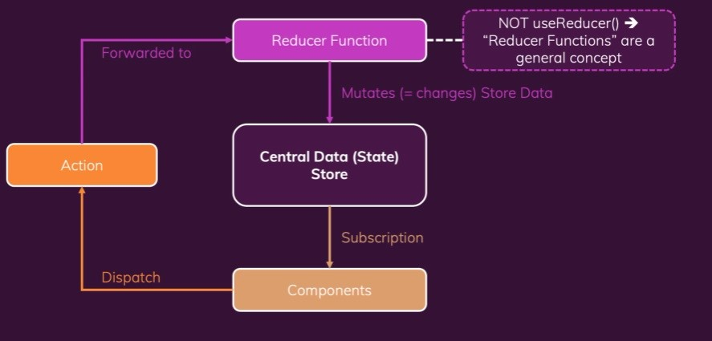

- [udemy React](#udemy-react)
  - [react 06](#react-06)
    - [Redux](#redux)
      - [What is "Redux"?](#what-is-redux)
        - [State의 3가지 종류](#state의-3가지-종류)
      - [Redux 작동 방식](#redux-작동-방식)
        - [Reducer Function](#reducer-function)
        - [Action](#action)
    - [redux 이해하기](#redux-이해하기)
      - [redux 관련 함수](#redux-관련-함수)
        - [store.getState()](#storegetstate)
        - [store.subscribe(function)](#storesubscribefunction)
        - [store.dispatch({ type: "orderString"})](#storedispatch-type-orderstring)
  - [redux 프로젝트](#redux-프로젝트)
      - [스토어 형성](#스토어-형성)
      - [리듀서 함수 생성](#리듀서-함수-생성)
      - [리액트 앱과 리덕스 스토어 연결하기](#리액트-앱과-리덕스-스토어-연결하기)
    - [스토어 제공하기](#스토어-제공하기)
    - [리액트 컴포넌트에서 리덕스 스토어 데이터(State) 사용하기](#리액트-컴포넌트에서-리덕스-스토어-데이터state-사용하기)
      - [useSelector](#useselector)
# udemy React 
## react 06
### Redux
#### What is "Redux"?
- 크로스 컴포넌트 또는 앱 와이드 상태를 관리하기 위한 state 관리 시스템

##### State의 3가지 종류
1. Local State : 데이터가 변경되어 컴포넌트 ui에 영향을 끼침. (ex: 세부정보를 끄는 토글..etc)
2. Cross-Component State : 한개의 컴포넌트에서 다른 다수의 컴포넌트에 영향을 주고 받을때의 State (ex : prop chaining,prop drilling)
3. App-Wide State : 전체 어플리케이션에 전역적으로 사용되는 State (ex : 유저 인증 상태, prop chaining,prop drilling )
- `Context`를 통해 위 3개의 컴포넌트를 관리할 수 있다.

- `Redux`는 `Context`의 복잡한 설정/ 관리, 비교적 낮은 성능과 같은 **잠재적**문제를 예방할 수 있다.

#### Redux 작동 방식
- Redux는 하나의 유일한 **데이터(State,상태) 저장소**(Central Data(State) Store)
  - 공통된 데이터 저장소를 가지므로, prop drilling, prop chaining과 같은 방식이 아닌 바로 컴포넌트간을 prop 할 수 있다.
  - 물론 컴포넌트는 Store를 Subscription 해야한다.
- 데이터는 무조건 **스토어 -> 컴포넌트**로 흐른다. 컴포넌트에서는 절대로 데이터를 수정할 수 없다.



##### Reducer Function
- `Redux`에서 데이터의 업데이트를 담당함.
- 데이터의 입력을 변환하여 반환
- Mutate Store Data
- input : Old State + Dispatched Action
- output : New State Object
- 순수 함수로 어떤 input에 대해 같은 output을 반환한다. 


##### Action
- Component에서 Dispatch를 수신받아, Reducer로 전달하면 새로운 상태로 갱신한다.
- State이 변경에 따라 Subscription한 컴포넌트에서는 UI를 업데이트한다.

### redux 이해하기
- redux-demo
```javascript
const redux = require("redux");

const counterReducer = (state = { counter: 0 }, action) => {
  if (action.type === "increment") {
    return {
      counter: state.counter + 1,
    };
  }

  if (action.type === "decrement") {
    return {
      counter: state.counter - 1,
    };
  }
  return state;
};
const store = redux.createStore(counterReducer);

// console.log(store.getState())

const counterSubscriber = () => {
  const latestState = store.getState();
  console.log(latestState);
};

store.subscribe(counterSubscriber);

store.dispatch({ type: "increment" });
store.dispatch({ type: "decrement" });
```
#### redux 관련 함수
##### store.getState()
- store에 저장된 최신의 state 반환

##### store.subscribe(function)
- state가 변경될때마다 function 실행

##### store.dispatch({ type: "orderString"}) 
- store의 orderString의 dispatch 실행

## redux 프로젝트
```git bash
$git install redux react-redux
```
- `react-redux` : react와 redux를 연결, 리덕스 스토어에 컴포넌트를 서브스크라이브 등의 기능을 함

#### 스토어 형성
```react
import {createStore} from 'redux'

const counterReducer = (state = {coutner : 0}, action) => {
  if (action.type === "increment"){
    return {
      counter : state.counter + 1,
    }
  }

  if (action.type === "decrement"){
    return {
      counter : state.counter - 1,
    }
  }

  return state
}

const store = createStore(counterReducer)
```
- 리듀서 함수 생성후 store 로 포인터를 지정한다.
- 
#### 리듀서 함수 생성
- action.type에 따라 다른 실행 설정

#### 리액트 앱과 리덕스 스토어 연결하기
- 이후에 컴포넌트가 스토어를 서브스크라이브한다.

### 스토어 제공하기
- 위 과정을 통해 `redux`를 활용하여 `store`를 형성하였다.
- 하지만 아직 `react`의 `App`과 `redux`의 store를 연결하지 않았다.
- `react-redux`에서 제공하는 `Provider` 컴포넌트를 활용하여 연결해보자.

```react
/// App.js(리액트 App의 최상위 레벨)
import React from "react";
import ReactDOM from "react-dom";
import { Provider } from "react-redux";

import "./index.css";
import App from "./App";
import store from "./store/index";

ReactDOM.render(
  <Provider store={store}>
    <App />
  </Provider>,
  document.getElementById("root")
);
```
- `Provider` 컴포넌트를 import하여 store에 `redux`의 `store`를 prop하였다.
- 해당 작업을 통해 `App`를 포함한 그 자식 컴포넌트 모두는 `store`에 dispatch, subscribtion, tab(데이터 가져오기) 가 가능하다.

### 리액트 컴포넌트에서 리덕스 스토어 데이터(State) 사용하기
#### useSelector
- 리덕스 팀에서 만든 리액트 커스텀 훅
- 자동으로 상태의 일부를 선택가능하게 해줌
- useStore보다 편하다고함.
- 포함된 컴포넌트를 자동으로 store를 subscibe 한다. 따라서 store의 state상태에 따라 자동 실행/갱신된다.

```react
import { useSelector } from 'react-redux' // useSelector 를 import 

import classes from './Counter.module.css';

const Counter = () => {
  const counter = useSelector(state => state.counter) // counter 에 store의 counter를 할당한다. state의 변화가 감지될시, 자동으로 해당 컴포넌트를 재실행한다.

  const toggleCounterHandler = () => {};

  return (
    <main className={classes.counter}>
      <h1>Redux Counter</h1>
      <div className={classes.value}>{counter}</div>
      <button onClick={toggleCounterHandler}>Toggle Counter</button>
    </main>
  );
};
```