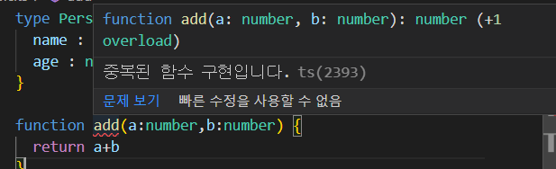
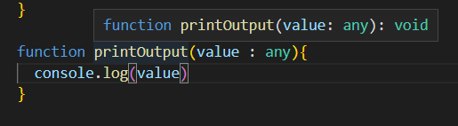
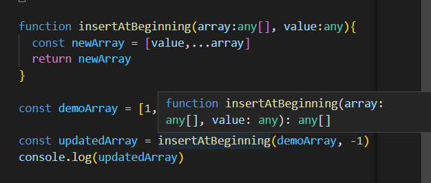
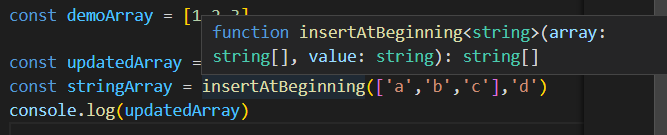

- [**udemy React + TypeScript**](#udemy-react--typescript)
  - [What is TypeScript?](#what-is-typescript)
    - [Typescript](#typescript)
    - [기본](#기본)
      - [변수 선언](#변수-선언)
      - [배열 선언](#배열-선언)
      - [객체 선언](#객체-선언)
    - [type inference(타입 추론)](#type-inference타입-추론)
    - [union type](#union-type)
    - [Type Aliases](#type-aliases)
    - [함수 및 함수 유형](#함수-및-함수-유형)
    - [Generics](#generics)
# **udemy React + TypeScript**
## What is TypeScript?
- javascript의 superset 언어
- javascript의 기능을 확장함
- 정적 타입(static type) 기능
  - 동적 타입(dynamic type)인 javascript에서는 input에 대해 일단 실행한다.
  - typescript에서는 입력시에 타입을 정해놓기 때문에 작성자가 의도한 값만 input이 입력된다.
- 오류를 잡기 좋아 대규모 프로젝트에 용이함.
### Typescript
```bash
$npm init -y // package.json 생성
$npm install typescript // typescript 설치
```
- typescript는 브라우저에서 실행불가하므로, javascript로 컴파일하여 사용해야한다.
```bash
$npx tsc typescriptFile.ts // typescript 파일을 javascript로 컴파일
```

### 기본
#### 변수 선언
```typescript
let paramName : number
```
- 형태 변수이름 : 변수 타입 으로 변수 선언한다.

#### 배열 선언
```typescript
let hobbies : string[]
```
- 형태 배열이름 : 배열 인자 타입 으로 배열 선언한다.
- 타입을 지정해주지 않으면 any 타입으로 배열의 모든 값의 타입이 통일되지 않아도 된다.

#### 객체 선언
```typescript
ley person: {
    name : string,
    age : number
}
person = {
    name:"max",
    age : 25,
}
```
- 위와 같이 객체의 인자들의 타입을 지정하여 선언할 수 있다.

```typescript
let people: {
    name: string,
    age: number,
}[]
```
- 위와 같이 동일한 형태의 객체를 갖는 배열로 선언할 수 있다.

### type inference(타입 추론)
- typescript는 가능한 많은 값의 타입을 유추하려고 함.
```typescript
let course = "react - omplete"
course = 1234 // 오류 발생
```
- 위 `course` 변수는 typescript에서 자동으로 string으로 인지함

### union type
- 한개의 변수에 여러개의 타입을 지정할 수 있을까?
```typescript
let course: string | number = "react - omplete"
course = 1234 
```
- 위 선언으로 `course`는 두개의 타입(string, number)을 가질 수 있는 변수가 되었다.

### Type Aliases
- Type Alias(타입 별칭) : 사용자가 정의한 타입을 사용하는 것.
- **TypeScript**에서만 존재하는 기능
```typescript
type newTypeName = {
    name: string
    age : number
}
let newType : newTypeName
let newType : newTypeName[]
```

### 함수 및 함수 유형

- 타입 추론에 의해 add 함수의 type이 number로 추론됨을 확인 할 수 있다.
- 함수 유형(function type) 또한 지정 가능하나, 되도록 하지 않는다. typesctipt의 추론을 따른다.


- 위와 같이 반환값이 없는 함수의 경우 type은 `void`이다.

### Generics
```typescript
function insertAtBeginning(array:any[], value:any){
  const newArray = [value,...array]
  return newArray
}

const demoArray = [1,2,3]

const updatedArray = insertAtBeginning(demoArray, -1)
```

- 이와 같이, `insertAtBeginning`함수 선언에서 입력 인자들을 `any`인자로 받았다고 해서 실제 값이 `number`가 들어가고 반환 역시 `number`여도 함수의 반환값은 선언때의 `any`로 유추된다.
- Generics은 보다 유연하고 안정적인 유추가 가능하게 한다.

```typescript
function insertAtBeginning<T>(array:T[], value:T){
  const newArray = [value,...array]
  return newArray
}
```
- `<GenericsName>` 을 함수 뒤에 붙이고 입력인자의 타입을 `GenericsName`으로 지정해주면 Generics 함수 선언이 완료된다.

- 위와 같이 선언할때 Generics 형식으로 선언했기 때문에, 입력값과 반환값에 따라 유추가 진행된다.