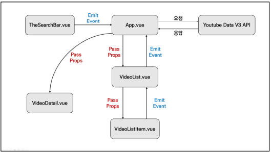
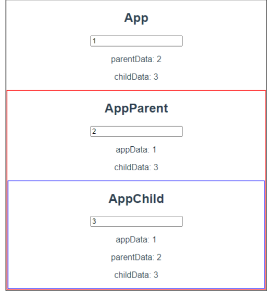

- [Vue\_03](#vue_03)
  - [Vue](#vue)
    - [Workshop](#workshop)
      - [Youtube API, Vue CLI 활용하여 컴포넌트간 관계 형성](#youtube-api-vue-cli-활용하여-컴포넌트간-관계-형성)
    - [Practice](#practice)
      - [Props와 emit event를 활용하여 아래와 같이 데이터를 주고받는 Application을 완성하시오.](#props와-emit-event를-활용하여-아래와-같이-데이터를-주고받는-application을-완성하시오)


# Vue_03
## Vue

### Workshop
#### Youtube API, Vue CLI 활용하여 컴포넌트간 관계 형성



0. 최상위 컴포넌트

   1. 최상위 컴포넌트(여기선 App.vue)에서 사용되는 데이터 정의

      1. 하위(자식) 컴포넌트로 pass props 되면 하위 컴포넌트에서는 받고, 등록하고, 사용한다.
      2. props는 :(콜론), emit은 @(골뱅이)의 shorthand로 사용한다.

      ```vue
      <보낼컴포넌트의케밥케이스> :자식컴포넌트에서받을데이터이름="현재컴포넌트에서보낼데이터이름"</보낼컴포넌트의케밥케이스>
      ```

      ```vue
      # 자식 컴포넌트 : child1
      function() {
      	this.$emit("emit메세지 1", 기타 추가로 보낼 데이터 or 변수들...)
      }
      
      ...
      부모컴포넌트에서는 v-on(@)을 통해 emit 메세지를 수신한다.
      <child1 @emit메세지1="실행할함수이름"></child1>
      ```

   2. 기존의 v-bind(:)와 v-on(@)의 사용방법과 같다.

   3. 최상위 컴포넌트의 scripts 상에서 사용할 component 모듈 import/ export default의components에 import 된 component를 등록한다.

   4. 등록된 component는 template상에서 사용한다.

   5. axios를 이용하여 비동기적으로 Youtube API를 활용하여 검색 데이터 가져오기

      1. Youtube developer docs를 참고하여 필요 옵션 사용하기.

1. 자식 컴포넌트

   1. VideoList : 검색된 Video item들을 포함하고, 선택된 Video에 대한 emit 메세지 전달하는 중간다리
   2. VideoListItem : 검색된 Videos 들을 나열, 각 객체로 처리함. VideoList에 포함됨
   3. SearchBar : 키입력을 통해 검색. 입력된 검색어는 데이터로 저장되어 API의 검색어 옵션으로 사용됨.
   
   

### Practice

#### Props와 emit event를 활용하여 아래와 같이 데이터를 주고받는 Application을 완성하시오. 


0. App - AppParent - AppChild 순으로 부모자식 관계가 형성됨
1. 최상위 컴포넌트 App 에서 데이터를 갖고, 자식 컴포넌트로 Pass props한다. 이에 따라 데이터 변경이 발생하면 비동기적인 갱신으로 모든 컴포넌트의 props data는 같은 값을 갖게 된다.
2. 자식 컴포넌트에서 데이터변경이 요청(input에 텍스트가 입력)시, 직접적 부모관계에 emit메세지를 송신의 반복으로 연쇄적으로 최상위 컴포넌트에 emit 메세지가 도달하고 데이터 갱신이 일어나게 했는데...
3. 최상위 컴포넌트의 데이터 변경에 따른 비동기적 데이터 갱신이 일어난다면, 2.와 같이 연쇄적인 emit message 전달이 없어도 되지않나.. 한다.
