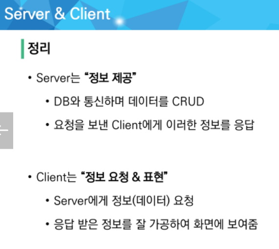
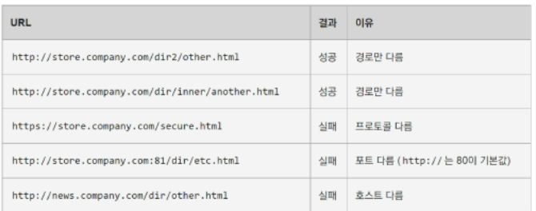
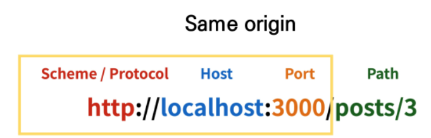
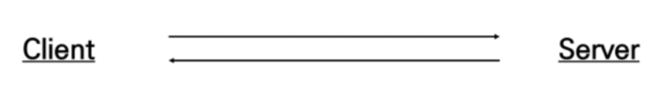
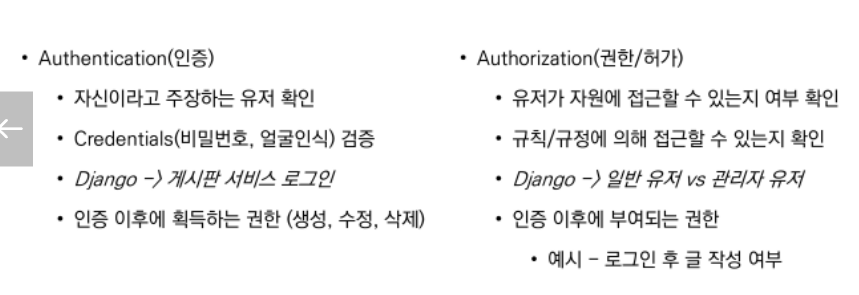
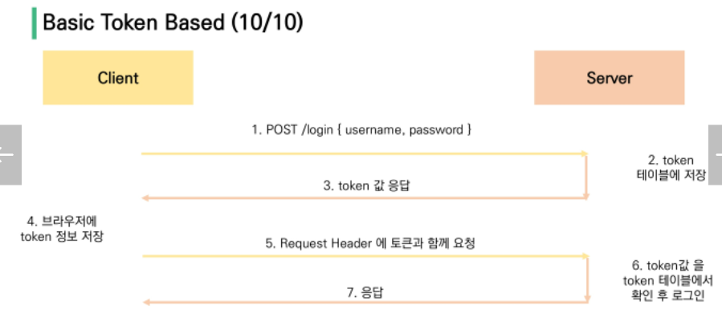

- [Vue\_04](#vue_04)
  - [Vue Vue+API 서버 활용](#vue-vueapi-서버-활용)
  - [Vue 04](#vue-04)
    - [Server \& Client](#server--client)
      - [Server](#server)
      - [Client](#client)
    - [Start Project Model + Serializer](#start-project-model--serializer)
    - [CORS](#cors)
      - [Same-origin policy(SOP)](#same-origin-policysop)
      - [Origin(출처)](#origin출처)
      - [Cross-Origin Resource Sharing(CORS)](#cross-origin-resource-sharingcors)
        - [Cross-Origin Resource Sharing Policty (CORS Policy)](#cross-origin-resource-sharing-policty-cors-policy)
      - [Why CORS?](#why-cors)
      - [How CORS?](#how-cors)
      - [Access-Control-Allow-Origin 응답 헤더.](#access-control-allow-origin-응답-헤더)
      - [CORS 시나리오](#cors-시나리오)
      - ['django-cors-headers' 라이브러리](#django-cors-headers-라이브러리)
    - [Authentication \& Authorization](#authentication--authorization)
      - [Authentication](#authentication)
      - [Authorization](#authorization)
          - [Authentication and Authorization work together : 회원 가입을 하고 로그인을 하면 할 수 있는 권한 생성/ 인증이후에 권한이 따라오는 경우가 많고 각 인증에 따라 다른 권한 부여.](#authentication-and-authorization-work-together--회원-가입을-하고-로그인을-하면-할-수-있는-권한-생성-인증이후에-권한이-따라오는-경우가-많고-각-인증에-따라-다른-권한-부여)
    - [DRF Authentication](#drf-authentication)
      - [다양한 인증 방식.](#다양한-인증-방식)
        - [Basic Token Authentication](#basic-token-authentication)
        - [JWT(Json Web Tokens)](#jwtjson-web-tokens)


# Vue_04
## Vue Vue+API 서버 활용

## Vue 04
### Server & Client
#### Server
- 클라이언트에게 '정보', '서비스' 를 제공하는 컴퓨터 시스템.

#### Client
- 서버에게 **올바른 서비스 요청, 요청에 필요한 인자 제공, 서버에서의 응답을 사용자에게 적절히 표현하는 시스템**
  - 서버에 올바른 요청 : Client(Postman, Browser)가 서버에 올바른 요청시, Server는 그에 맞는 데이터(JSON)을 넘겨준다.





### Start Project Model + Serializer
### CORS
#### Same-origin policy(SOP)
- "동일 출처 정책"
- 특정 출처에서 불러온 문서나 스크립트가 다른 출처에서 가져온 리소스와 상호작용 하는 것을 제한하는 보안 방식.
#### Origin(출처)
- 두 URL의 protocol, port, host 가 모두 같아야 동일 출처라 할 수 있다.





#### Cross-Origin Resource Sharing(CORS)
- "교차 출저 리소스(자원) 공유"
- 보안 상의 이유로 브라우저는 교차 출처 HTTP 요청을 제한한다(SOP)
- 다른 출저의 리소스를 불러오려면 그 출처에서 올바른 CORS header를 포함한 응답을 반환해야 한다. → **추가 HTTP header**를 사용하여, 특정 출처의 웹 앱을 다른 출처의 자원에 접근할 수 있는 권한을 부여하도록 브라우저에 알려주는 체제.
- 리소스가 자신의 출처(Domain, Protocol, Port)와 다를때, **교차출처 HTTP 요청**을 실행한다.
  → 다른 출처의 리소스를 불러오려면 그 출처에서 **올바른 CORS header를 포함한 응답을 반환**해야한다.

##### Cross-Origin Resource Sharing Policty (CORS Policy)
- 교차 출처 리소스 공유 정책
- SOP의 반대.
- CORS를 사용하여 교차 출처 접근을 허용한다.
  - CORS는 HTTP의 일부로, 어떤 호스트에서 자신의 컨테츠를 불러갈 수 있는지 **서버에 지정할 수 있는 방법**이다.


#### Why CORS?
1. 브라우저 & 웹 애플리이케션 보호
	- 특정 서비스를 외부 사용자가 이용(공격)하지 못하도록 막는다.
2. Server의 자원 관리
#### How CORS?
- CORS 표준에 의해 추가된 **HTTP Header**를 통해 이를 통제.	
  - ex) Access-Control-Allow-Origin
#### Access-Control-Allow-Origin 응답 헤더.
- 이 응답이 주어진 출처(origin)로 부터 요청 코드와 공유 될 수 있는지를 나타냄.
	- Access-Control-Allow-Origin: * 와 같은 식.(브라우저 리소스에 접근하는 임의 origin으로부터 요청을 허용한다고 알리는 응답(HTTP)에 포함된다.)

#### CORS 시나리오



- Client(서버 1)에서 Server(서버 2)의 도메인의 컨텐츠를 호출한다(서로 다른 리소스(HTTP or Protocol or Port)일때,)

- Client에서 GET /doc HTTP/1.1 Origin: 서버1 의 요청을 보내고 Server에서는 HTTP/1.1 200 OK Access-Control-Allow-Origin:*(또는 Client의 리소스로 지정해줌)로 응답한다

  

1. Vue.js에서 A서버로 요청
2. A서버에서는 Access-Control-Allow-Origin 에 특정 Origin을 포함시켜 응답한다.
3. 브라우저는 2.의 응답에서 Access-Control-Allow-Origin을 확인후 허용 여부를 결정한다.
4. 프레임워크 별로 이를 지원하는 라이브러리가 존재한다.
   - Django에서는 그게 아래의 django-cors-headers이다.


#### 'django-cors-headers' 라이브러리
- 응답에 CORS header를 추가해주는 라이브러리
- 다른 출처에서 보내는 Django 앱에 대한 브라우저 내 요청을 허용 or 선택적 허용 기능 제공.

```bash
$pip install django-cors-headers #라이브러리 설치
```

- settings.py에서...

1. INSTALLED_APPS 에 추가
2. MINDDLEWARE 추가
3. CORS_ALLOWED_ORIGINS 에 교차 출처 자원 공유.

### Authentication & Authorization
#### Authentication
- 인증, 입증/ 사용자가 누구인지(인증된 사용자인지 아닌지)확인하는 행위
- **모든 보안 프로세스의 첫 단계**(가장기본요소)
- 401 Unauthorized : HTTP표준에서는 미승인 이지만, 의미상 비인증을 의미
#### Authorization
- 권한 부여, 허가/ 사용자에게 특정 리소스 또는 기능에 대한 액세스 권한 부여하는 과정
- 보안환경에서 권한 부여는 항상 인증을 따라야 한다.
- 403 Forbidden : 서버가 클라이언트가 누군지 알지만 권한부여는 안함



###### Authentication and Authorization work together : 회원 가입을 하고 로그인을 하면 할 수 있는 권한 생성/ 인증이후에 권한이 따라오는 경우가 많고 각 인증에 따라 다른 권한 부여.

### DRF Authentication
#### 다양한 인증 방식.
##### Basic Token Authentication
1. 사용자의 서버에 대한 요청
2. 서버에서 해당 사용자의 정보를 통해 token 저장
3. token 값 응답
4. 브라우저에 token 정보 저장
5. Request Header 에 토큰과 함께 요청
6. token 값을 token 테이블에서 확인 후 로그인
7. 응답




##### JWT(Json Web Tokens)
- "JSON Web Token" : JSON 포맷을 활용하여 요소 간 안전하게 정보를 교환하기 위한 표준 포맷
- 기본 토큰 인증 체계와 달링 JWT 인증 확인은 데이터베이스를 사용하여 토큰의 유형성 검사.
	- JWT는 데이터베이스에서 유효성검사 필요 X
	- 토큰 탈취시 서버측에서 토큰 무효화가 불가능하다.

```bash
$pip install django-allauth
$pip install dj-rest-auth
```

- 위 패키지를 통해, login/ logout/ signup 등 기본적인 사항을 모두 구현되어 있는 것을 가져와 사용할 수 있다.
- 토큰 발급을 통한 로그인 상태 구현 또한 구현 가능.


- settings.py에 

```python
INSTALLED_APPS = [
    ...
    
    'rest_framework',
    'rest_framework.authtoken',
    
    'dj_rest_auth',
    'dj_rest_auth.registeration',
    
    'allauth',
    'allauth.account',
    
    'django.contrib.sites'
]

...

SITE_ID = 1

REST_FRAMEWORK = {
    'DEFAULT_AUTHENTICATION_CLASSES':[
        'rest_framework.authentication.TokenAuthentication',
    ],
    
    'DEFAULT_PERMISSION_CLASSES':[
       	'rest_framework.permissions.IsAuthenticated',
    ]
}

...
urls.py 에서 urlspatterns 추가
```

- 그냥 공식문서 찾아서 위 내용을 복붙하도록 한다.
